This notebook prepares the data used in our analyses. It also produces the figures displayed in our article, showing raw comparisons between reality and scenarios.

```{r setup, include=T, message=F, warning=F}
knitr::opts_chunk$set(message=F, warning=F, fig.align = "center",  dev='png')

library(tidyverse) #loads multiple packages (see https://tidyverse.tidyverse.org/)

#core tidyverse packages loaded:
# ggplot2, for data visualisation. https://ggplot2.tidyverse.org/
# dplyr, for data manipulation. https://dplyr.tidyverse.org/
# tidyr, for data tidying. https://tidyr.tidyverse.org/
# readr, for data import. https://readr.tidyverse.org/
# purrr, for functional programming. https://purrr.tidyverse.org/
# tibble, for tibbles, a modern re-imagining of data frames. https://tibble.tidyverse.org/
# stringr, for strings. https://stringr.tidyverse.org/
# forcats, for factors. https://forcats.tidyverse.org/
# lubridate, for date/times. https://lubridate.tidyverse.org/

#also loads the following packages (less frequently used):
# Working with specific types of vectors:
#     hms, for times. https://hms.tidyverse.org/
# Importing other types of data:
#     feather, for sharing with Python and other languages. https://github.com/wesm/feather
#     haven, for SPSS, SAS and Stata files. https://haven.tidyverse.org/
#     httr, for web apis. https://httr.r-lib.org/
#     jsonlite for JSON. https://arxiv.org/abs/1403.2805
#     readxl, for .xls and .xlsx files. https://readxl.tidyverse.org/
#     rvest, for web scraping. https://rvest.tidyverse.org/
#     xml2, for XML. https://xml2.r-lib.org/
# Modelling
#     modelr, for modelling within a pipeline. https://modelr.tidyverse.org/
#     broom, for turning models into tidy data. https://broom.tidymodels.org/

# Use the conflicted package (<http://conflicted.r-lib.org/>) to force all conflicts to become errors

# #loading other packages
library(zoo) #for rollmean function
library(cowplot) #for multiple plots with plot_grid() 
library(ISOweek) #to convert weeks to date and vice versa
library(patchwork) #for multiple plots

#colors of the reality curve, report reality dots, and scenario curves
g_theme <- scale_color_manual(values=c('#ff0000', "black",'#D8D8D8'))

#resolution of png graphs
dpi_resolution <- 350

#import functions
source("functions.R")
```

# Prepare Data

The first section **Prepare reality data** focuses on true data of Intensive Care Units (ICU) and Hospitalizations. Most of it is from one of Pasteur Institute's modelling unit paper ([Paireau et al 2022](https://www.pnas.org/doi/abs/10.1073/pnas.2103302119){target="_blank"}), which has its own cleaning and smoothing process of the government raw data. This dataset stops on July 2021. Beyond this date we use data from multiple sources (Pasteur Institute's subsequent reports and government data) and combine them all to produce one unique and coherent dataset.

Since scenarios data were not public, we had to extract them manually from the reports figures, using [WebPlotDigitizer](https://apps.automeris.io/wpd/){target="_blank"}. The process for each report is described in the **Prepare Scenarios ICU** and **Prepare Scenarios Hospitalizations** paragraphs. For each report we indicate its original URL source. Then :

  -   In the *Reproduced* tab, we reproduce the original figures from our extracted data and compare them to reality.
  -   In the *Error* tab, we check the error of best-case, worst-case and median scenarios to reality, expressed as a % of the historical hospitalization peak.
  -   In the *Original* tab, we provide the screenshot of the original scenarios figures from which data are extracted.

## Prepare reality data {.tabset .tabset-fade .tabset-pills}

### Sources

Most of our reality data is based on [Paireau et al (2022)](https://www.pnas.org/doi/abs/10.1073/pnas.2103302119){target="_blank"} paper, the official data processed by Pasteur Institute, which gives us the data up to July 2021.

```{r load_Paireau_et_al_data_France}
# to read data from Paireau et al (2022) at a given geographical scale
true_data_Paireau_et_al <- f_read_paireau("metropolitan") #national scale
true_data_Paireau_et_al_IDF <- f_read_paireau("IDF") #Ile-de-France region scale
```

Beyond July 2021, for Intensive Care Units (ICU) data, we load the the reported data on data.gouv, on [this page](https://www.data.gouv.fr/fr/datasets/donnees-hospitalieres-relatives-a-lepidemie-de-covid-19/){target="_blank"}. We then combine it with Paireau et al data.

```{r load_data_gouv_data}
# download data related to ICU and hospitalization data from the data.gouv source
# critical care beds, hospitalization beds, and conventional hospitalization beds
data_gouv_beds_hosp_rea <- 
  read_csv2(
    "source_data/reality_data_gouv/covid-hospit-2023-03-31-18h01.csv"
    ) %>%
  mutate(
    date = as.Date(jour) #rename date in English and transform string to date object
    )

# extract only national scale data
data_gouv_ICU_beds <- data_gouv_beds_hosp_rea %>%
  filter(
    # 0 = men + women, 1 = men, 2 = women => select 0, remove 1 and 2
    sexe =="0",
    #remove overseas territories
    dep != 971 & dep != 972 & dep != 973 & dep != 974 & dep != 976 & dep != 978,
    #last scenario stops on April 2022, we do not keep the data beyond this point
    date <= as.Date("2022-04-01")
    ) %>%
  #group all departments together to have national data
  group_by(
    date
    ) %>% 
  summarise(
    ICU_beds = sum(rea, na.rm = T)
    )
```

For daily hospital admissions, Paireau et al (2022) use a smoothing process. This processed data is reported only up to July 2021. Beyond this date, we manually extract the data from the subsequent Pasteur reports, using [WebplotDigitizer](https://apps.automeris.io/wpd/){target="_blank"}.

```{r load_Pasteur_reports_hospital_data}
# load Pasteur reports data on new admissions
path_source <- "source_data/reality_reports_hosp_adm/"
f_read <- function(scenario_date){
  temp <- read_csv(paste0(path_source, scenario_date, ".csv")) %>%
    mutate(scenario = gsub("_", "-", scenario_date))
}
# combine the different data on hospital admissions
true_data_new_hosp_Pasteur_reports <- bind_rows(
  f_read("2021_05_21"),
  f_read("2021_07_27"),
  f_read("2021_08_05"),
  f_read("2021_10_04"),
  f_read("2021_12_17"),
  f_read("2022_02_15") %>% 
    #for the January 2022 period the smoothed admissions is not reported, so we compute it
    mutate(
      new_hosp_smooth=rollmean(new_hosp, 7, na.pad = T, align = "right")
      )
  )
```

The reality datasets comparison and combination is detailed in the next tab *Datasets Combination*

### Datasets combination {.tabset .tabset-fade}

#### ICU

For ICU beds, data from Paireau et al (2022) and from data.gouv match very well on their common period until July 2021. So after this date we use the data.gouv data (just with a 2-day offset to better alignment). The difference between the 2 datasets is typically less than 1%.

```{r ICU_datasets_combination}
day_offset <- -2

#for national scale, combine Paireau and data.gouv datasets
reality_ICU_beds <- bind_rows(
  
  #Paireau dataset before July 2021
  true_data_Paireau_et_al %>% 
    select(date, ICU_beds) %>%
    filter(date<as.Date("2021-07-01")),
  
  #data.gouv dataset after July 2021, with a negative 2-day offset
  data_gouv_ICU_beds %>% 
    select(date, ICU_beds) %>% 
    mutate(date = date + day_offset) %>%
    filter(date>=as.Date("2021-07-01"))
)

#for IDF region scale, Paireau data alone is enough, because no scenario beyond July 2021
reality_ICU_beds_IDF <- true_data_Paireau_et_al_IDF %>% select(date, ICU_beds)

#maximum ICU beds occupancy reached, for further normalization in the code
max_ICU_beds <- max(reality_ICU_beds$ICU_beds, na.rm=T)
max_ICU_beds_IDF <- max(reality_ICU_beds_IDF$ICU_beds, na.rm=T)

#plot the 2 datasets and their combination to see the negligible discrepancies
ggplot() +
  
  #data.gouv ICU line
  geom_line(
    data =data_gouv_ICU_beds, linewidth=2.5, alpha=.4,
    aes(date+day_offset, ICU_beds, color="data.gouv")
    ) +
  
  #Paireau et al ICU line
  geom_line(
    data = true_data_Paireau_et_al,
    aes(date, ICU_beds, color="Paireau et al."),
    linewidth=2.5, alpha=.4,
    ) +
  
  #our combined ICU true data
  geom_line(
    data=reality_ICU_beds, 
    aes(date, ICU_beds, linetype="combination\nused in this study")
    ) +
  
  #ICU beds capacity horizontal line
  geom_hline(yintercept = max_ICU_beds, linetype="dashed") +
  
  #labels
  labs(
    title = "ICU beds occupied by COVID patients",
    subtitle = "horizontal line: historical maximum occupancy of ICU beds during 1st wave",
    colour = element_blank(),
    linetype = element_blank(),
    y="COVID-related ICU beds occupancy",
    x=element_blank()
  )
```

```{r error_comparison_ICU_beds}
#prepare data to see error
temp <- 
  inner_join(
    true_data_Paireau_et_al %>% 
      select(date, ICU_beds_Paireau=ICU_beds),
    data_gouv_ICU_beds %>% 
      select(date, ICU_beds_data_gouv=ICU_beds) %>% 
      mutate(date=date+day_offset),
    by="date"
    ) %>%
  mutate(
    error=(ICU_beds_Paireau-ICU_beds_data_gouv),
    error_percent=(ICU_beds_Paireau-ICU_beds_data_gouv)/max_ICU_beds*100
    )

#plot showing error between the 2 ICU datasets on their common period
plot_grid(
  
  #absolute error plot
  ggplot(temp) +
    geom_area(aes(date, error, fill="")) +
    geom_hline(yintercept = max_ICU_beds, linetype="dashed") +
    scale_y_continuous(
      labels = scales::label_number(drop0trailing = TRUE),
      limits = c(0, max_ICU_beds)
      ) +
    annotate(
        'text', x = as.Date("2021-05-01"), y = 6400, label = "horizontal line:\nmax ICU beds occupancy", 
        color = "black", fontface = "italic", family = "Times New Roman", hjust=1
      ) +
    theme(legend.position = "none") +
    labs(
      title = "Error between the 2 ICU beds datasets",
      subtitle = "absolute error (number of ICU beds)",
      y="ICU beds", x=element_blank()
    ),
  
  #relative error plot
  ggplot(temp) +
    geom_area(aes(date, error_percent/100, fill="")) +
    scale_y_continuous(
      labels = scales::percent,
      limits = c(0, NA)
      ) +
    theme(legend.position = "none") +
    labs(
      title = "",
      subtitle = "relative error (% of ICU beds peak)",
      y="% of 1st wave peak", x=element_blank()
    )
  )
```

#### Hospital admissions

We cannot apply the same method as ICU beds for new hospital admissions, since the modelers use a modified indicator not reported in data.gouv (see details in [Paireau et al 2022](https://www.pnas.org/doi/abs/10.1073/pnas.2103302119){target="_blank"}). So for the period after July 2021, we have to extract the true data of "new hospital admissions" from the different subsequent Pasteur reports, when it is reported.

```{r graph_all_pasteur_reports_true_data_new_hosp}
#graph of all sources
ggplot(true_data_new_hosp_Pasteur_reports) +
  
  #reports data new hospitalizations smoothed
  geom_line(
    aes(date, new_hosp_smooth, group=scenario, color=scenario), 
    linewidth=2
    ) +
  
  #reports data new hospitalizations 
  geom_point(
    aes(date, new_hosp, group=scenario, color=scenario), 
    alpha=.2
    ) +
  
  #Paireau et al (2022) data new hospitalizations smoothed 
  geom_line(
    data = true_data_Paireau_et_al, linewidth=1,
    aes(date, new_hosp_smooth, linetype="Paireau et al.")
    ) +
  
  #Paireau et al data new hospitalizations 
  geom_point(
    data = true_data_Paireau_et_al, alpha=.2,
    aes(date, new_hosp)
    ) +
  
  #labs
  labs(
    x=element_blank(), 
    y="daily new hospital admissions",
    color="Pasteur\nreport source",
    linetype=element_blank(),
    title = "Datasets used for new hospital admissions"
    )
```

```{r combine_data_on_hospitalizations}
#gather data from all reports, for dates beyond July 2021
true_data_new_hosp_Pasteur_reports <- true_data_new_hosp_Pasteur_reports %>% 
  # average for each date because sometimes multiple values for 1 date
  group_by(
    date
    ) %>% 
  summarise(
    new_hosp=round(mean(new_hosp, na.rm=T)),
    new_hosp_smooth=round(mean(new_hosp_smooth, na.rm=T))
    ) %>%
  filter(
    date>=as.Date("2021-07-01")
    )

#replace all NAN by NA
true_data_new_hosp_Pasteur_reports <- true_data_new_hosp_Pasteur_reports %>% 
  mutate_all(~replace(., is.nan(.), NA))

#merge the 2 datasets (Paireau for before July 2021, gathered reports for after)
reality_new_hosp_adm <- bind_rows(
  true_data_new_hosp_Pasteur_reports,
  true_data_Paireau_et_al %>% 
    select(date, new_hosp_smooth, new_hosp) %>%
    filter(date<as.Date("2021-07-01"))
)

#remove data not useful anymore
rm(
  data_gouv_beds_hosp_rea, data_gouv_ICU_beds, day_offset,
  true_data_Paireau_et_al, true_data_new_hosp_Pasteur_reports
  )
```

```{r extrapolation_december_2022_new_how}
#for the few days in the end of December 2022, we linearly extrapolate the data

#remove lines were new_hosp_smooth not reported
reality_new_hosp_adm <- reality_new_hosp_adm %>% filter(is.na(new_hosp_smooth)==F)

#extrapolate new hospitalizations on missing period in Nov-Dec 2021
date_min <- "2021-11-23"
date_max <- "2021-12-07"
ndays <- as.numeric(as.Date(date_max) - as.Date(date_min))
hosp_min <- reality_new_hosp_adm$new_hosp_smooth[reality_new_hosp_adm$date==as.Date(date_min)]
hosp_max <- reality_new_hosp_adm$new_hosp_smooth[reality_new_hosp_adm$date==as.Date(date_max)]

temp <- data_frame(
  date = seq(from=as.Date(date_min), to=as.Date(date_max), by="day"),
  new_hosp = NA,
  new_hosp_smooth = seq(from=hosp_min, to=hosp_max, by=(hosp_max-hosp_min)/(ndays))
) 
temp$new_hosp_smooth <- round(temp$new_hosp_smooth)

#remove first and last rows (start and end days)
temp = temp[-1,]
temp = temp[-nrow(temp),]

#combine original data and extrapolation
reality_new_hosp_adm <- bind_rows(
  reality_new_hosp_adm, 
  temp
)

#remove temporary variables
rm(date_min, date_max, ndays, hosp_min, hosp_max)
```

Combining all the datasets together yields the following result, after extrapolation on missing period (just 2 weeks in Nov-Dec 2021) :

```{r final_data_new_hosp}
#plot the data
ggplot(reality_new_hosp_adm) +
  geom_line(aes(date, new_hosp_smooth)) +
  geom_line(aes(date, new_hosp), alpha=.4) +
  labs(
    title = "New COVID-related hospital admissions",
    y = "daily new hospital admissions"
  )
```

For the scenarios at the Ile-de-France region scale, no need to combine datasets, as none of the scenarios goes beyond July 2021. We can just use the Paireau et al (2022) data.

```{r get_new_hosp_IDF}
#get IDF data on hospital admissions from Pairea et al (2022)
reality_new_hosp_adm_IDF <- true_data_Paireau_et_al_IDF %>% select(-ICU_beds)
rm(true_data_Paireau_et_al_IDF)
```


### Historical maxima beds occupancy

In our analysis, we use the historical maxima of ICU beds occupancy and hospital admissions to normalize the error between scenarios and reality.

```{r ICU_beds_capacity}
max_ICU_beds <- max(reality_ICU_beds$ICU_beds, na.rm=T)
max_ICU_beds_IDF <- max(reality_ICU_beds_IDF$ICU_beds, na.rm=T)
max_new_hosp <- max(reality_new_hosp_adm$new_hosp_smooth, na.rm=T)
max_new_hosp_IDF <- max(reality_new_hosp_adm_IDF$new_hosp_smooth, na.rm=T)
```

  -   maximum ICU bed occupancy in France: `r max_ICU_beds`
  -   maximum daily new hospital admissions in France: `r max_new_hosp`
  -   maximum ICU bed occupancy in Ile-de-France region: `r max_ICU_beds_IDF`
  -   maximum daily new hospital in Ile-de-France region: `r max_new_hosp_IDF`

## Prepare Scenarios ICU

```{r output_path_for_corrected_ICU_scenarios}
# where prepared ICU data is saved
output_path <- "output_data/extracted_data/ICU_scenarios/"
output_path_error <- "output_data/min_med_max_and_error/ICU_error/"
```


### October 30, 2020 {.tabset .tabset-fade .tabset-pills}

Source: [Les Echos newspaper](https://www.lesechos.fr/economie-france/social/covid-la-decrue-dans-les-services-de-reanimation-esperee-en-france-dans-une-dizaine-de-jours-1261656){target="_blank"}, November 3, 2020. We know the publication date from the statement "The scientists from Pasteur Institute and Santé Publique France updated their epidemic scenarios on October 30". Identified by Google search.

#### Reproduced

```{r 2020_10_30_Pasteur}
# load scenarios
scenarios <- read_csv("source_data/2020_10_30/ICU.csv") %>%
  mutate(date = as.Date(date, format = "%Y/%m/%d", optional = T))

# graph comparison
f_graph(
  reality_ICU_beds, scenarios, # reality and scenarios datasets
  "ICU_beds", # variable of interest
  "2020-10-30", 5000, #publication date label
  "2020-10-01", "2020-12-15", #date limits x axis
  NA, # y axis limits
  "ICU beds", # y label
  "reality in Paireau et al." # reality data source
)

# save data
temp <- f_prepare_to_save(scenarios, reality_ICU_beds, "ICU_beds")
f_save_csv_files(temp, output_path, "2020_10_30_ICU.csv")
```

#### Error

```{r}
# compute error and min med max scenarios
error <- f_compute_error("2020-10-01", "2020-12-15", temp, max_ICU_beds)

f_graph_error(
  error,
  "2020-10-30", 25 #publication date label
  )

f_save_csv_files(error, output_path_error, "2020_10_30_ICU_error.csv") #2nd lockdown ends on Dec 15, so OK to compare up to the end of the scenarios (Dec 15)
```

#### Orginal

```{r 2020_10_30_original, echo=FALSE, out.width="500px"}
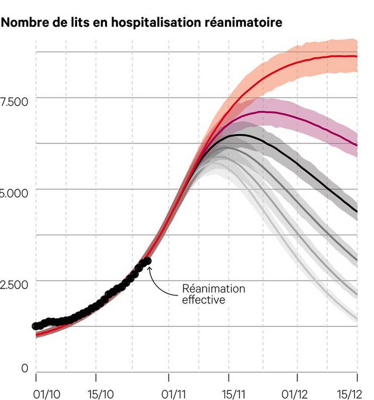
```


### May 21, 2021 {.tabset .tabset-fade .tabset-pills}

Source: [Pasteur report](https://modelisation-covid19.pasteur.fr/loosening/Mise_a_jour_scenarios_de_levee_des_mesures_de_freinage_20210521.pdf){target="_blank"}, May 21, 2021. Identified on Pasteur Institute's website, on [this page](https://modelisation-covid19.pasteur.fr/realtime-analysis/delta-variant-dynamic/){target="_blank"}.

#### Reproduced 

```{r 2021_05_21_Pasteur}
# load scenarios
scenarios <- read_csv("source_data/2021_05_21/ICU.csv") %>%
  mutate(date = as.Date(date, format = "%Y/%m/%d", optional = T))

# graph comparison
f_graph(
  reality_ICU_beds, scenarios, # reality and scenarios datasets
  "ICU_beds", # variable of interest
  "2021-05-21", 1000, # publication date label
  "2021-01-15", "2021-06-30", # date limits x axis
  6100, # y axis limits
  "ICU beds", # y label
  "reality in Paireau et al." # reality data source
) 

# prepare and save data
temp <- f_prepare_to_save(scenarios, reality_ICU_beds, "ICU_beds")
f_save_csv_files(
  temp %>% filter(date<=as.Date("2021-06-15")), #stop comparison mid-June before delta variant dominant
  output_path, "2021_05_21_ICU.csv"
  )
```

#### Error

```{r}
# compute error and min med max scenarios
error <- f_compute_error("2021-03-15", "2021-06-15", temp, max_ICU_beds)

f_graph_error(
  error,
  "2021-05-21", 10 #publication date label
  )

f_save_csv_files(error, output_path_error, "2021_05_21_ICU_error.csv")
```

#### Original {.tabset .tabset-fade}

##### fig 3A

```{r 2021_05_21_fig_3A_original, echo=FALSE, out.width="500px"}
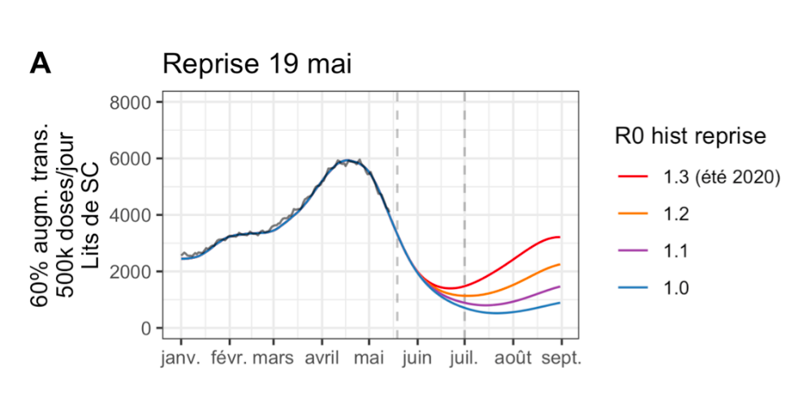
```

##### fig 3C

```{r 2021_05_21_fig_3C_original, echo=FALSE, out.width="500px"}
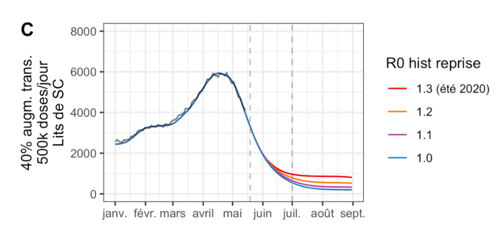
```

##### fig 3E

```{r 2021_05_21_fig_3E_original, echo=FALSE, out.width="500px"}
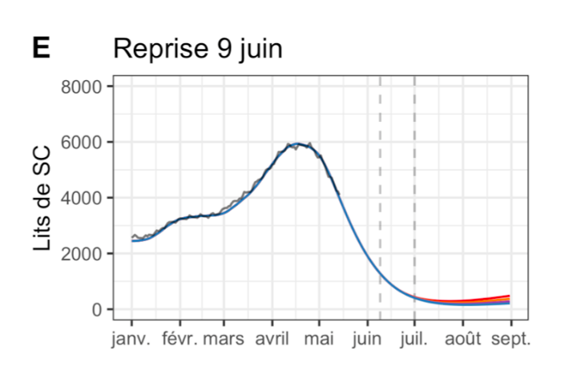
```

##### fig 3G

```{r 2021_05_21_fig_3G_original, echo=FALSE, out.width="500px"}
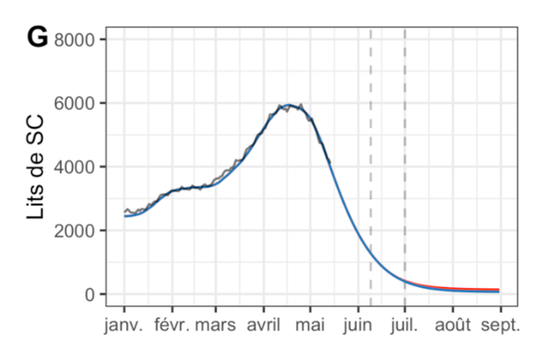
```


### July 26, 2021 {.tabset .tabset-fade .tabset-pills}

Source: [Pasteur report](https://modelisation-covid19.pasteur.fr/variant/Institut_Pasteur_Acceleration_vaccination_et_Delta_20210726.pdf){target="_blank"}, July 26, 2021. Identified on Pasteur Institute's website, on [this page](https://modelisation-covid19.pasteur.fr/realtime-analysis/delta-variant-dynamic/){target="_blank"}.

#### Reproduced 

```{r 2021_07_26_Pasteur_ICU_beds}
scenarios <- read_csv("source_data/2021_07_26/ICU.csv") %>%
  mutate(date = as.Date(date, format = "%Y/%m/%d", optional = T))

f_graph(
  reality_ICU_beds, scenarios, # reality and scenarios datasets
  "ICU_beds", # variable of interest
  "2021-07-26", 5000, #publication date label
  "2021-06-15", "2021-10-01", #date limits on x axis
  NA, # y axis limits
  "ICU beds", # y label
  "reality in data.gouv" # reality label
) 

# save data
temp <- f_prepare_to_save( scenarios,  reality_ICU_beds,  "ICU_beds")
f_save_csv_files(temp, output_path, "2021_07_26_ICU.csv")
```

#### Error

```{r}
# compute error and min med max scenarios
error <- f_compute_error("2021-07-15", "2021-10-10", temp, max_ICU_beds)

f_graph_error(
  error,
  "2021-07-26", 100 #publication date label
  )

f_save_csv_files(error, output_path_error, "2021_07_26_ICU_error.csv")
```

#### Original {.tabset .tabset-fade}

##### Fig 6 {.tabset .tabset-fade}

###### zoomed

```{r}
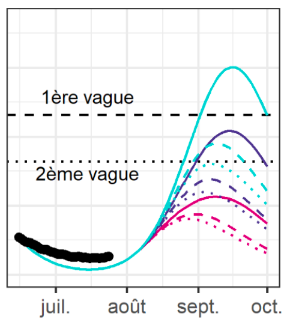
```

###### all

```{r 2021_07_26_fig6_original, echo=FALSE, out.width="500px"}
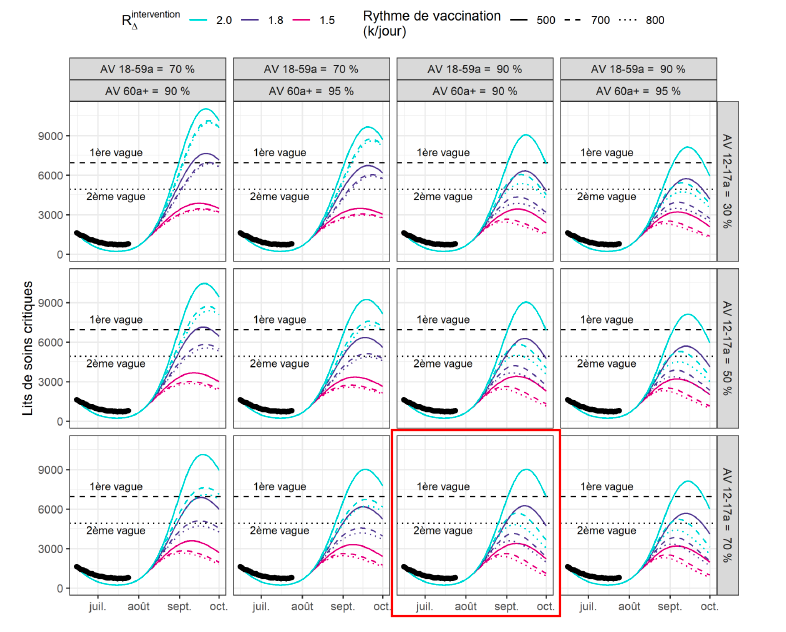
```

##### Fig 5 {.tabset .tabset-fade}

###### zoomed

```{r}
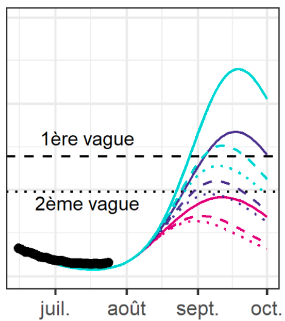
```

###### all

```{r 2021_07_26_fig5_original, echo=FALSE, out.width="500px"}
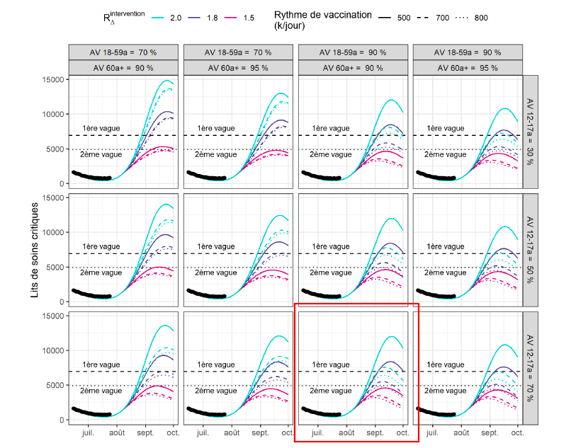
```


### August 5, 2021 {.tabset .tabset-fade .tabset-pills}

Source: [Pasteur report](https://modelisation-covid19.pasteur.fr/variant/InstitutPasteur_Dynamiques_regionales_des_hospitalisations_20210805.pdf){target="_blank"}, August 5, 2021. Identified on Pasteur Institute's website, on [this page](https://modelisation-covid19.pasteur.fr/realtime-analysis/delta-variant-dynamic/){target="_blank"}.

#### Reproduced

```{r 2021_08_05_Pasteur_ICU_beds}
# load scenarios
scenarios <- read_csv("source_data/2021_08_05/ICU.csv") %>%
  mutate(date = as.Date(date, format = "%Y/%m/%d", optional = T))

# graph comparison
f_graph(
  reality_ICU_beds, scenarios, # reality and scenarios datasets
  "ICU_beds",  # variable of interest
  "2021-08-05", 5000, #publication date label
  "2021-06-15", "2021-10-01", #date limits
  NA, # y axis limits
  "ICU beds", # y label
  "reality in data.gouv" # reality label
) 

# save data
temp <- f_prepare_to_save( scenarios,  reality_ICU_beds,  "ICU_beds")
f_save_csv_files(temp, output_path, "2021_08_05_ICU.csv")
```


#### Error

```{r}
# compute error and min med max scenarios
error <- f_compute_error("2021-07-15", "2021-10-10", temp, max_ICU_beds)

f_graph_error(
  error,
  "2021-08-05", 50 #publication date label
  )

f_save_csv_files(error, output_path_error, "2021_08_05_ICU_error.csv")
```

#### Original {.tabset .tabset-fade}

##### Fig F

```{r 20201_08_05_original, echo=FALSE, out.width="500px"}
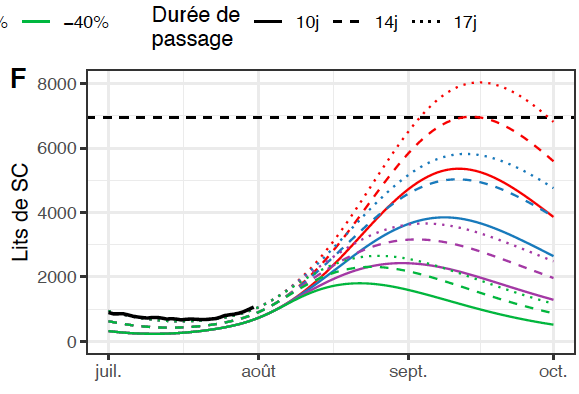
```


### January 7, 2022 {.tabset .tabset-fade .tabset-pills}

Source: [Pasteur report](https://modelisation-covid19.pasteur.fr/variant/InstitutPasteur_Complement_Analyse_Impact_Omicron_20220107_corrige.pdf){target="_blank"}, January 7, 2022. Identified on Pasteur Institute's website, on [this page](https://modelisation-covid19.pasteur.fr/realtime-analysis/omicron-variant-epidemic/){target="_blank"}.

#### Reproduced 

```{r 2022-01-07_ICU}
#load scenario
scenarios <- read_csv("source_data/2022_01_07/ICU_low_VE.csv") %>%
  mutate(date = as.Date(date, format = "%Y/%m/%d", optional = T))

# graph comparison
f_graph(
  reality_ICU_beds, scenarios, # reality and scenarios datasets
  "ICU_beds",  # variable of interest
  "2022-01-07", 1000, #publication date label
  "2021-12-01", "2022-04-01", #date limits
  NA, # y limits
  "ICU beds", # y label
  "reality in data.gouv" # reality label
)

# save data
temp <- f_prepare_to_save(scenarios, reality_ICU_beds, "ICU_beds")
f_save_csv_files(temp, output_path, "2022_01_07_ICU.csv")
```

#### Error

```{r}
# compute error and min med max scenarios
error <- f_compute_error("2021-12-01", "2022-04-01", temp, max_ICU_beds)

f_graph_error(
  error,
  "2022-01-07", 50 #publication date label
  )

f_save_csv_files(error, output_path_error, "2022_01_07_ICU_error.csv")
```

#### Original {.tabset .tabset-fade}

##### Figure 4 zoomed

```{r 2022_01_07_original_SC_zoom, echo=FALSE, out.width="500px"}
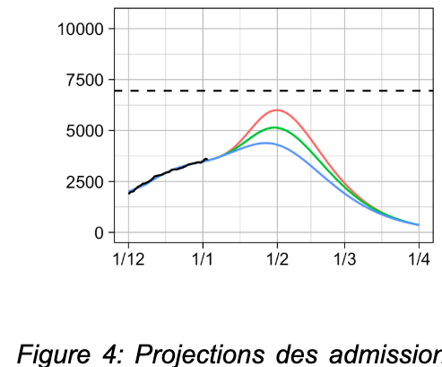
```

##### Figure 4 all

```{r 2022_01_07_original_SC, echo=FALSE, out.width="500px"}
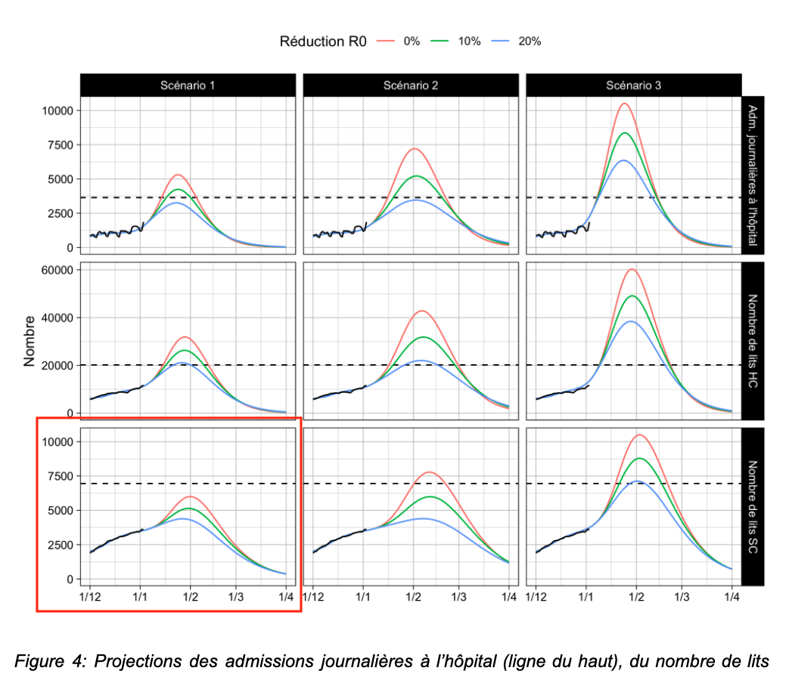
```


## Prepare Scenarios Hospitalizations

```{r output_path_for_corrected_hospital_scenarios}
# where prepared new hosp data is saved
output_path <- "output_data/extracted_data/new_hosp_scenarios/"
output_path_error <- "output_data/min_med_max_and_error/new_hosp_error/"
```

```{r reality_new_hosp_daily_to_weekly}
#some scenarios report data on weekly and not daily basis
#for reality dataset, transform daily data to weekly data, to compare to scenarios
temp2 <- reality_new_hosp_adm %>%
  select(date,new_hosp) %>%
  mutate(
    date = ISOweek(date),
    date = ISOweek2date(paste0(date, "-4"))
    ) %>%
  group_by(date) %>%
  summarise(new_hosp = sum(new_hosp, na.rm=T)) 
```


### January 16, 2021 {.tabset .tabset-fade .tabset-pills}

Source: [EPIcx report 26](https://www.epicx-lab.com/uploads/9/6/9/4/9694133/inserm_covid-19-voc_dominance-20210116.pdf){target="_blank"}, January 16, 2021. Identified on EPIcx lab [webpage](https://www.epicx-lab.com/covid-19-pandemic-response.html){target="_blank"}.

#### Reproduced

```{r 2021_01_16}
#careful, original data reported per week, have to transform it
scenarios <- read_csv("source_data/2021_01_16/new_hosp_weekly.csv")
scenarios$date <- paste0(scenarios$date, "-4") #add number 4 to date, fo "Wednesday"
scenarios$date <- ISOweek2date(scenarios$date) #transform weeks numbers into dates

#graph comparison
f_graph(
  temp2, scenarios, # reality and scenarios datasets
  "new_hosp", # variable of interest
  "2021-01-16", 1000, #publication date label
  "2020-10-01", "2021-05-01", #date limits on x axis
  NA, # y axis limits
  "weekly hospital admissions", # y label
  "reality in Paireau et al." # reality label
)

#prepare and save data
temp <- f_prepare_to_save(scenarios, temp2, "new_hosp")
temp <- temp %>% 
  mutate(across(-c(date), function(x) x/7)) %>% #weekly hosp transformed in daily hosp
  filter(date <= as.Date("2021-03-22")) #stop comparison before 3rd lockdown, on March 22nd

#since only 1 point per week, we linearly extrapolate missing days
temp <- left_join(
  #add missing days by join
  data_frame(date = seq(as.Date(min(temp$date)), max(temp$date), by="days")),
  temp, 
  by="date"
  ) %>%
  #linear extrapolation on missing values
  mutate(across(-date, ~na.approx(.x, na.rm=F)))

#save
f_save_csv_files(temp, output_path, "2021_01_16_new_hosp.csv")
```

#### Error

```{r}
#compute error and min med max scenarios
error <- f_compute_error("2020-10-01", "2021-05-01", temp, max_new_hosp)

f_graph_error(
  error,
  "2021-01-16", 50 #publication date label
  )

f_save_csv_files(error, output_path_error, "2021_01_16_new_hosp_error.csv")
```

#### Original {.tabset .tabset-fade}

##### Fig 1

```{r 2021_01_16_original, echo=FALSE, out.width="100%"}
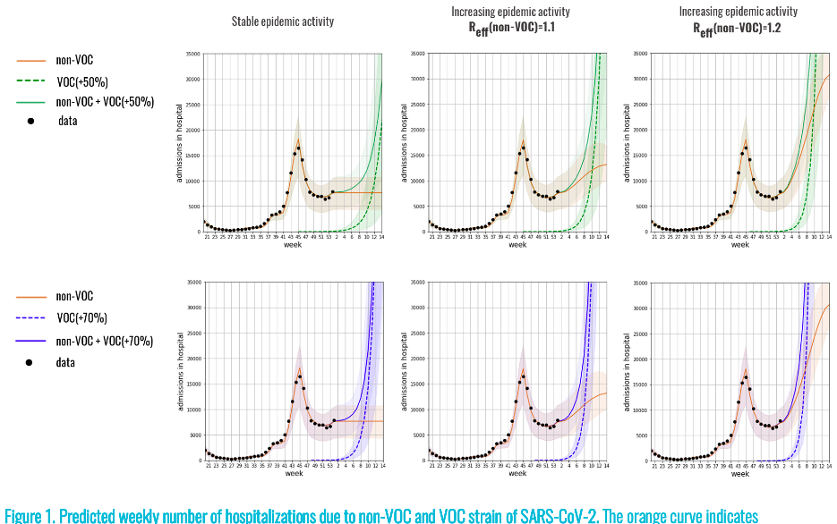
```


### February 2, 2021 {.tabset .tabset-fade .tabset-pills}

Source: [EPIcx report 28](https://www.epicx-lab.com/uploads/9/6/9/4/9694133/inserm-covid-19-voc-lockdown-20210202.pdf){target="_blank"}, February 2, 2021. Identified on EPIcx lab [webpage](https://www.epicx-lab.com/covid-19-pandemic-response.html){target="_blank"}.

#### Reproduced 

```{r 2021_02_02_EPIcx}
#careful, original data reported per week, have to transform it
scenarios <- read_csv("source_data/2021_02_02/new_hosp_weekly.csv")
scenarios$date <- paste0(scenarios$date, "-4") #add number 4 to date, fo "Wednesday"
scenarios$date <- ISOweek2date(scenarios$date) #transform weeks numbers into dates

#graph comparison
f_graph(
  temp2, scenarios, # reality and scenarios datasets
  "new_hosp", # variable of interest
  "2021-02-02", 1000, # publication date label
  "2020-10-01", "2021-05-01", # date limits x axis
  NA, # y axis limits
  "weekly hospital admissions", # y label
  "reality in Paireau et al." # reality label
)

#prepare to save data
temp <- f_prepare_to_save(scenarios, temp2, "new_hosp")

#date limits of comparison
temp <- temp %>% mutate(across(-c(date), function(x) x/7)) %>% #weekly hosp transformed in daily hosp
    filter(date <= as.Date("2021-03-22")) #stop comparison before 3rd lockdown, on March 22nd

#since only 1 point per week, we linearly extrapolate missing days
temp <- left_join(
  #add missing days by join
  data_frame(date = seq(as.Date(min(temp$date)), max(temp$date), by="days")),
  temp, 
  by="date"
  ) %>%
  #linear extrapolation on missing values
  mutate(across(-date, ~na.approx(.x, na.rm=F)))

#save
f_save_csv_files(temp, output_path, "2021_02_02_new_hosp.csv")
```


#### Error

```{r}
error <- f_compute_error("2020-10-01", "2021-05-01", temp, max_new_hosp)

f_graph_error(
  error,
  "2021-02-02", 50 #publication date label
  )

f_save_csv_files(error, output_path_error, "2021_02_02_new_hosp_error.csv")
```

#### Original {.tabset .tabset-fade}

##### Fig 2

```{r 2021_02_02_original, echo=FALSE, out.width="100%"}
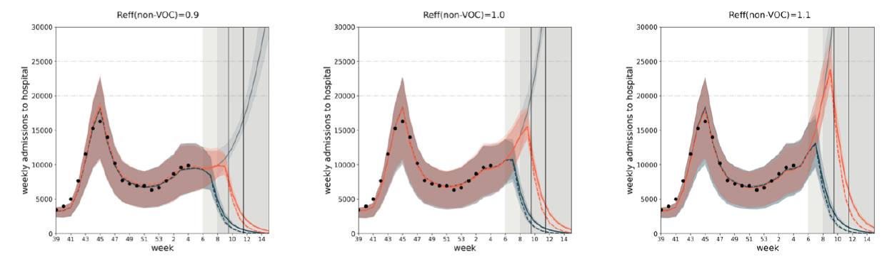
```


### February 8, 2021 {.tabset .tabset-fade .tabset-pills}

Source: [Pasteur report](https://modelisation-covid19.pasteur.fr/variant/RapportInstitutPasteur_variants_8fevrier2021.pdf){target="_blank"}, February 8, 2021. Identified on Pasteur Institute's website, on [this page](https://modelisation-covid19.pasteur.fr/realtime-analysis/impact-variant/){target="_blank"}.

#### Reproduced {.tabset .tabset-fade}

```{r 2021_02_08_Pasteur}
#load data
scenarios <- read_csv("source_data/2021_02_08/new_hosp.csv") %>%
  mutate(date = as.Date(date, format = "%Y/%m/%d", optional = T))

#graph comparison
f_graph(
  reality_new_hosp_adm, scenarios, # datasets reality and scenarios
  "new_hosp_smooth", # variable of interest
  "2021-02-08", 5000, # publication date label
  "2021-01-01", "2021-06-01", # date limits
  NA, # y axis limits
  "daily hospital admissions", # y label
  "reality in Paireau et al." # reality label
) +
  geom_line( # add unsmoothed new hosp
    data=reality_new_hosp_adm, aes(date, new_hosp), alpha=.4, color="red"
  )

#prepare corrected data to save
temp <- f_prepare_to_save(
  scenarios %>% filter(date <= as.Date("2021-03-22")), #stop comparison before 3rd lockdown, on March 22nd
  reality_new_hosp_adm %>% select(date, new_hosp_smooth),
  "new_hosp_smooth"
  )

#save
f_save_csv_files(temp, output_path, "2021_02_08_new_hosp.csv")
```


#### Error

```{r}
error <- f_compute_error("2021-01-01", "2021-03-27", temp, max_new_hosp)

f_graph_error(
  error,
  "2021-02-08", 50 #publication date label
  )

f_save_csv_files(error, output_path_error, "2021_02_08_new_hosp_error.csv")
```

#### Original {.tabset .tabset-fade}

##### Fig 2A

```{r 2021_02_08_fig_2_original, echo=FALSE, out.width="500px"}
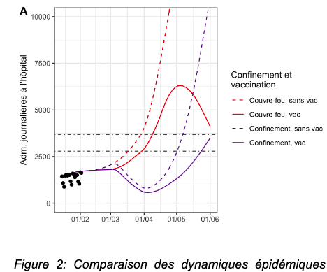
```

##### Fig 6A

```{r 2021_02_08_fig_6_original, echo=FALSE, out.width="500px"}
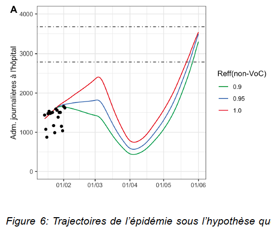
```

##### Fig 7C

```{r 2021_02_08_fig_7_original, echo=FALSE, out.width="100%"}
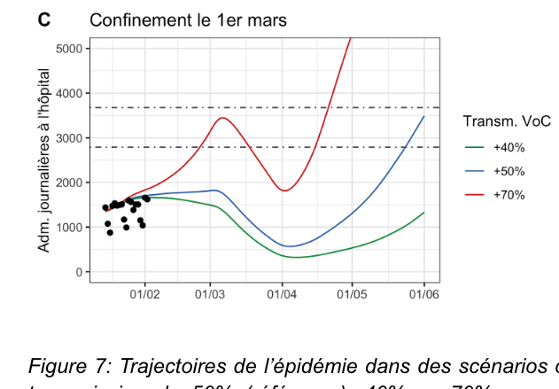
```


### February 14, 2021 {.tabset .tabset-fade .tabset-pills}

Source: [EPIcx report 29](https://www.epicx-lab.com/uploads/9/6/9/4/9694133/inserm_covid-19-voc_socialdistancing-20210214.pdf){target="_blank"}, February 14, 2021. Identified on EPIcx lab [webpage](https://www.epicx-lab.com/covid-19-pandemic-response.html){target="_blank"}.

#### Reproduced 

```{r 2021_02_14_EPIcx}
#careful, original data reported per week, have to transform it
scenarios <- read_csv("source_data/2021_02_14/new_hosp_weekly.csv")
scenarios$date <- paste0(scenarios$date, "-4") #add number 4 to date, fo "Wednesday"
scenarios$date <- ISOweek2date(scenarios$date) #transform weeks numbers into dates

#graph comparison
f_graph(
  temp2, scenarios, # reality and scenarios datasets
  "new_hosp", # variable of interest
  "2021-02-14", 1000, #publication date label
  "2020-10-01", "2021-05-01", #date limits
  NA, # y limits
  "weekly hospital admissions", # y label
  "reality in Paireau et al." # reality label
)

#prepare to save data
temp <- f_prepare_to_save(scenarios, temp2, "new_hosp")

#date limits of comparison
temp <- temp %>% mutate(across(-c(date), function(x) x/7)) %>% #weekly hosp transformed in daily hosp
    filter(date <= as.Date("2021-03-22")) #stop comparison before 3rd lockdown, on March 22nd

#since only 1 point per week, we linearly extrapolate missing days
temp <- left_join(
  #add missing days by join
  data_frame(date = seq(as.Date(min(temp$date)), max(temp$date), by="days")),
  temp, 
  by="date"
  ) %>%
  #linear extrapolation on missing values
  mutate(across(-date, ~na.approx(.x, na.rm=F)))

#save
f_save_csv_files(temp, output_path, "2021_02_14_new_hosp.csv")
```


#### Error

```{r}
error <- f_compute_error("2020-10-01", "2021-05-01", temp, max_new_hosp)

f_graph_error(
  error,
  "2021-02-02", 50 #publication date label
  )

f_save_csv_files(error, output_path_error, "2021_02_14_new_hosp_error.csv")
```

#### Original {.tabset .tabset-fade}

##### Fig 2

```{r 2021_02_14_original, echo=FALSE, out.width="100%"}
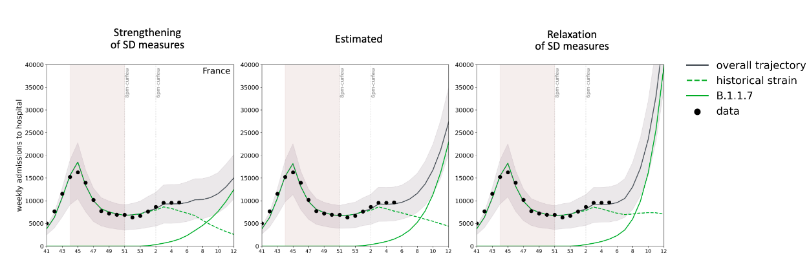
```


### February 23, 2021 {.tabset .tabset-fade .tabset-pills}

Source: [Pasteur report](https://hal-pasteur.archives-ouvertes.fr/pasteur-03149525/document){target="_blank"}, February 23, 2021. Identified on Pasteur Institute's website, on [this page](https://modelisation-covid19.pasteur.fr/realtime-analysis/impact-variant/){target="_blank"}.

#### Reproduced 

```{r 2021_02_23_Pasteur}
#load scenario data
scenarios <- read_csv("source_data/2021_02_23/new_hosp.csv") %>%
  mutate(date = as.Date(date, format = "%Y/%m/%d", optional = T))

f_graph(
  reality_new_hosp_adm, scenarios, 
  "new_hosp_smooth", 
  "2021-02-23", 3000, #publication date label
  "2021-01-15", "2021-07-01", #date limits
  NA, # y limits
  "daily hospital admissions",
  "reality in Paireau et al."
) 

#prepare and save data
temp <- f_prepare_to_save(
  scenarios, 
  reality_new_hosp_adm %>% select(date, new_hosp_smooth), 
  "new_hosp_smooth"
  )
temp <- temp %>% filter(date <= as.Date("2021-03-22")) #stop comparison before 3rd lockdown, on March 22nd
f_save_csv_files(temp, output_path, "2021_02_23_new_hosp.csv")
```

#### Error

```{r}
error <- f_compute_error("2021-01-16", "2021-03-27", temp, max_new_hosp)

f_graph_error(
  error,
  "2021-02-23", 15 #publication date label
  )

f_save_csv_files(error, output_path_error, "2021_02_23_new_hosp_error.csv")
```

#### Original {.tabset .tabset-fade}

##### Fig 2C

```{r 2021_02_23__fig2_original, echo=FALSE, out.width="80%"}
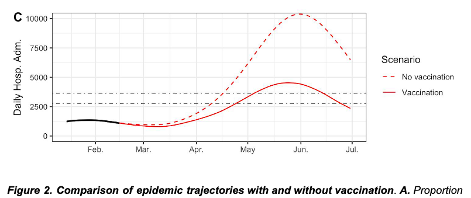
```

##### Fig 5A, 5C and 5E

```{r 2021_02_23_fig_5_original, echo=FALSE, out.width="500px"}
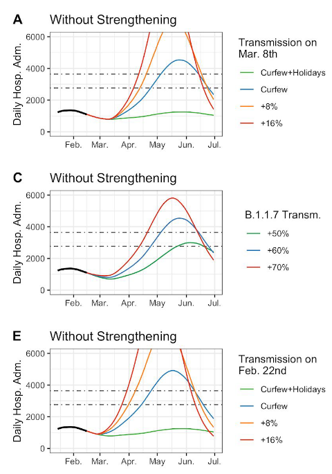
```


### April 26, 2021 {.tabset .tabset-fade .tabset-pills}

Source: [Pasteur report](https://modelisation-covid19.pasteur.fr/loosening/Scenarios_de_levee_des_mesures_de_freinage_20210426.pdf){target="_blank"}, April 26, 2021. Identified on Pasteur Institute's website, on [this page](https://modelisation-covid19.pasteur.fr/realtime-analysis/delta-variant-dynamic/){target="_blank"}.

#### Reproduced 

```{r 2021_04_26_Pasteur}
#load scenarios
scenarios <- read_csv("source_data/2021_04_26/new_hosp.csv") %>%
  mutate(date = as.Date(date, format = "%Y/%m/%d", optional = T))

#graph comparison
f_graph(
  reality_new_hosp_adm, scenarios, 
  "new_hosp_smooth",
  "2021-04-26", 1000, #publication date label
  "2021-01-15", "2021-07-01", #date limits
  NA, # y limits
  "daily hospital admissions", 
  "reality in Paireau et al."
) +
  geom_line(
    data=reality_new_hosp_adm, aes(date, new_hosp), alpha=.4, color="red"
  )  +
  ylim(0, 2000)

#prepare data so save
temp <- f_prepare_to_save(
  scenarios, 
  reality_new_hosp_adm %>% select(date, new_hosp_smooth), 
  "new_hosp_smooth"
  )

#comparison dates limits
temp <- temp %>% filter(date<=as.Date("2021-06-15")) #stop comparison mid-June before delta variant dominant

#save data
f_save_csv_files(temp, output_path, "2021_04_26_new_hosp.csv")
```

#### Error

```{r}
error <- f_compute_error("2021-03-15", "2021-06-15", temp, max_new_hosp)

f_graph_error(error,
 "2021-04-26", 30 #publication date label
  )
f_save_csv_files(error, output_path_error, "2021_04_26_new_hosp_error.csv")
```

#### Original {.tabset .tabset-fade}

##### Fig 3B and 3D

```{r 2021_04_26_original, echo=FALSE, out.width="500px"}
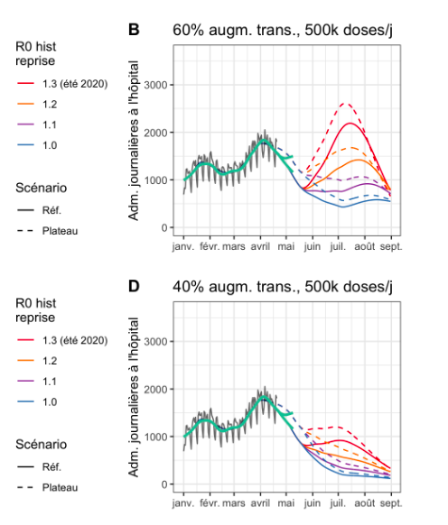
```


### May 21, 2021 {.tabset .tabset-fade .tabset-pills}

Source: [Pasteur report](https://modelisation-covid19.pasteur.fr/loosening/Mise_a_jour_scenarios_de_levee_des_mesures_de_freinage_20210521.pdf){target="_blank"}, May 21, 2021. Identified on Pasteur Institute's website, on [this page](https://modelisation-covid19.pasteur.fr/realtime-analysis/delta-variant-dynamic/){target="_blank"}.

#### Reproduced 

```{r 2021_05_21_Pasteur_new_hosp}
scenarios <- read_csv("source_data/2021_05_21/new_hosp.csv") %>%
  mutate(date = as.Date(date, format = "%Y/%m/%d", optional = T))

f_graph(
  reality_new_hosp_adm, scenarios, 
  "new_hosp_smooth",
  "2021-05-21", 2500, #publication date label
  "2021-01-15", "2021-06-30", #date limits
  NA, # y limits
  "daily hospital admissions", 
  "reality in Paireau et al."
) +
  geom_line(data = reality_new_hosp_adm, aes(date, new_hosp), alpha=.4, color="red")

#prepare data
temp <- f_prepare_to_save(
  scenarios, 
  reality_new_hosp_adm %>% select(date, new_hosp_smooth), 
  "new_hosp_smooth"
  )
temp <- temp %>% filter(date<=as.Date("2021-06-15")) #stop comparison mid-June before delta variant dominant 

#save data
f_save_csv_files(temp, output_path, "2021_05_21_new_hosp.csv")
```

#### Error

```{r}
error <- f_compute_error("2021-03-15", "2021-06-15", temp, max_new_hosp)

f_graph_error(
  error,
  "2021-05-21", 10 #publication date label
  )

f_save_csv_files(error, output_path_error, "2021_05_21_new_hosp_error.csv")
```

#### Original {.tabset .tabset-fade}

##### fig 1A

```{r 2021_05_21_fig_1A_original, echo=FALSE, out.width="500px"}
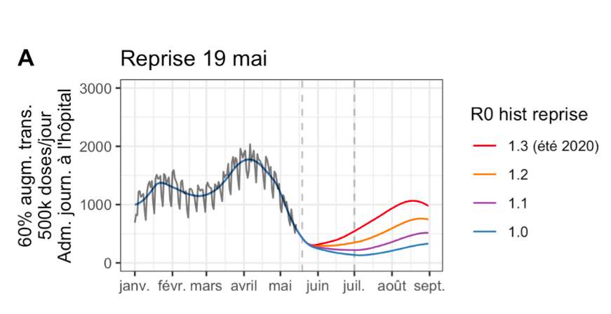
```

##### fig 1C

```{r 2021_05_21_fig_1C_original, echo=FALSE, out.width="500px"}
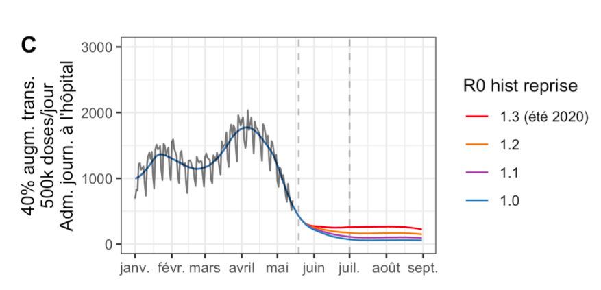
```

##### fig 1E

```{r 2021_05_21_fig_1E_original, echo=FALSE, out.width="500px"}
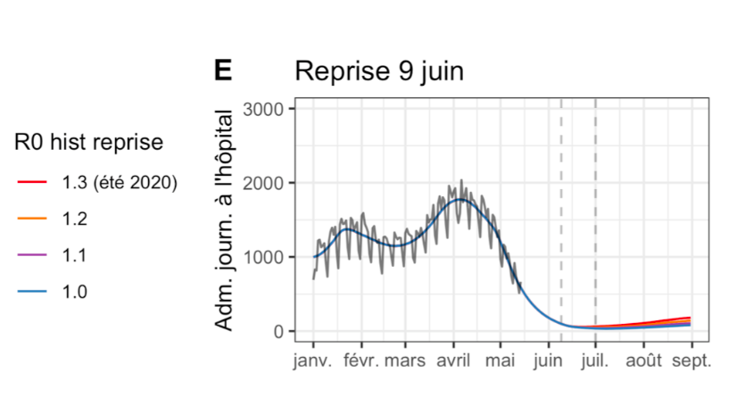
```

##### fig 1G

```{r 2021_05_21_fig_1G_original, echo=FALSE, out.width="500px"}
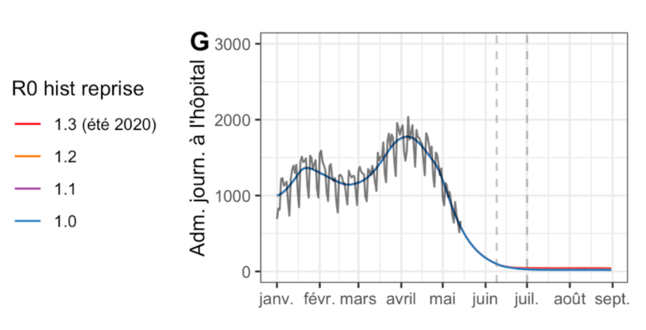
```


### July 26, 2021 {.tabset .tabset-fade .tabset-pills}

Source: [Pasteur report](https://modelisation-covid19.pasteur.fr/variant/Institut_Pasteur_Acceleration_vaccination_et_Delta_20210726.pdf){target="_blank"}, July 26, 2021. Identified on Pasteur Institute's website, on [this page](https://modelisation-covid19.pasteur.fr/realtime-analysis/delta-variant-dynamic/){target="_blank"}.

#### Reproduced 

```{r 2021_07_26_Pasteur_new_hosp}
#load scenarios
scenarios <- read_csv("source_data/2021_07_26/new_hosp.csv") %>%
  mutate(date = as.Date(date, format = "%Y/%m/%d", optional = T))

#graph comparison
f_graph(
  reality_new_hosp_adm, scenarios, 
  "new_hosp_smooth",
  "2021-07-26", 3500, #publication date label
  "2021-06-15", "2021-10-01", #date limits
  NA, # y limits
  "daily hospital admissions", 
  "reality"
)

#prepare and save data
temp <- f_prepare_to_save(scenarios, reality_new_hosp_adm, "new_hosp_smooth")
f_save_csv_files(temp, output_path, "2021_07_26_new_hosp.csv")
```

#### Error

```{r}
error <- f_compute_error("2021-07-15", "2021-10-10", temp, max_new_hosp)

f_graph_error(
  error,
  "2021-07-26", 50 #publication date label
  )

f_save_csv_files(error, output_path_error, "2021_07_26_new_hosp_error.csv")
```

#### Original {.tabset .tabset-fade}

##### Fig 3 zoomes 

```{r}
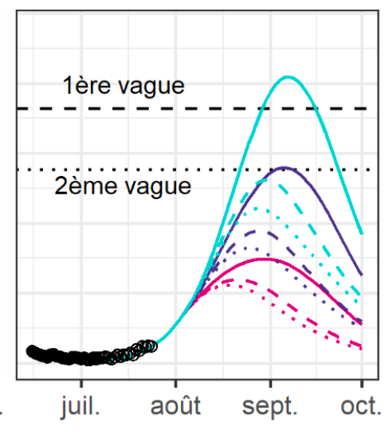
```

##### Fig 3 all

```{r}
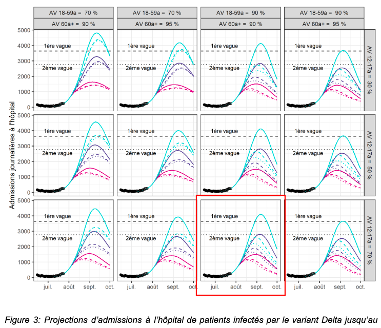
```


### August 5, 2021 {.tabset .tabset-fade .tabset-pills}

Source: [Pasteur report](https://modelisation-covid19.pasteur.fr/variant/InstitutPasteur_Dynamiques_regionales_des_hospitalisations_20210805.pdf){target="_blank"}, August 5, 2021. Identified on Pasteur Institute's website, on [this page](https://modelisation-covid19.pasteur.fr/realtime-analysis/delta-variant-dynamic/){target="_blank"}.

#### Reproduced 

```{r 2021_08_05_Pasteur_new_hosp}
#load scenario
scenarios <- read_csv("source_data/2021_08_05/new_hosp.csv") %>%
  mutate(date = as.Date(date, format = "%Y/%m/%d", optional = T))

#graph comparison
f_graph(
  reality_new_hosp_adm, scenarios, 
  "new_hosp_smooth",
  "2021-08-05", 1500, #publication date label
  "2021-06-15", "2021-10-01", #date limits
  NA, # y limits
  "daily hospital admissions", 
  "reality"
) 

#prepare and save data
temp <- f_prepare_to_save(scenarios, reality_new_hosp_adm, "new_hosp_smooth")
f_save_csv_files(temp, output_path, "2021_08_05_new_hosp.csv")
```

#### Error

```{r}
error <- f_compute_error("2021-07-15", "2021-10-10", temp, max_new_hosp)

f_graph_error(
  error,
  "2021-08-05", 50 #publication date label
  )

f_save_csv_files(error, output_path_error, "2021_08_05_new_hosp_error.csv")
```

#### Original {.tabset .tabset-fade}

##### Fig A

```{r 20201_08_05_original_A, echo=FALSE, out.width="500px"}
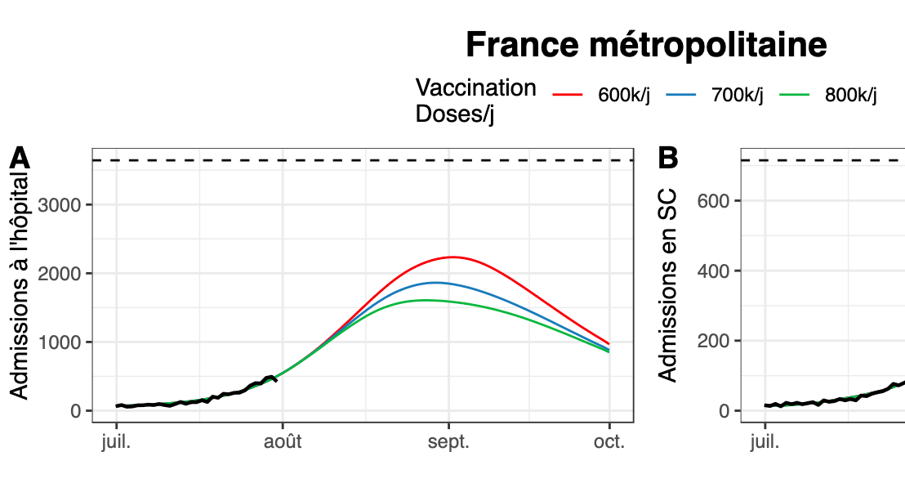
```

##### Fig C

```{r 20201_08_05_original_C, echo=FALSE, out.width="500px"}
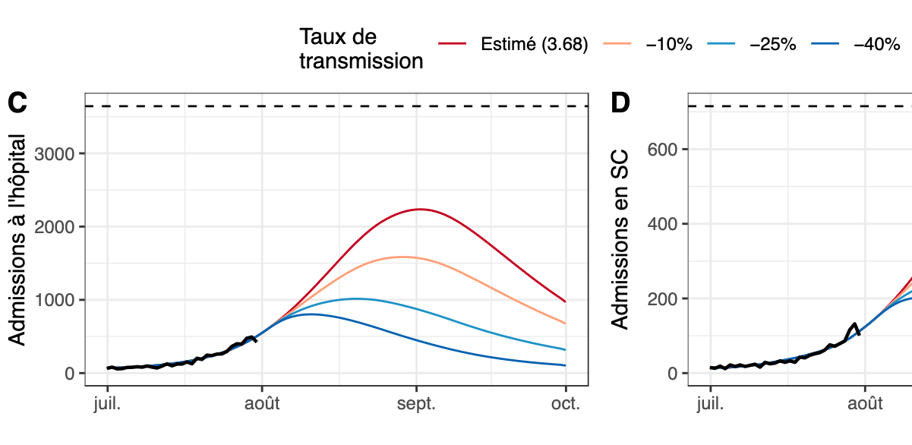
```


### October 4, 2021 {.tabset .tabset-fade .tabset-pills}

Source: [Pasteur report](https://modelisation-covid19.pasteur.fr/scenarios/InstitutPasteur_scenariosCOVID19AutomneHiver_2021.pdf){target="_blank"}, October 4, 2021. Identified on Pasteur Institute's website, on [this page](https://modelisation-covid19.pasteur.fr/realtime-analysis/fall-winter-scenarios/){target="_blank"}.

#### Reproduced 

```{r 2021-10-10 Pasteur}
#load scenarios
scenarios <- read_csv("source_data/2021_10_04/new_hosp.csv") %>%
  mutate(date = as.Date(date, format = "%Y/%m/%d", optional = T))

#graph comparison
f_graph(
  reality_new_hosp_adm, scenarios, 
  "new_hosp_smooth",
  "2021-10-04", 1000, #publication date label
  "2021-07-01", "2022-01-01", #date limits
  NA, # y limits
  "daily hospital admissions beds", 
  "reality"
)

#prepare and save data
temp <- f_prepare_to_save(scenarios, reality_new_hosp_adm, "new_hosp_smooth")
temp <- temp %>% filter(date <= as.Date("2021-12-15")) #stop comparison before Omicron dominance in mid-December
f_save_csv_files(temp, output_path, "2021_10_04_new_hosp.csv")
```

#### Error

```{r}
error <- f_compute_error("2021-09-15", "2021-12-20", temp, max_new_hosp)

f_graph_error(
  error,
  "2021-10-04", -10 #publication date label
  )

f_save_csv_files(error, output_path_error, "2021_10_04_new_hosp_error.csv")
```

#### Original {.tabset .tabset-fade}

##### Fig 9

```{r 2021_10_04_original, echo=FALSE, out.width="500px"}
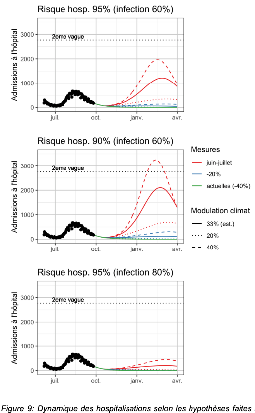
```


### January 7, 2022 {.tabset .tabset-fade .tabset-pills}

Source: [Pasteur report](https://modelisation-covid19.pasteur.fr/variant/InstitutPasteur_Complement_Analyse_Impact_Omicron_20220107_corrige.pdf){target="_blank"}, January 7, 2022. Identified on Pasteur Institute's website, on [this page](https://modelisation-covid19.pasteur.fr/realtime-analysis/omicron-variant-epidemic/){target="_blank"}.

#### Reproduced 

```{r 2022-01-07_new_hosp}
#load data
scenarios <- read_csv("source_data/2022_01_07/new_hosp_low_VE.csv") %>%
  mutate(date = as.Date(date, format = "%Y/%m/%d", optional = T))

#graph comparison
f_graph(
  reality_new_hosp_adm, scenarios, 
  "new_hosp_smooth",
  "2022-01-07", 3500, #publication date label
  "2021-12-01", "2022-04-01", #date limits
  NA, # y limits
  "daily new hospital admissions", 
  "reality"
) + 
  geom_line(
    data = reality_new_hosp_adm,
    aes(date, new_hosp), alpha = .4, color = "red"
  )

#prepare and save data
temp <- f_prepare_to_save(scenarios, reality_new_hosp_adm, "new_hosp_smooth")
f_save_csv_files(temp, output_path, "2022_01_07_new_hosp.csv")
```

#### Error

```{r}
error <- f_compute_error("2021-12-01", "2022-04-01", temp, max_new_hosp)

f_graph_error(
  error,
  "2022-01-07", 50 #publication date label
  ) +
  xlim(as.Date(NA), as.Date("2022-02-15")) #we do not have reality data past Feb 11

f_save_csv_files(error, output_path_error, "2022_01_07_new_hosp_error.csv")
```


#### Original {.tabset .tabset-fade}

##### Figure 4 zoomed

```{r 2022_01_07_original_new_hosp_zoom, echo=FALSE, out.width="500px"}
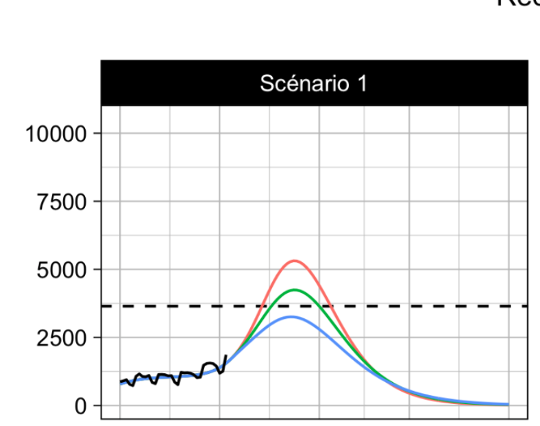
```

##### Figure 4 all

```{r 2022_01_07_original_new_hosp, echo=FALSE, out.width="500px"}
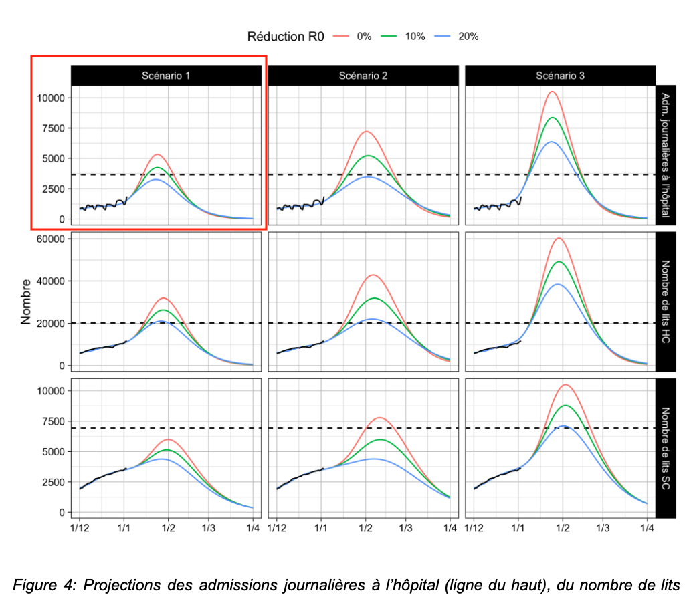
```


```{r}
#remove temporary variables
rm(error, temp, temp2, scenarios)
```


# Results

## All reports grouped {.tabset .tabset-fade .tabset-pills}

```{r combine_all_scenarios_data}
path_source <- "output_data/extracted_data/"

#combine all ICU scenarios data for whole France
data_ICU_beds <- bind_rows(lapply(
  c("2020_10_30", "2021_05_21", "2021_07_26", "2021_08_05", "2022_01_07"), 
  f_read_ICU
  ))

#combine all new scenarios hosp data for whole France
data_new_hosp <- bind_rows(lapply(
  c("2021_01_16", "2021_02_02", "2021_02_08", "2021_02_14", "2021_02_23", "2021_04_26", "2021_05_21", "2021_07_26", "2021_08_05", "2021_10_04", "2022_01_07"), 
  f_read_new_hosp
  ))

# compute error relative to max ICU occupancy or max new hosp admissions  (used for colored scenarios in graph)
data_ICU_beds <- f_gather_scenarios_compute_relative_error(data_ICU_beds, max_ICU_beds)
data_new_hosp <- f_gather_scenarios_compute_relative_error(data_new_hosp, max_new_hosp)

# remove scenarios data before report publication date; remove empty values
data_ICU_beds <- data_ICU_beds %>%
  group_by(report) %>%
  filter(
    date>=as.Date(report),
    is.na(value)==F
    )
data_new_hosp <- data_new_hosp %>%
  group_by(report) %>%
  filter(
    date>=as.Date(report),
    is.na(value)==F
    )
```

```{r}
# min and max dates of 1st wave and scenarios period, for the limits of the 2 different panes on graph
date_first_wave_min <- min(reality_ICU_beds$date)
date_first_wave_max <- as.Date("2020-06-01")
date_scenarios_min <- min(data_ICU_beds$date)
date_scenarios_max <- max(data_ICU_beds$date)

# for the relative width of the 2 panes
first_wave_duration <- as.numeric(date_first_wave_max-date_first_wave_min)
scenarios_duration <- as.numeric(date_scenarios_max-date_scenarios_min)
first_wave_rel_duration <- first_wave_duration /(first_wave_duration+scenarios_duration)
scenarios_rel_duration <- scenarios_duration /(first_wave_duration+scenarios_duration)
```


### ICU

```{r graph_all_ICU}
# get max error for color scale
max_error <- max(data_ICU_beds$error, na.rm = T)

# collect dates of the reports and number of reports (used for x axis)
report_dates_ICU <- data_frame(
  report = unique(as.Date(data_ICU_beds$report)), # dates of reports
  place = report # to localize on x axis
)
n_reports <- as.numeric(nrow(report_dates_ICU))
  
#reorder and rename report names in more explicit dates
data_ICU_beds <- data_ICU_beds %>%
  mutate(
    report_date = report,
    report = format(as.Date(report_date), format="%b %d, %Y")
  )
data_ICU_beds$report <- factor(
  data_ICU_beds$report,
  levels = c(
    "Oct 30, 2020", 
    "May 21, 2021", 
    "Jul 26, 2021", 
    "Aug 05, 2021", 
    "Jan 07, 2022"
  )
)
#small offset to position summer 2021 reports because they are too close
report_dates_ICU$place[report_dates_ICU$place=="2021-07-26"] <- report_dates_ICU$place[report_dates_ICU$place=="2021-07-26"]-10
report_dates_ICU$place[report_dates_ICU$place=="2021-08-05"] <- report_dates_ICU$place[report_dates_ICU$place=="2021-08-05"]+3
```

```{r all_ICU_beds_graph}
# pane of reality data only for 1st wave to show peak
g1_first_wave <- ggplot(reality_ICU_beds %>% filter(date<date_first_wave_max)) +
  
  #1st lockdown
  #annotate(geom = "rect", xmin = as.Date("2020-03-17"), xmax = as.Date("2020-05-11"), ymin = -Inf, ymax=Inf, alpha=.2) +
  
  # line of real ICU beds occupancy
  geom_line(
    aes(date, ICU_beds, linetype="reality")
    ) +
  # horizontal line showing max ICU occupancy
  geom_hline(
    yintercept = max_ICU_beds, linetype="dashed"
    ) +
  # and its annotation
  annotate(
    'text', x = as.Date("2020-03-05"), y = max_ICU_beds, label = "1st wave\npeak in\nApril 2020", 
    color = "black", fontface = "italic", family = "Times New Roman", vjust=-.2, hjust=0
    ) +
  # other graph parameters
  theme(
    legend.position = "none",
    axis.text.x = element_blank(),
    axis.ticks.x = element_blank()
    ) +
  coord_cartesian(
    expand=F, xlim = c(date_first_wave_min,NA), ylim = c(0, NA)
    )  +
  labs(
    x = element_blank(),
    y = "ICU beds\noccupied by COVID patients"
    ) 

# pane of scenarios vs reality
g1_scenarios <- ggplot(data_ICU_beds) +
  
  #2nd lockdown
  #annotate(geom = "rect", xmin = as.Date("2020-10-30"), xmax = as.Date("2020-12-15"), ymin = -Inf, ymax=Inf, alpha=.2) +
  
  #3rd lockdown
  #annotate(geom = "rect", xmin = as.Date("2021-03-19"), xmax = as.Date("2021-05-03"), ymin = -Inf, ymax=Inf, alpha=.2) +
  
  #curfew
  #annotate(geom = "segment", x = as.Date("2020-12-15"), xend = as.Date("2021-06-20"), y = 12000, yend=12000) +
  #annotate(geom="text", x = as.Date("2020-12-15"), y = 12000, label = "national curfew", color = "black", fontface = "italic", family = "Times New Roman", vjust=0, hjust=0) +
  
  #dates of reports on x axis
  geom_rug(
    data = report_dates_ICU, aes(report)
    ) +
  scale_x_continuous(
    breaks=report_dates_ICU$place,
    labels=format(report_dates_ICU$report, format="%b %d, %Y")
    ) +
  
  # scenarios curves and their colors
  geom_line(
    aes(date, value, group=interaction(scenario_type, report), color=abs(error)), 
    linewidth=1.5
    ) +
  scale_colour_stepsn(
    colours = c("green", "orange", "red", "purple"), 
    values = c(0, 15, 30, 100, round(max_error))/max_error,
    breaks = c(0, 15, 30, 100, round(max_error)),
    labels = c("0%", "± 15%", "± 30%", "± 100%", ""),
  ) +
  
  # reality curve
  geom_line(
    data=reality_ICU_beds %>% filter(date>date_scenarios_min-15), 
    aes(date, ICU_beds, linetype="reality")) +
  
  # annotation 1st wave peak in France
  geom_hline(
    yintercept = max_ICU_beds, linetype="dashed"
    ) +
  
  # other parameters
  theme(
    axis.text.x = element_text(angle = 45, hjust=1),
    axis.ticks.x=element_blank(),
    axis.line.y = element_blank(),
    axis.text.y = element_blank(),
    axis.ticks.y = element_blank()
    ) +
  coord_cartesian(
    expand=F, xlim = c(date_scenarios_min-15,NA), ylim = c(0, NA)
    )  +
  labs(
    x = paste("publication dates of the", n_reports, "reports"),
    y=element_blank(), x=element_blank(),
    color=" error of scenario\n  as % of\n 1st wave peak",
    linetype= element_blank()
    )
```

```{r}
# combination of the 2 panes
g1 <- g1_first_wave + g1_scenarios +
  plot_layout(widths = c(first_wave_rel_duration, scenarios_rel_duration)) & 
  ylim(0, 12500)  
g1

#save
f_save_graph_pdf_png(
  "../graphs/raw_comparisons/all_ICU_scenarios_reality",
  7, 4, dpi_resolution
)
```


### New hospitalizations

```{r prepare_all_new_hosp}
#max error for color scale
max_error <- max(data_new_hosp$error, na.rm = T)

#date of the reports
report_dates_hosp <- data_frame(
  report = unique(as.Date(data_new_hosp$report)),
  place = report #to localize on x axis
)
#number of reports
n_reports <- as.numeric(nrow(report_dates_hosp))

data_new_hosp <- data_new_hosp %>%
  mutate(
    report_date = report,
    report = format(as.Date(report_date), format="%b %d, %Y")
  )

#reorder report and rename them with more explicit date
data_new_hosp$report <- factor(
  data_new_hosp$report,
  levels = c(
    "Jan 16, 2021",
    "Feb 02, 2021", 
    "Feb 08, 2021", 
    "Feb 14, 2021",
    "Feb 23, 2021", 
    "Apr 26, 2021", 
    "May 21, 2021",
    "Jul 26, 2021", 
    "Aug 05, 2021", 
    "Oct 04, 2021",
    "Jan 07, 2022"
  )
)

#small offset to position summer 2021 reports
report_dates_hosp$place[report_dates_hosp$place=="2021-07-26"] <- report_dates_hosp$place[report_dates_hosp$place=="2021-07-26"]-5
report_dates_hosp$place[report_dates_hosp$place=="2021-08-05"] <- report_dates_hosp$place[report_dates_hosp$place=="2021-08-05"]+5
#small offset to position winter 2021 reports
report_dates_hosp$place[report_dates_hosp$place=="2021-01-16"] <- report_dates_hosp$place[report_dates_hosp$place=="2021-01-16"]-10
report_dates_hosp$place[report_dates_hosp$place=="2021-02-02"] <- report_dates_hosp$place[report_dates_hosp$place=="2021-02-02"]-10
report_dates_hosp$place[report_dates_hosp$place=="2021-02-08"] <- report_dates_hosp$place[report_dates_hosp$place=="2021-02-08"]-1
report_dates_hosp$place[report_dates_hosp$place=="2021-02-14"] <- report_dates_hosp$place[report_dates_hosp$place=="2021-02-14"]+8
report_dates_hosp$place[report_dates_hosp$place=="2021-02-23"] <- report_dates_hosp$place[report_dates_hosp$place=="2021-02-23"]+15

# min and max dates of 1st wave and scenarios period, for the 2 different panes on graph
# date_first_wave_min <- min(reality_new_hosp_adm$date)
# date_first_wave_max <- as.Date("2020-06-01")
# date_scenarios_min <- min(data_new_hosp$date)
# date_scenarios_max <- max(data_new_hosp$date)
```

```{r all_new_hosp_graph}
#plot 1st wave
g2_first_wave <- ggplot(reality_new_hosp_adm %>% filter(date<date_first_wave_max)) +
  geom_line(
    aes(date, new_hosp_smooth, linetype="reality")
    ) +
  geom_line(
    aes(date, new_hosp), alpha=.2
    ) +
  geom_hline(
    yintercept = max_new_hosp, linetype="dashed"
    ) +
  theme(
    legend.position = "none",
    axis.text.x = element_blank(),
    axis.ticks.x = element_blank()
    ) +
  coord_cartesian(
    expand=F, xlim = c(date_first_wave_min,NA), ylim = c(0, NA)
    )  +
  labs(
    x = element_blank(),
    y = "daily new hospital admissions\nrelated to COVID") +
  annotate(
    'text', x = as.Date("2020-03-05"), y = max_new_hosp, label = "1st wave\npeak in\nApril 2020", 
    color = "black", fontface = "italic", family = "Times New Roman", vjust=-.2, hjust=0
    ) 

#plot scenarios
g2_scenarios <- ggplot(data_new_hosp) +
  
  #dates of reports on x axis
  geom_rug(
    data = report_dates_hosp, aes(report)
    ) +
  scale_x_continuous(
    breaks=report_dates_hosp$place,
    labels=format(report_dates_hosp$report, format="%b %d, %Y")
    ) +
  
  # un-smoothed reality
  geom_line(
    data=reality_new_hosp_adm %>% filter(date>date_scenarios_min-15), 
    aes(date, new_hosp), alpha=.2
    ) +
  
  # scenarios curves and their colors
  geom_line(
    aes(date, value, group=interaction(scenario_type, report), color=abs(error)), 
    linewidth=1
    ) +
  scale_colour_stepsn(
    colours = c("green", "orange", "red", "purple"), 
    values = c(0, 15, 30, 100, round(max_error))/max_error,
    breaks = c(0, 15, 30, 100, round(max_error)),
    labels = c("0%", "± 15%", "± 30%", "± 100%", ""),
  ) +
  
  # reality curve 
  geom_line(
    data=reality_new_hosp_adm %>% filter(date>date_scenarios_min-15), 
    aes(date, new_hosp_smooth, linetype="reality")
    ) +
  
  # annotation peak 1st wave
  geom_hline(
    yintercept = max_new_hosp, linetype="dashed"
    ) +
  
  #other parameters
  coord_cartesian(
    expand=F, xlim = c(date_scenarios_min-15,NA), ylim = c(0, NA)
    )  +
  theme(
    axis.text.x = element_text(angle = 45, hjust=1),
    axis.ticks.x=element_blank(),
    axis.line.y = element_blank(),
    axis.text.y = element_blank(),
    axis.ticks.y = element_blank()
    ) +
  labs(
    x = paste("publication dates of the", n_reports, "reports"),
    y=element_blank(), x=element_blank(),
    color=" error of scenario\n  as % of\n 1st wave peak",
    linetype=element_blank()
  ) 
```

```{r}
g2 <- g2_first_wave + g2_scenarios + 
  plot_layout(widths = c(first_wave_rel_duration, scenarios_rel_duration)) & 
  ylim(0, 5500)  
g2

#save
f_save_graph_pdf_png(
  "../graphs/raw_comparisons/all_hosp_scenarios_reality",
  7, 4, dpi_resolution
)
```


### Both

```{r graph_all_combined}
#get common legend
p <- get_plot_component(g1, "guide-box", return_all = TRUE)

g1_b <- 
  g1_first_wave + labs(y = element_blank()) +
  g1_scenarios + labs(x = element_blank()) + theme(legend.position = "none") +
  plot_annotation(subtitle = "Intensive Care Units beds") +
  plot_layout(widths = c(first_wave_rel_duration, scenarios_rel_duration)) & 
  ylim(0, 12500) 

g2_b <- 
  g2_first_wave + labs(y = element_blank()) +
  g2_scenarios + labs(x = "publication dates of the reports") + theme(legend.position = "none") +
  plot_annotation(subtitle = "New Hospital Admissions") +
  plot_layout(widths = c(first_wave_rel_duration, scenarios_rel_duration)) & 
  ylim(0, 5500) 

#combine graphs
plot_grid(
  plot_grid(
    g1_b, g2_b, nrow=2
  ),
  p[[6]],
  ncol = 2, rel_widths = c(.8, .2)
)

#save
f_save_graph_pdf_png(
  "../graphs/raw_comparisons/all_scenarios_reality",
  8, 8, dpi_resolution
)
```


## Comparison by modellers {.tabset .tabset-fade .tabset-pills}

### New hospitalizations

```{r modelers_new_hosp}
temp <- bind_rows(
  
  # Jan 2022, illegitimate
  read_csv("source_data/improper_comparisons/improper_comparison_Jan_07_2022_new_hosp.csv") %>%
    gather(scenario_type, value, -date) %>%
    #the modelers stop their comparison on Feb 15
    filter(date<as.Date("2022-02-15") & date>=as.Date("2022-01-07")),
  
  # May 2021, legitimate
  data_new_hosp %>%
    filter(report == "May 21, 2021") %>%
    select(date, reality, scenario_type, value) 
)
  


p2 <- ggplot(data_new_hosp) +
  theme(
    axis.text.x = element_text(angle = 45, hjust=1),
    axis.ticks.x=element_blank(),
    legend.position = "none"
    ) +
  
  #scenarios curves
  geom_line(
    aes(date, value, group=interaction(scenario_type, report)), 
    linewidth=1.5, color="gray",
    ) +
  
  #reality  
  geom_line(
    data=reality_new_hosp_adm %>% filter(date>=as.Date("2020-10-15")), 
    aes(date, new_hosp_smooth, linetype="reality"),
    linewidth=1,
    ) +
  
  #scenario assessed by modelers
  geom_line(
    data = temp, 
    aes(date, value, group=scenario_type), 
    color="red", linewidth=1.5
    ) +
  
  labs(
    y="daily new hospital admissions\nrelated to COVID", x=element_blank(),
    color=" error of scenario\n  as % of\n 1st wave peak",
    linetype=element_blank()
  ) +
  ylim(0, 5500)

p2
```

### ICU

```{r modelers_ICU}
#dataset of scenarios compared by modelers
temp <- bind_rows(
  
  #Feb 2021, illegitimate
  read_csv("source_data/improper_comparisons/improper_comparison_Feb_02_2022.csv") %>%
    #only 1 median scenario
    select(date, reality, value = med) %>%
    mutate(scenario_type = "median") %>%
    #starting April, lockdown in place
    filter(date<as.Date("2021-03-31") & date>=as.Date("2021-02-08")), 
  
  # Jan 2022, illegitimate
  read_csv("source_data/improper_comparisons/improper_comparison_Jan_07_2022_ICU.csv") %>%
    gather(scenario_type, value, -c(date, reality)) %>%
    #the modelers stop their comparison on Feb 15
    filter(date<as.Date("2022-02-15") & date>=as.Date("2022-01-07"))
  )

p1 <- ggplot(data_ICU_beds) +
  theme(
    axis.text.x = element_text(angle = 45, hjust=1),
    axis.ticks.x=element_blank(),
    legend.position = "none"
    ) +
  
  #scenarios curves
  geom_line(
    aes(date, value, group=interaction(scenario_type, report)),
    linewidth=1.5, color="gray"
    ) +
  
  #reality national scale
  geom_line(
    data=reality_ICU_beds %>% filter(date>=as.Date("2020-10-15")), 
    aes(date, ICU_beds, linetype="reality"),
    linewidth=1
    ) +
  
  #scenario assessed by modelers
  geom_line(
    data = temp, 
    aes(date, value, group=scenario_type), 
    color="red", linewidth=1.5
    ) +
  labs(
    x = element_blank(),
    y="ICU beds\noccupied by COVID-patients",
    linetype= element_blank()
  ) 

p1
```

### Both

```{r modelers_both}
plot_grid(
  p1 + theme(axis.text.x = element_blank()) +
     annotate(
      'text', x = as.Date("2021-01-30"), y = 1500, label = "reality", 
      color = "black", fontface = "bold.italic", family = "Times New Roman",
      vjust=-0.2, size=5
      ) +
    annotate(
      'text', x = as.Date("2020-12-15"), y = 5600, label = "scenarios\nnot publicly\ncompared\nto reality\nby modelers", 
      color = "darkgrey", fontface = "bold.italic", family = "Times New Roman",
      vjust=0, hjust=0, size=4.5
      ) +
    annotate(
      'text', x = as.Date("2021-04-15"), y = 6400, label = "scenarios\npublicly\ncompared\nto reality by\nmodelers", 
      color = "red", fontface = "bold.italic", family = "Times New Roman",
      vjust=0, hjust=0, size=4.5
      ),
  p2,
  nrow=2
  )

#save
f_save_graph_pdf_png(
  "../graphs/raw_comparisons/self_assessed_modellers",
  7, 7, dpi_resolution
)
```


## Short-term changes

In some cases the reports are published just a few weeks apart. In theses cases we compare the short-term changes in the scenarios dynamics. The 3 case studies are a-b) winter 2021, c) spring 2021, d) summer 2021.

```{r short_term_changes}
#function for short-term scenarios changes
f_graph_short_term_changes <- 
  function(
    reports, #a string vector of the reports to select
    date_min, date_max #x limits of the graph
    ){
    
    #data frame for vertical lines showing publication dates
    temp <- data_frame(
      report = reports, x = as.Date(reports, format = "%b %d, %Y")
    )

    #keep only reports of interest
    temp2 <- data_new_hosp %>% filter(report %in% reports)
    
    #chronologically order reports
    temp2$report <- factor(temp2$report, levels=reports)
    temp$report <- factor(temp$report, levels=reports)

    #graph
    g <- ggplot(temp2) +
      geom_line(
        aes(date, value, group=scenario_type, color="scenarios"), 
        linewidth=1
        ) +
      geom_line(
        data = reality_new_hosp_adm,
        aes(date, new_hosp, color="reality"), 
        alpha=.2
        ) +
      geom_line(
        data = reality_new_hosp_adm,
        aes(date, new_hosp_smooth, color="reality"), 
        linewidth=1
        ) +
      geom_vline(data = temp, aes(xintercept = x), linetype="dashed") +
      facet_wrap(vars(report), nrow=1) +
      scale_color_manual(values=c('#ff0000','#D8D8D8')) +
      labs(
        x=element_blank(), y="hospital admissions", color=element_blank()
      )
    
    return(g)
  }

g1 <- 
  f_graph_short_term_changes(
    c("Jan 16, 2021", "Feb 02, 2021", "Feb 14, 2021")
    ) +
  xlim(as.Date("2021-01-01"), as.Date("2021-03-25"))
  
g2 <- 
  f_graph_short_term_changes(
    c("Feb 08, 2021", "Feb 23, 2021")
    ) +
  xlim(as.Date("2021-01-01"), as.Date("2021-03-25")) +
  ylim(0, 3100)

g3 <- 
  f_graph_short_term_changes(
    c("Apr 26, 2021", "May 21, 2021")
    ) +
  xlim(as.Date("2021-04-01"), as.Date("2021-06-15")) +
  ylim(0, 2000) 

g4 <- 
  f_graph_short_term_changes(
    c("Jul 26, 2021", "Aug 05, 2021")
    ) +
  xlim(as.Date("2021-07-15"), as.Date("2021-10-01"))


g1 + 
  g3 + theme(axis.title.y = element_blank()) +
  g2 + 
  g4 + theme(axis.title.y = element_blank()) + 
  plot_layout(nrow = 2, guides = "collect") +
  plot_annotation(tag_levels = 'a', subtitle = "vertical line: publication date") 

#save
f_save_graph_pdf_png(
  "../graphs/raw_comparisons/short_term_changes",
  8, 5, dpi_resolution
)
```

# Other figures and appendix {.tabset .tabset-fade .tabset-pills}

## Illegitimate comparisons {.tabset .tabset-fade}

### Feb 02, 2021

```{r}
temp <- data_new_hosp %>%
  filter(report_date == "2021-02-08")

ggplot(temp) +
  geom_line(
    aes(date, value, group=scenario_type, color="scenarios"), 
    linewidth=1
    ) +
  geom_line(
    data = reality_new_hosp_adm,
    aes(date, new_hosp, color="reality"), 
    alpha=.2
    ) +
  geom_line(
    data = reality_new_hosp_adm,
    aes(date, new_hosp_smooth, color="reality"), 
    linewidth=1
    ) +
  geom_vline(data = temp, aes(xintercept = as.Date(report_date)), linetype="dashed") +
  facet_wrap(vars(report), nrow=1)  +
  scale_color_manual(values=c('#ff0000','#D8D8D8')) +
  labs(
    x=element_blank(), y="hospital admissions", color=element_blank(),
    subtitle = "vertical line: publication date"
  ) +
  xlim(as.Date("2021-01-01"), as.Date("2021-03-22")) +
  theme(
    legend.position = c(0.8, 0.2),
    legend.background = element_rect(fill="transparent")
    )

#save
f_save_graph_pdf_png(
  "../graphs/raw_comparisons/legitimate_Feb_08_2021",
  2.5, 2.5, dpi_resolution
)
```

### Jan 07, 2022

```{r}
temp <- data_ICU_beds %>%
  filter(report_date == "2022-01-07")

ggplot(temp) +
  geom_line(
    aes(date, value, group=scenario_type, color="scenarios"), 
    linewidth=1
    ) +
  geom_line(
    data = reality_ICU_beds,
    aes(date, ICU_beds, color="reality"), 
    linewidth=1
    ) +
  geom_vline(data = temp, aes(xintercept = as.Date(report_date)), linetype="dashed") +
  facet_wrap(vars(report), nrow=1)  +
  scale_color_manual(values=c('#ff0000','#D8D8D8')) +
  labs(
    x=element_blank(), y="hospital admissions", color=element_blank(),
    subtitle = "vertical line: publication date"
  ) +
  xlim(as.Date("2021-12-01"), as.Date("2022-04-01")) +
  theme(
    legend.position = c(0.6, 0.2),
    legend.background = element_rect(fill="transparent")
    )

#save
f_save_graph_pdf_png(
  "../graphs/raw_comparisons/legitimate_Jan_07_2022",
  2.5, 2.5, dpi_resolution
)
```


<!-- # Region Ile-de-France scenarios -->


<!-- ## Prepare Scenarios ICU -->


<!-- ### April 12, 2020, Ile-de-France {.tabset .tabset-fade .tabset-pills} -->

<!-- Source: [EPIcx repor 9](https://medecine.sorbonne-universite.fr/wp-content/uploads/2020/04/report_lockdown-idf-inserm-fr.pdf) (and in English [here](https://www.epicx-lab.com/uploads/9/6/9/4/9694133/inserm-covid-19_report_lockdown_idf-20200412.pdf)), April 12, 2020, and the associated [preprint](https://www.medrxiv.org/content/10.1101/2020.04.13.20063933v1) published on April 17. We extracted the figures from the preprint. -->

<!-- #### Reproduced {.tabset .tabset-fade} -->

<!-- We add a slight 3 days offset to the scenarios, for better alignment with reality data. -->

<!-- ```{r } -->
<!-- #offset values -->
<!-- x_reality_offset <- 0 -->
<!-- y_reality_offset <- 0 -->
<!-- x_scenarios_offset <- -3 -->
<!-- y_scenarios_offset <- 0 -->
<!-- ``` -->

<!-- ##### Before correction  -->

<!-- ```{r 2020_04_12_EPIcx} -->
<!-- scenarios <- read_csv("source_data/2020_04_12/ICU.csv") %>% -->
<!--   mutate(date = as.Date(date, format = "%Y/%m/%d", optional = T)) -->

<!-- f_graph( -->
<!--   reality_ICU_beds_IDF, scenarios,  -->
<!--   "ICU_beds",  -->
<!--   "2020-04-12", 200, #publication date label -->
<!--   "2020-03-01", "2020-07-20", #date limits -->
<!--   3000, # y limits -->
<!--   "ICU beds in Ile-de-France", #y axis label -->
<!--   "reality in Paireau et. al" #reality label -->
<!-- ) -->
<!-- ``` -->

<!-- ##### After correction -->

<!-- ```{r} -->
<!-- temp <- f_prepare_to_save(scenarios, reality_ICU_beds_IDF, "ICU_beds") -->

<!-- f_graph_corrected( -->
<!--   temp,  -->
<!--   "2020-04-12", 200, #publication date label -->
<!--   "2020-03-01", "2020-07-20", #date limits -->
<!--   3000, # y limits -->
<!--   "Intensive care beds in Ile-de-France",  -->
<!--   "reality in Paireau et. al" -->
<!-- ) -->

<!-- f_save_csv_files(temp, output_path, "2020_04_12_ICU.csv") -->
<!-- ``` -->

<!-- #### Error -->

<!-- ```{r} -->
<!-- error <- f_compute_error("2020-03-01", "2020-07-01", temp, max_ICU_beds_IDF) -->

<!-- f_graph_error( -->
<!--   error, -->
<!--   "2020-04-12", 100 #publication date label -->
<!--   )  -->

<!-- f_save_csv_files(error, output_path_error, "2020_04_12_ICU_error.csv") -->
<!-- ``` -->


<!-- #### Original {.tabset .tabset-fade} -->

<!-- ##### Fig 7b and 7d -->

<!-- ```{r 2020_04_12_original_fig6d, echo=FALSE, out.width="500px"} -->
<!-- 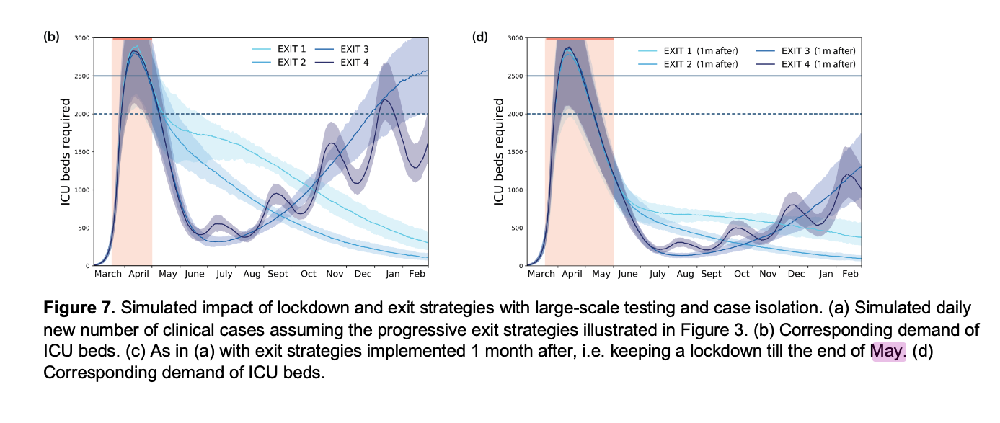 -->
<!-- ``` -->

<!-- ##### Fig 5b for reality -->

<!-- ```{r 2020_04_12_original_figS3b, echo=FALSE, out.width="500px"} -->
<!-- 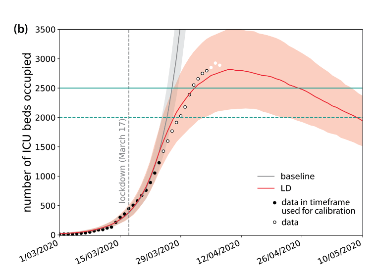 -->
<!-- ``` -->


<!-- ### April 28, 2020, Ile-de-France {.tabset .tabset-fade .tabset-pills} -->

<!-- Source: [Les Echos newspaper](https://www.lesechos.fr/idees-debats/editos-analyses/pourquoi-philippe-a-douche-les-francais-1199309), April 29, 2020. Specified "dated Tuesday", so we deduce that the publication dates from Tuesday April 28. Identified by Google search. -->

<!-- #### Reproduced  -->

<!-- We add a slight vertical offset (150 beds, or about 6% of the 2500 peak value), for better alignment with reality data. -->

<!-- ```{r} -->
<!-- # we do not correct the data: offset 0 -->
<!-- x_reality_offset <- 0 -->
<!-- y_reality_offset <- -150 -->
<!-- x_scenarios_offset <- 0 -->
<!-- y_scenarios_offset <- 0 -->
<!-- ``` -->


<!-- ##### Before correction  -->

<!-- ```{r 2020_04_28_Pasteur} -->
<!-- # load scenario -->
<!-- scenarios <- read_csv("source_data/2020_04_28/ICU.csv") %>% -->
<!--   mutate(date = as.Date(date, format = "%Y/%m/%d", optional = T)) -->

<!-- # graph comparison -->
<!-- f_graph( -->
<!--   reality_ICU_beds_IDF, scenarios,  -->
<!--   "ICU_beds",  -->
<!--   "2020-04-28", 1000, #publication date label -->
<!--   "2020-03-19", "2020-06-28", #date limits -->
<!--   NA, # y limits -->
<!--   "ICU beds in Ile-de-France", #y axis label -->
<!--   "reality in Paireau et. al" #reality label -->
<!-- ) -->

<!-- ``` -->

<!-- ##### After correction -->

<!-- ```{r} -->
<!-- temp <- f_prepare_to_save(scenarios, reality_ICU_beds_IDF, "ICU_beds") -->

<!-- f_graph_corrected( -->
<!--   temp,  -->
<!--   "2020-04-28", 1000, #publication date label -->
<!--   "2020-03-19", "2020-06-28", #date limits -->
<!--   NA, # y limits -->
<!--   "ICU beds in Ile-de-France", #y axis label -->
<!--   "reality in Paireau et. al" #reality label -->
<!-- ) -->

<!-- f_save_csv_files(temp, output_path, "2020_04_28_ICU.csv") -->
<!-- ``` -->


<!-- #### Error -->

<!-- ```{r} -->
<!-- error <- f_compute_error("2020-03-29", "2020-06-28", temp, max_ICU_beds_IDF) -->

<!-- f_graph_error( -->
<!--   error, -->
<!--   "2020-04-28", 50 #publication date label -->
<!--   )  -->

<!-- f_save_csv_files(error, output_path_error, "2020_04_28_ICU_error.csv") -->
<!-- ``` -->

<!-- #### Original  -->

<!-- ```{r 2020_04_28_original, echo=FALSE, out.width="500px"} -->
<!-- 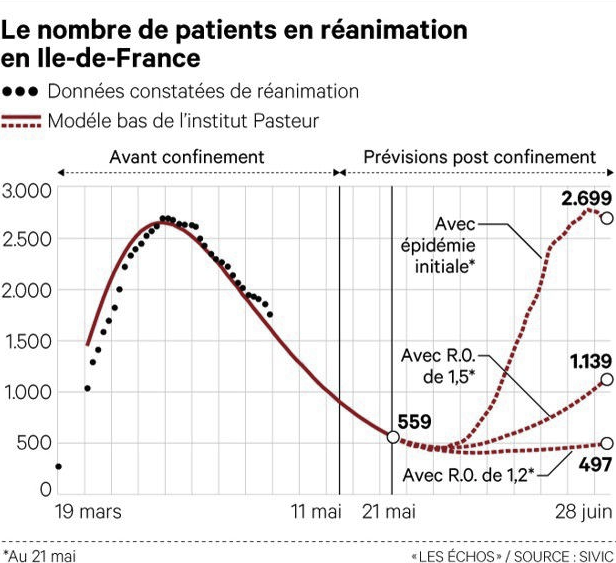 -->
<!-- ``` -->


<!-- ### May 12, 2020, Ile-de-France {.tabset .tabset-fade .tabset-pills} -->

<!-- voir comment on justifie l'offset: relire la fonction. A priori descendre les scénarios de 200, mais je ne peux pas descendre les points noirs, juste bouger la ligne rouge. Cela pose problème pour la sauvegarde et la figure globale ? -->

<!-- Source: [EPIcx report 10](https://www.medrxiv.org/content/10.1101/2020.05.08.20095521v1.full.pdf), published on May 12, 2020. -->

<!-- TO BE RE CHECKED -->

<!-- #### Reproduced {.tabset .tabset-fade} -->

<!-- We add a small vertical offset (100 beds, orr about 3% of the 3000 peak value) for better alignment of scenario with reality. -->

<!-- ```{r} -->
<!-- #offset values -->
<!-- x_reality_offset <- 0 -->
<!-- y_reality_offset <- 0 -->
<!-- x_scenarios_offset <- 0 -->
<!-- y_scenarios_offset <- -100 -->
<!-- ``` -->

<!-- ##### Before correction -->

<!-- ```{r 2020_10_30} -->
<!-- scenarios <- read_csv("source_data/2020_05_12/ICU.csv") %>% -->
<!--   mutate(date = as.Date(date, format = "%Y/%m/%d", optional = T)) -->

<!-- f_graph( -->
<!--   reality_ICU_beds_IDF, scenarios,  -->
<!--   "ICU_beds",  -->
<!--   "2020-05-12", 3000, #publication date label -->
<!--   "2020-03-01", "2020-08-01", #date limits -->
<!--   NA, # y limits -->
<!--   "ICU beds", -->
<!--   "reality in data.gouv" -->
<!-- ) -->
<!-- ``` -->

<!-- ##### After correction -->

<!-- ```{r} -->
<!-- temp <- f_prepare_to_save( -->
<!--   scenarios,  -->
<!--   reality_ICU_beds_IDF,  -->
<!--   "ICU_beds" -->
<!--   ) -->

<!-- f_graph_corrected( -->
<!--   temp,  -->
<!--   "2020-05-12", 3000, #publication date label -->
<!--   "2020-03-01", "2020-08-01", #date limits -->
<!--   NA, # y limits -->
<!--   "ICU beds",  -->
<!--   "reality in data.gouv" -->
<!-- ) -->

<!-- #end of 2nd lockdown December 15, which is also the end of the scenarios -->
<!-- f_save_csv_files(temp, output_path, "2020_05_12_ICU.csv") -->
<!-- ``` -->

<!-- #### Error -->

<!-- ```{r} -->
<!-- error <- f_compute_error("2020-03-01", "2020-08-01", temp, max_ICU_beds_IDF) -->

<!-- f_graph_error( -->
<!--   error, -->
<!--   "2020-05-12", 50 #publication date label -->
<!--   ) -->

<!-- f_save_csv_files(error, output_path_error, "2020_05_12_ICU.csv_error.csv") -->
<!-- ``` -->

<!-- #### Orginal -->

<!-- ```{r 2020_05_12_original, echo=FALSE, out.width="500px"} -->
<!-- 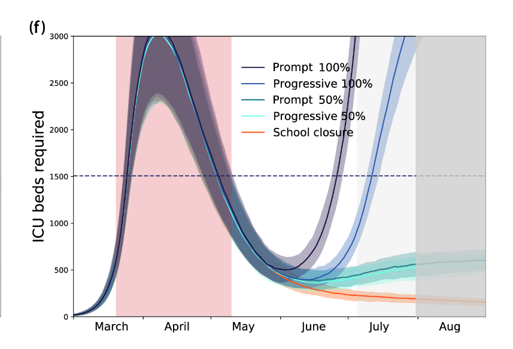 -->
<!-- ``` -->


<!-- ## Prepare Scenarios New Hospitalizations -->


<!-- ### November 8, 2021, Ile-de-France {.tabset .tabset-fade .tabset-pills} -->

<!-- Source: [EPIcx report 21](https://www.epicx-lab.com/uploads/9/6/9/4/9694133/inserm_covid-19-lockdown_schools_open-20201108.pdf), published on Novemebr 11, 2020. -->

<!-- #### Reproduced  -->

<!-- The apparent discrepancy between median scenario and smoothed reality before the publication date is actually present in the modeler's own report. See the *Original* tab, and compare the black dots to the median scenario. -->

<!-- ```{r 2020_11_08_EPIcx} -->
<!-- # load data -->
<!-- scenarios <- read_csv("source_data/2020_11_08/new_hosp.csv") %>% -->
<!--   mutate(date = as.Date(date, format = "%Y/%m/%d", optional = T)) -->

<!-- # graph comparison -->
<!-- f_graph( -->
<!--   reality_new_hosp_adm_IDF, scenarios,  -->
<!--   "new_hosp_smooth",  -->
<!--   "2020-11-08", 700, #publication date label -->
<!--   "2020-08-30", "2020-12-15", #date limits -->
<!--   600, # y limits -->
<!--   "daily hospital admissions", -->
<!--   "reality in Paireau et al." -->
<!-- )  + -->
<!--   # add unsmoothed reality new hospitalization, for better comparison with modelers' reality -->
<!--   geom_line( -->
<!--     data=reality_new_hosp_adm_IDF, aes(date, new_hosp), alpha=.4, color="red" -->
<!--   ) -->

<!-- # we do not correct the data: no offset -->
<!-- x_reality_offset <- 0 -->
<!-- y_reality_offset <- 0 -->
<!-- x_scenarios_offset <- 0 -->
<!-- y_scenarios_offset <- 0 -->

<!-- # save data -->
<!-- temp <- f_prepare_to_save( -->
<!--   scenarios,  -->
<!--   reality_new_hosp_adm_IDF %>% select(date, new_hosp_smooth), -->
<!--   "new_hosp_smooth" -->
<!--   ) -->
<!-- temp <- temp %>% filter(date <= as.Date("2020-12-15")) # stop comparison before ... -->
<!-- f_save_csv_files(temp, output_path, "2020_11_08_new_hosp.csv") -->
<!-- ``` -->


<!-- #### Error -->

<!-- ```{r} -->
<!-- error <- f_compute_error("2020-08-30", "2020-12-31", temp, max_new_hosp_IDF) -->

<!-- f_graph_error( -->
<!--   error, -->
<!--   "2020-11-08", 20 #publication date label -->
<!--   ) -->

<!-- f_save_csv_files(error, output_path_error, "2020_11_08_new_hosp_error.csv") -->
<!-- ``` -->


<!-- #### Original  -->

<!-- ```{r 2020_11_08_original, echo=FALSE, out.width="50%"} -->
<!-- 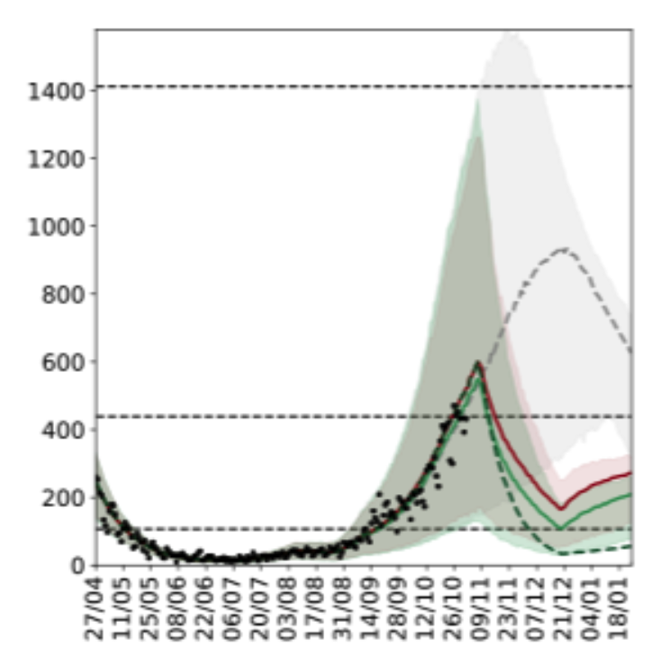 -->
<!-- ``` -->


<!-- ## Results -->

<!-- ```{r} -->
<!-- #ICU only in Ile de France region -->
<!-- data_ICU_beds_IDF <- bind_rows( -->
<!--   f_read_ICU("2020_04_12"), -->
<!--   f_read_ICU("2020_04_28"), -->
<!--   f_read_ICU("2020_05_12") -->
<!-- ) -->
<!-- #new hosp data for IDF -->
<!-- data_new_hosp_IDF <- f_read_new_hosp("2020_11_08") -->

<!-- data_ICU_beds_IDF <- f_gather_scenarios_compute_relative_error(data_ICU_beds_IDF, max_ICU_beds_IDF) -->
<!-- data_new_hosp_IDF <- f_gather_scenarios_compute_relative_error(data_new_hosp_IDF, max_new_hosp_IDF) -->
<!-- ``` -->


<!-- #### ICU -->

<!-- ```{r graph_all_ICU_IDF} -->
<!-- max_error <- max(abs(data_ICU_beds_IDF$error), na.rm = T) -->
<!-- g1 <- ggplot(data_ICU_beds_IDF) + -->

<!--   #scenarios curves and their colors -->
<!--   geom_line( -->
<!--     aes(date, value, group=interaction(scenario_type, report), color=abs(error)),  -->
<!--     linewidth=1.5 -->
<!--     ) + -->
<!--   scale_colour_stepsn( -->
<!--     colours = c("green", "orange", "red", "purple"),  -->
<!--     values = c(0, 15, 30, 100, round(max_error))/max_error, -->
<!--     breaks = c(0, 15, 30, 100, round(max_error)), -->
<!--     labels = c("0%", "± 15%", "± 30%", "± 100%", ""), -->
<!--   ) + -->

<!--   #reality curve -->
<!--   geom_line( -->
<!--     data=reality_ICU_beds_IDF, -->
<!--     aes(date, ICU_beds) -->
<!--     ) + -->

<!--   #1st wave peak annotation -->
<!--   geom_hline( -->
<!--     yintercept = max_ICU_beds_IDF, linetype="dashed" -->
<!--     ) + -->
<!--   annotate( -->
<!--     'text', x = as.Date("2020-09-15"), y = max_ICU_beds_IDF, label = "1st wave peak", -->
<!--     color = "black", fontface = "italic", family = "Times New Roman", vjust=-.4, hjust=0 -->
<!--     ) + -->

<!--   labs( -->
<!--     x = element_blank(), -->
<!--     y="ICU beds\noccupied by COVID-patients", -->
<!--     color=" error of scenario\n  as % of\n 1st wave peak", -->
<!--     linetype= element_blank() -->
<!--     ) + -->
<!--   coord_cartesian( -->
<!--     ylim = c(0, NA), -->
<!--     xlim = c(as.Date("2020-03-01"), as.Date("2020-08-01")) -->
<!--     ) + -->
<!--   facet_wrap(vars(report), nrow=2) -->
<!-- g1 -->
<!-- ``` -->

<!-- #### New hospitalizations TO BE FINISHED -->

<!-- ```{r graph_all_new_hosp_IDF} -->
<!-- max_error <- max(abs(data_new_hosp_IDF$error), na.rm = T) -->
<!-- g2 <- ggplot(data_new_hosp_IDF) + -->

<!--   #scenarios curves and their colors -->
<!--   geom_line( -->
<!--     aes(date, value, group=interaction(scenario_type, report), color=abs(error)), -->
<!--     linewidth=1.5 -->
<!--     ) + -->
<!--   # scale_colour_stepsn( -->
<!--   #   colours = c("green", "orange", "red"), -->
<!--   #   values = c(0, 15, 30, 100, round(max_error))/max_error, -->
<!--   #   breaks = c(0, 15, 30, 100, round(max_error)), -->
<!--   #   labels = c("0%", "± 15%", "± 30%", "± 100%", ""), -->
<!--   # ) + -->

<!--   #reality curve -->
<!--   geom_line( -->
<!--     data=reality_new_hosp_adm_IDF, -->
<!--     aes(date, new_hosp_smooth) -->
<!--     ) + -->
<!--   #unsmoothed reality curve -->
<!--   geom_line( -->
<!--     data=reality_new_hosp_adm_IDF, -->
<!--     aes(date, new_hosp), alpha=.4 -->
<!--     ) + -->

<!--   #1st wave peak -->
<!--   geom_hline(yintercept = max_new_hosp_IDF, linetype="dashed") + -->
<!--   annotate( -->
<!--     'text', x = as.Date("2020-09-15"), y = max_new_hosp_IDF, label = "1st wave peak", -->
<!--     color = "black", fontface = "italic", family = "Times New Roman", vjust=-.4, hjust=0 -->
<!--     ) + -->

<!--   labs( -->
<!--     x = paste("publication dates of the", n_reports, "reports"), -->
<!--     y="daily new hospital admissions\nrelated to COVID", -->
<!--     color=" error of scenario\n  as % of\n 1st wave peak", -->
<!--     linetype= element_blank() -->
<!--     ) + -->
<!--   coord_cartesian( -->
<!--     ylim = c(0, NA), -->
<!--     xlim = c(as.Date("2020-10-01"), as.Date("2020-12-31")) -->
<!--     ) + -->
<!--   facet_wrap(vars(report)) -->
<!-- g2 -->

<!-- library(patchwork) -->
<!-- g1 + g2 -->
<!-- ``` -->


```{r remove_all_files_from_environement}
rm(list = ls())
```


