CHANGER AJUSTEMENT ? : NE PAS TOUCHER A REALITY, JUSTE CHANGER REALITY REPORT ET SCENARIOS

ENREGISTRER REALITY, LA COMBINAISON DE TOUS LES SCENARIOS

MIEUX DE PRENDRE LE med = (max+min)/2 que le vrai med, pose problème quand bcp de scénarios multipliés ?

This notebook prepares the data used in our analyses. 

The first paragraph *Prepare reality data* focuses on true data of Intensive Care Units (ICU) and Hospitalizations. Most of it is from one of Pasteur Institutes's team paper ([Paireau et al 2022](https://www.pnas.org/doi/abs/10.1073/pnas.2103302119)), which has its own cleaning and smoothing process of the government raw data. This dataset stops on July 2021. Beyond this date we use data from multiple sources (Pasteur Institue's subsequent reports, government data) and combine them all to produce one unique and coherent dataset.

Since Pasteur Institute's scenarios data were not public, we had to extract them manually from the reports figures, using [WebPlotDigitizer](https://apps.automeris.io/wpd/). The process for each report is described in the *Prepare Scenarios ICU* and *Prepare Scenarios Hospitalizations* paragraphs. For each report we indicate its original URL source. Then :

  -   In the *Original* tab, we provide the screenshot of the original scenarios figures from which data are extracted.
  -   In the *Reproduced* tab, we reproduce the original figures from our extracted data. In some rare cases, we horizontally or vertically offset the data for better alignment, based on comparison to reality data before report publication.
  -   EST CE QUE JE LAISSE LE ERROR TAB ??

```{r setup, include=FALSE}
knitr::opts_chunk$set(message=F, warning=F, fig.align = "center",  dev='svg')
library(plyr)
library(lattice)
library(lubridate)
library(svglite)

#loading relevant packages
library(zoo) #for rollmean function
library(tidyr)
library(tidyverse) #mainly for reading files functions
library(dplyr)
library(ggplot2) #for ggplot graphs
library(cowplot) #for plot_grid()
library(stringr) #to manipulate strings
library(ISOweek) #to convert weeks to date and vice versa

theme_set(
  theme_classic() +
  theme(panel.grid.major.y = element_line(),
        text = element_text(family = "Times New Roman"),
        plot.title = element_text(face="bold")
        )
  )
g_theme <- scale_color_manual(values=c('#ff0000', "black",'#D8D8D8'))
```

```{r function_to_generate_min_med_max_error}
f_compute_error <- function(date_begin, date_end, dataset, normalization_figure){
  #dates delimiting the comparison period
  date_min <- as.Date(date_begin)
  date_max <- as.Date(date_end)
  #preparing file : gets date and true data value on the period
  reality_file <- dataset %>%
    select(date, reality) %>%
    filter(date>date_min & date<date_max)
  #computing min, med and max of scenarios
  temp <- dataset %>% 
    select(-reality, -reality_report) %>%
    rowwise() %>%
    mutate(
      med = median(c_across(-date), na.rm=T),
      min = min(c_across(-date), na.rm=T),
      max = max(c_across(-date), na.rm=T)
    )
  #joins 2 files
  reality_file <- inner_join(reality_file, temp, by="date")
  reality_file <- reality_file %>%
    mutate(
      error_min = round((min-reality)/normalization_figure*100, 1),
      error_med = round((med-reality)/normalization_figure*100, 1),
      error_max = round((max-reality)/normalization_figure*100, 1)
    ) %>%
  #remove infinite values (when min med and max applied to NAs)
    filter(
      !(is.infinite(min) | is.infinite(med) | is.infinite(max))
    )
  
  return (reality_file)
}
```

```{r function_graph}
f_graph <- 
  function(
    true_data, scenarios, variable, 
    x_label_publication, y_label_publication,
    x_min, x_max, y_max,
    str_y, str_reality
  ){
    modellers_true_data <- scenarios %>%
      select(date, reality)
    
    scenarios <- scenarios %>%
      select(-reality) %>%
      gather(key=scenario, value = value, -date)

    
    p <- ggplot(data = scenarios) + 
      #scenarios lines
      geom_line(
        aes(
          x=date, y=value, 
          group=scenario, color="scenarios"
        ),
        size = 1
      ) + 
      #reality line
      geom_line(
        data= true_data, 
        aes(
          x=date, y=!!as.symbol(variable), 
          color = str_reality
          ),
        size = 1
        ) +
      #modellers reality line
      geom_point(
        data = modellers_true_data,
        aes(
          date, reality, color = "reality in report"
          ) 
      ) +
      #publication date line and label
      geom_vline(
        xintercept = as.Date(x_label_publication), linetype="dashed"
      ) +
      annotate(
        'text', x = as.Date(x_label_publication)-1, y = y_label_publication, label = "publication\ndate", 
        color = "black", fontface = "italic", family = "Times New Roman", hjust=1
      ) +
      # x and y limits
      xlim(as.Date(x_min), as.Date(x_max)) + ylim(0, y_max) + 
      g_theme +
      labs(
        title = "",
        subtitle = "",
        color="",
        x="", y= str_y
        )
    
    return(p)
  }
```

```{r function_to_correct_curves}
f_offset <- function(dataset_scenarios, dataset_reality, variable_select){
  #reality 
  temp_reality <- dataset_reality %>% select(date, reality = !!as.symbol(variable_select))
  temp_reality$date <- temp_reality$date + x_reality_offset #on date (x)
  temp_reality$reality <- temp_reality$reality + y_reality_offset #on values (y)
  
  #reality in report
  temp_reality_report <- dataset_scenarios %>% select(date, reality_report = reality)
  
  #scenarios offset
  temp_scenarios <- dataset_scenarios %>% select(-reality)
  temp_scenarios$date <- temp_scenarios$date + x_scenarios_offset #on dates (x)
  temp_scenarios[,-1] <- lapply(temp_scenarios[,-1], function(x) x+y_scenarios_offset) #on values (y)
  
  temp <- full_join(temp_scenarios, temp_reality_report, by="date")
  temp <- left_join(temp, temp_reality)
  
  return(temp)
}
```

```{r function_graph_of_corrected_data}
f_graph_corrected <- 
  function(
    scenarios, 
    x_label_publication, y_label_publication,
    x_min, x_max, y_max,
    str_y, str_reality
  ){
    modellers_true_data <- scenarios %>%
      select(date, reality_report)
    
    true_data <- scenarios %>%
      select(date, reality)
    
    scenarios <- scenarios %>%
      select(-reality, -reality_report) %>%
      gather(key=scenario, value = value, -date)

    
    p <- ggplot(data = scenarios) + 
      #scenarios lines
      geom_line(
        aes(
          x=date, y=value, 
          group=scenario, color="scenarios"
        ),
        size = 1
      ) + 
      #reality line
      geom_line(
        data= true_data, 
        aes(
          x=date, y=reality, 
          color = str_reality
          ),
        size = 1
        ) +
      #modellers reality line
      geom_point(
        data = modellers_true_data,
        aes(
          date, reality_report, color = "reality in report"
          ) 
      ) +
      #publication date line and label
      geom_vline(
        xintercept = as.Date(x_label_publication), linetype="dashed"
      ) +
      annotate(
        'text', x = as.Date(x_label_publication)-1, y = y_label_publication, label = "publication\ndate", 
        color = "black", fontface = "italic", family = "Times New Roman", hjust=1
      ) +
      # x and y limits
      xlim(as.Date(x_min), as.Date(x_max)) + ylim(0, y_max) + 
      g_theme +
      labs(
        title = "",
        subtitle = "",
        color = "",
        x="", y= str_y
        )
    
    return(p)
  }
```

```{r function_graph_of_errors}
f_graph_error <- function(
    dataset, x_label, y_label
    ){
  ggplot(dataset, aes(date)) + 
  geom_line(aes(y=error_med)) +
  geom_ribbon(aes(ymin = error_min, ymax = error_max), alpha = 0.1) + 
  geom_hline(yintercept = 0) +
  geom_vline(xintercept=as.Date(x_label), linetype="dashed") +
  annotate(
    'text', x = as.Date(x_label)-1, y = y_label, label = "publication\ndate", 
    color = "black", fontface = "italic", family = "Times New Roman", hjust=1
  ) +
  labs(
    x="", y="error as % of 1st wave peak",
    title = "Median, min and max relative errors of scenarios vs reality",
    subtitle = "line: median scenario ; area: min and max scenarios"
  )
}
```

# Prepare Data

## Prepare reality data {.tabset .tabset-fade .tabset-pills}

### Sources

Most of our reality data is based on [Paireau et al (2022)](https://www.pnas.org/doi/abs/10.1073/pnas.2103302119) paper, which gives us the data up to July 2021.

```{r load_Paireau_et_al_data}
true_data_Paireau_et_al <- readRDS("source_data/reality_Paireau_2022_paper/full_data.rds") %>%
  filter(
    region == "metropolitan" #only metropolitan France
    ) %>%
  select(
    date, 
    new_hosp = iHosp, #new hospitalizations
    new_hosp_smooth=iHosp_smooth, #new hospitalizations smoothed
    ICU_beds = inICU_smooth #ICU beds smoothed
    ) %>%
  distinct()

#the "smooth" data is reported multiple time for each date, so we synthesize it
true_data_Paireau_et_al <- true_data_Paireau_et_al %>%
  group_by(date) %>%
  summarise_all(mean, na.rm=T) %>%
  mutate_all(round, 0)
```

Beyond July 2021, for Intensive Care Units (ICU) data, we load the the reported data on data.gouv, on [this page](https://www.data.gouv.fr/fr/datasets/donnees-hospitalieres-relatives-a-lepidemie-de-covid-19/). We then combine it with Paireau et al data.

```{r load_data_gouv_data}
#download data related to ICU Beds
data_gouv_beds_hosp_rea <- 
  read_csv2(
    "source_data/reality_data_gouv/covid-hospit-2023-03-31-18h01.csv"
    ) %>%
  mutate(date = as.Date(jour))

#Beds : critical car beds, hospitalization beds and conventional hospitalization beds
true_data_beds_hosp_rea <- data_gouv_beds_hosp_rea %>%
  filter(
    # 0 = men + women, 1 = men, 2 = women ; select 0, remove 1 and 2
    sexe =="0",
    #remove overseas territories
    dep != 971 & dep != 972 & dep != 973 & dep != 974 & dep != 976 & dep != 978,
    #last scenario stops on Avril 2022, we do not keep the data beyond this point
    date <= as.Date("2022-04-01")
    ) %>%
  #group all departments together to have national data
  group_by(date) %>% 
  dplyr::summarise(
    ICU_beds = sum(rea, na.rm = T)
    )

#Beds for April 28, 2020 scenario : only region Ile-de-France
true_data_beds_hosp_rea_IDF <- data_gouv_beds_hosp_rea %>%
  filter(
    # 0 = men + women, 1 = men, 2 = women ; select 0, remove 1 and 2
    sexe =="0", 
    # select region Ile-de-France departments
    dep %in% c(75, 92, 93, 94, 91, 95, 78, 77),
    #last scenario stops on Avril 2022, we do not keep the data beyond this point
    date <= as.Date("2022-04-01")
    ) %>% 
  #group all departments 
  group_by(date) %>% 
  dplyr::summarise(
    ICU_beds = sum(rea, na.rm = T)
    ) 
```

For hospital admissions, the Paireau et al use a smoothing process. This processed data is reported only up to July 2021. Beyond this date, we manually extract the data from the subsequent Pasteur reports, using [WebplotDigitizer](https://apps.automeris.io/wpd/).

```{r load_Pasteur_reports_hospital_data}
#load Pasteur reports data on new admissions
path_source <- "source_data/reality_reports_hosp_adm/"
f_read <- function(scenario_date){
  temp <- read_csv(paste0(path_source, scenario_date, ".csv")) %>%
    mutate(scenario = gsub("_", "-", scenario_date))
}
#combine the different data on hospital admissions
true_data_new_hosp_Pasteur_reports <- bind_rows(
  f_read("2021_05_21"),
  f_read("2021_07_27"),
  f_read("2021_08_05"),
  f_read("2021_10_04"),
  f_read("2021_12_17"),
  f_read("2022_02_15") %>% 
    #for the January 2022 period the smoothed admissions is not reported, so we compute it
    mutate(
      new_hosp_smooth=rollmean(new_hosp, 7, na.pad = T, align = "right")
      )
  )
```

### Datasets combinations {.tabset .tabset-fade}

#### ICU

For ICU beds, data from Paireau et al. and from data.gouv match very well on their common period until July 2021, so after this date we use the data.gouv data (just with a 2-day offset to better align). The difference between the 2 datasets is typically less than 1%.

```{r ICU_datasets_combination}
day_offset <- -2

#combine Paireau and data.gouv datasets
reality_ICU_beds <- bind_rows(
  #Paireau dataset before July 2021
  true_data_Paireau_et_al %>% 
    select(date, ICU_beds) %>%
    filter(date<as.Date("2021-07-01")),
  #data.gouv dataset after July 2021, with a negative 2-day offset
  true_data_beds_hosp_rea %>% 
    select(date, ICU_beds) %>% 
    mutate(date = date + day_offset) %>%
    filter(date>=as.Date("2021-07-01"))
)
#maximum ICU beds occupancy reached, for normalization further in the code
max_ICU_beds <- max(reality_ICU_beds$ICU_beds, na.rm=T)

#Ile-de-France data for first scenarios (April 2020), based on data.gouv data and with the 2-day offset
reality_ICU_beds_IDF <- true_data_beds_hosp_rea_IDF %>%
  mutate(date = date+day_offset)
max_ICU_beds_IDF <- max(reality_ICU_beds_IDF$ICU_beds, na.rm=T)

#plot the 2 datasets and their combination to see the negligible discrepancies
ggplot(true_data_Paireau_et_al) +
  #data.gouv
  geom_line(
    data =true_data_beds_hosp_rea, linewidth=2.5, alpha=.4,
    aes(date+day_offset, ICU_beds, color="data.gouv")
    ) +
  #Paireau et al
  geom_line(
    aes(date, ICU_beds, color="Paireau et al."),
    linewidth=2.5, alpha=.4,
    ) +
  #our true data
  geom_line(
    data=reality_ICU_beds, 
    aes(date, ICU_beds, linetype="combination\nused in this study")
    ) +
  #ICU beds capacity
  geom_hline(yintercept = max_ICU_beds, linetype="dashed") +
  labs(
    title = "ICU beds occupied by COVID patients",
    subtitle = "horizontal line: historical maximum occupancy of ICU beds during 1st wave",
    colour = "",
    linetype = "",
    y="COVID-related ICU beds occupancy",
    x=""
  )
```

```{r error_comparison_ICU_beds}
#prepare data to see error
temp <- 
  inner_join(
    true_data_Paireau_et_al %>% 
      select(date, ICU_beds_Paireau=ICU_beds),
    true_data_beds_hosp_rea %>% 
      select(date, ICU_beds_data_gouv=ICU_beds) %>% 
      mutate(date=date+day_offset),
    by="date"
    ) %>%
  mutate(
    error=(ICU_beds_Paireau-ICU_beds_data_gouv),
    error_percent=(ICU_beds_Paireau-ICU_beds_data_gouv)/max_ICU_beds*100
    )

plot_grid(
  ggplot(temp) +
    geom_area(aes(date, error, fill="absolute error")) +
    geom_hline(yintercept = max_ICU_beds, linetype="dashed") +
    ylim(0, max_ICU_beds) +
    annotate(
        'text', x = as.Date("2021-05-01"), y = 6000, label = "horizontal line:\nmax ICU beds occupancy", 
        color = "black", fontface = "italic", family = "Times New Roman", hjust=1
      ) +
    theme(legend.position = "top") +
    labs(
      title = "Error between the 2 ICU beds datasets",
      fill="",
      y="ICU beds",
      x=""
    ),
  ggplot(temp) +
    geom_area(aes(date, error_percent, fill="relative error")) +
    ylim(0, NA) +
    theme(legend.position = "top") +
    labs(
      title = "",
      fill="",
      y="% of 1st wave peak",
      x=""
    )
)
```

#### Hospital admissions

We cannot apply the same method for new hospital admissions, since the modellers use a modified indicator not reported in data.gouv (see details in [Paireau et al 2022](https://www.pnas.org/doi/abs/10.1073/pnas.2103302119). So for the period after July 2021, we have to extract the true data of "new hospital admissions" from the different subsequent reports, when it is reported.

```{r combine_data_on_hospitalizations}
#graph of all sources
ggplot(true_data_new_hosp_Pasteur_reports) +
  #reports data new hospitalizations smoothed
  geom_line(
    aes(date, new_hosp_smooth, group=scenario, color=scenario), 
    linewidth=2
    ) +
  #reports data new hospitalizations 
  geom_point(
    aes(date, new_hosp, group=scenario, color=scenario), 
    alpha=.2
    ) +
  #Paireau et al data new hospitalizations smoothed 
  geom_line(
    data = true_data_Paireau_et_al, linewidth=1,
    aes(date, new_hosp_smooth, linetype="Paireau et al.")
    ) +
  #Paireau et al data new hospitalizations 
  geom_point(
    data = true_data_Paireau_et_al, alpha=.2,
    aes(date, new_hosp)
    ) +
  labs(
    x="", y="daily new hospital admissions",
    color="report source",
    linetype="",
    title = "Datasets used for new hospital admissions"
    )

#synthesize data from all reports
true_data_new_hosp_Pasteur_reports <- true_data_new_hosp_Pasteur_reports %>% 
  group_by(date) %>% #because sometimes multiple values for 1 date
  summarise(
    new_hosp=round(mean(new_hosp, na.rm=T)),
    new_hosp_smooth=round(mean(new_hosp_smooth, na.rm=T))
    ) %>%
  filter(date>=as.Date("2021-07-01"))
#replace all NAN by NA
true_data_new_hosp_Pasteur_reports <- true_data_new_hosp_Pasteur_reports %>% 
  mutate_all(~replace(., is.nan(.), NA))

#merge the 2 datasets
reality_new_hosp_adm <- bind_rows(
  true_data_new_hosp_Pasteur_reports,
  true_data_Paireau_et_al %>% 
    select(date, new_hosp_smooth, new_hosp) %>%
    filter(date<as.Date("2021-07-01"))
)

#remove data not useful anymore
rm(
  data_gouv_beds_hosp_rea, true_data_beds_hosp_rea, true_data_beds_hosp_rea_IDF,
  true_data_Paireau_et_al, true_data_new_hosp_Pasteur_reports
  )
```

Combining all the datasets together yields the following result, after extrapolation on missing period (just 2 weeks in Nov-Dec 2021) :

```{r final_data_new_hosp}
#remove lines were new_hosp_smooth not reported
reality_new_hosp_adm <- reality_new_hosp_adm %>% filter(is.na(new_hosp_smooth)==F)

#extrapolate new hospitalizations on missing period in Nov-Dec 2021
date_min <- "2021-11-23"
date_max <- "2021-12-07"
ndays <- as.numeric(as.Date(date_max) - as.Date(date_min))
#ndays <- as.numeric(as.Date("2021-11-25") - as.Date("2021-11-23"))
hosp_min <- reality_new_hosp_adm$new_hosp_smooth[reality_new_hosp_adm$date==as.Date(date_min)]
hosp_max <- reality_new_hosp_adm$new_hosp_smooth[reality_new_hosp_adm$date==as.Date(date_max)]

temp <- data_frame(
  date = seq(from=as.Date(date_min), to=as.Date(date_max), by="day"),
  new_hosp = NA,
  new_hosp_smooth = seq(from=hosp_min, to=hosp_max, by=(hosp_max-hosp_min)/(ndays))
) 
temp$new_hosp_smooth <- round(temp$new_hosp_smooth)

#remove first and last rows (start and end days)
temp = temp[-1,]
temp = temp[-nrow(temp),]

#combine original data and extrapolation
reality_new_hosp_adm <- bind_rows(
  reality_new_hosp_adm, 
  temp
)

#remove temporary variables
rm(date_min, date_max, ndays, hosp_min, hosp_max)

#plot the data
ggplot(reality_new_hosp_adm) +
  geom_line(aes(date, new_hosp_smooth)) +
  geom_line(aes(date, new_hosp), alpha=.4) +
  labs(
    title = "New COVID-related hospital admissions"
  )
```

#### historical maxima

In our analysis, we use the historical maxima of ICU beds occupancy and hospital admissions to normalize the erro between scenarios and reality.

```{r ICU_beds_capacity}
max_ICU_beds <- max(reality_ICU_beds$ICU_beds, na.rm=T)
max_ICU_beds_IDF <- max(reality_ICU_beds_IDF$ICU_beds, na.rm=T)
max_new_hosp <- max(reality_new_hosp_adm$new_hosp_smooth, na.rm=T)
```


## Prepare Scenarios ICU

```{r output_path_for_corrected_ICU_scenarios}
output_path <- "output_data/extracted_data/ICU_scenarios/"
output_path_error <- "output_data/min_med_max_and_error/ICU_error/"
```

### April 28, 2020 {.tabset .tabset-fade .tabset-pills}

Source: [Les Echos newspaper](https://www.lesechos.fr/idees-debats/editos-analyses/pourquoi-philippe-a-douche-les-francais-1199309), April 29, 2020. Specified "dated Tuesday", so we deduce that the publication dates from Tuesday April 28. Identified by Google search.

#### Original 

```{r 2020_04_28_original, echo=FALSE, out.width="500px"}
knitr::include_graphics("source_data/2020_04_28/2020_04_28.png")
```

#### Reproduced {.tabset .tabset-fade}

We do not correct the data (no x nor y offset for better alignment).

```{r offset_values}
#offset values
x_reality_offset <- 0
y_reality_offset <- 0
x_scenarios_offset <- 0
y_scenarios_offset <- 0
```

##### Before correction

```{r 2020_04_28_Pasteur}
scenarios <- read_csv("source_data/2020_04_28/ICU.csv") %>%
  mutate(date = as.Date(date, format = "%Y/%m/%d", optional = T))

f_graph(
  reality_ICU_beds_IDF, scenarios, 
  "ICU_beds", 
  "2020-04-28", 1000, #publication date label
  "2020-03-19", "2020-06-28", #date limits
  NA, # y limits
  "ICU beds in Ile-de-France", #y axis label
  "reality in data.gouv" #reality label
)
```

##### After correction

```{r}
temp <- f_offset(scenarios, reality_ICU_beds_IDF, "ICU_beds")

f_graph_corrected(
  temp, 
  "2020-04-28", 1000, #publication date label
  "2020-03-19", "2020-06-28", #date limits
  NA, # y limits
  "Intensive care beds in Ile-de-France", 
  "reality in data.gouv"
)

write_csv(temp, paste0(output_path, "2020_04_28_ICU.csv"))
```

#### Error

```{r}
error <- f_compute_error("2020-03-29", "2020-06-28", temp, max_ICU_beds_IDF)

f_graph_error(
  error,
  "2020-04-28", 50 #publication date label
  ) 

write_csv(error, paste0(output_path_error, "2020_04_28_ICU_error.csv"))
```


### October 30, 2020 {.tabset .tabset-fade .tabset-pills}

Source: [Les Echos newspaper](https://www.lesechos.fr/economie-france/social/covid-la-decrue-dans-les-services-de-reanimation-esperee-en-france-dans-une-dizaine-de-jours-1261656), November 3, 2020. We know the publication date from the statement "The scientists from Pasteur Institute and Santé Publique France updated their epidemic scenarios on October 30". Identified by Google search.

checker la sortie du confinement

#### Orginal

```{r 2020_10_30_original, echo=FALSE, out.width="500px"}
knitr::include_graphics("source_data/2020_10_30/2020_10_30.png")
```

#### Reproduced {.tabset .tabset-fade}

We do not correct the data (no x nor y offset for better alignment)

```{r}
#offset values
x_reality_offset <- 0
y_reality_offset <- 0
x_scenarios_offset <- 0
y_scenarios_offset <- 0
```

##### Before correction

```{r 2020_10_30}
scenarios <- read_csv("source_data/2020_10_30/ICU.csv") %>%
  mutate(date = as.Date(date, format = "%Y/%m/%d", optional = T))

f_graph(
  reality_ICU_beds, scenarios, 
  "ICU_beds", 
  "2020-10-30", 5000, #publication date label
  "2020-10-01", "2020-12-15", #date limits
  NA, # y limits
  "ICU beds",
  "reality in Paireau et al."
)
```

##### After correction

```{r}
temp <- f_offset(
  scenarios, 
  reality_ICU_beds, 
  "ICU_beds"
  )

f_graph_corrected(
  temp, 
  "2020-10-30", 5000, #publication date label
  "2020-10-01", "2020-12-15", #date limits
  NA, # y limits
  "ICU beds", 
  "reality in Paireau et al."
)

#end of 2nd lockdown December 15, which is also the end of the scenarios
write_csv(temp, paste0(output_path, "2020_10_30_ICU.csv"))
```


#### Error

```{r}
error <- f_compute_error("2020-10-01", "2020-12-15", temp, max_ICU_beds)

f_graph_error(
  error,
  "2020-10-30", 25 #publication date label
  )

write_csv(error, paste0(output_path_error, "2020_10_30_ICU_error.csv"))
```


### May 21 Scenarios {.tabset .tabset-fade .tabset-pills}

Source: [Pasteur report](https://modelisation-covid19.pasteur.fr/loosening/Mise_a_jour_scenarios_de_levee_des_mesures_de_freinage_20210521.pdf), May 21, 2021. Identified on Pasteur Institute's website, on [this page](https://modelisation-covid19.pasteur.fr/realtime-analysis/delta-variant-dynamic/).

#### Original {.tabset .tabset-fade}

##### fig 3A

```{r 2021_05_21_fig_3A_original, echo=FALSE, out.width="500px"}
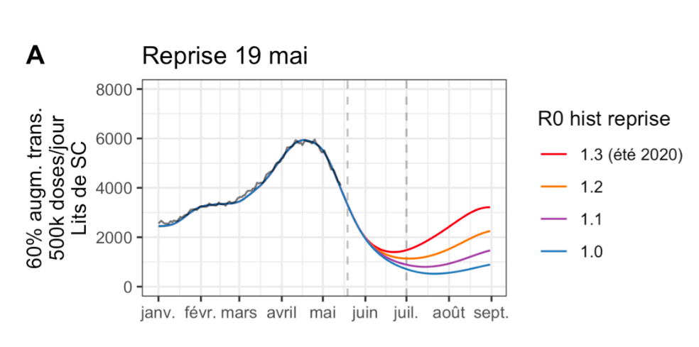
```

##### fig 3C

```{r 2021_05_21_fig_3C_original, echo=FALSE, out.width="500px"}
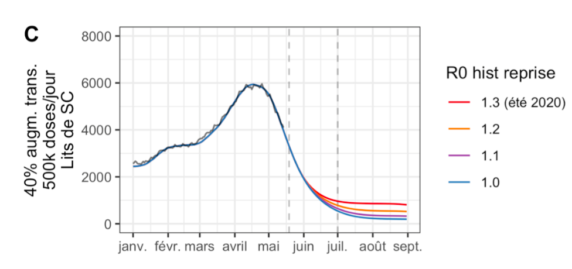
```

##### fig 3E

```{r 2021_05_21_fig_3E_original, echo=FALSE, out.width="500px"}
knitr::include_graphics("source_data/2021_05_21/2021_05_21_fig3E.png")
```

##### fig 3G

```{r 2021_05_21_fig_3G_original, echo=FALSE, out.width="500px"}
knitr::include_graphics("source_data/2021_05_21/2021_05_21_fig3G.png")
```

#### Reproduced {.tabset .tabset-fade}

We do not correct the data (no x nor y offset for better alignment).

```{r}
#offset values
x_reality_offset <- 0
y_reality_offset <- 0
x_scenarios_offset <- 0
y_scenarios_offset <- 0
```


##### Before correction

```{r 2021_05_21_Pasteur}
scenarios <- read_csv("source_data/2021_05_21/ICU.csv") %>%
  mutate(date = as.Date(date, format = "%Y/%m/%d", optional = T))

f_graph(
  reality_ICU_beds, scenarios, 
  "ICU_beds",
  "2021-05-21", 1000, #publication date label
  "2021-01-15", "2021-06-30", #date limits
  NA, # y limits
  "ICU beds", 
  "reality in Paireau et al."
) + ylim(0, 6100)
```

##### After correction

```{r}
temp <- f_offset(
  scenarios, 
  reality_ICU_beds %>% select(date, ICU_beds), 
  "ICU_beds"
  )

f_graph_corrected(
  temp, 
  "2021-05-21", 1000, #publication date label
  "2021-01-15", "2021-06-30", #date limits
  NA, # y limits
  "ICU beds", 
  "reality in Paireau et al."
) + ylim(0, 6100)

write_csv(
  temp %>% filter(date<=as.Date("2021-06-15")), #stop comparison mid-June before delta variant dominant
  paste0(output_path, "2021_05_21_ICU.csv")
  )
```

#### Error

```{r}
error <- f_compute_error("2021-03-15", "2021-06-15", temp, max_ICU_beds)

f_graph_error(
  error,
  "2021-05-21", 10 #publication date label
  )

write_csv(error, paste0(output_path_error, "2021_05_21_ICU_error.csv"))
```


### July 26, 2021 {.tabset .tabset-fade .tabset-pills}

Source: [Pasteur report](https://modelisation-covid19.pasteur.fr/variant/Institut_Pasteur_Acceleration_vaccination_et_Delta_20210726.pdf), July 26, 2021. Identified on Pasteur Institute's website, on [this page](https://modelisation-covid19.pasteur.fr/realtime-analysis/delta-variant-dynamic/).

#### Original {.tabset .tabset-fade}

##### Fig 6 {.tabset .tabset-fade}

###### zoomed

```{r}
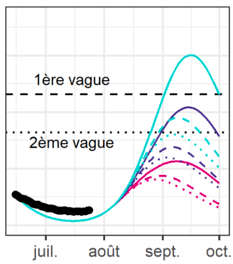
```

###### all

```{r 2021_07_26_fig6_original, echo=FALSE, out.width="500px"}
knitr::include_graphics("source_data/2021_07_26/2021_07_26_fig6.png")
```

##### Fig 5 {.tabset .tabset-fade}

###### zoomed

```{r}
knitr::include_graphics("source_data/2021_07_26/fig5_zoom.png")
```

###### all

```{r 2021_07_26_fig5_original, echo=FALSE, out.width="500px"}
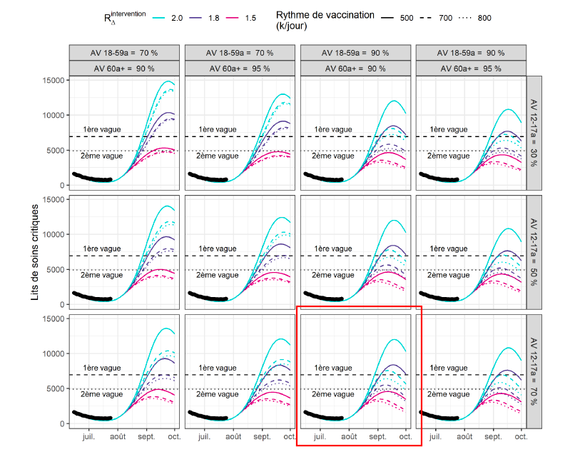
```

#### Reproduced {.tabset .tabset-fade .tabset-pills}

We do not correct the data (no x nor y offset for better alignment). The apparent discrepancy between the scenarios and reality before publication date is not due to improper data extraction, but is present in the modelers' report (see *Original* tab, figure 6.)

```{r}
#offset values
x_reality_offset <- 0
y_reality_offset <- 0
x_scenarios_offset <- 0
y_scenarios_offset <- 0
```

##### Before correction

```{r 2021_07_26_Pasteur_ICU_beds}
scenarios <- read_csv("source_data/2021_07_26/ICU.csv") %>%
  mutate(date = as.Date(date, format = "%Y/%m/%d", optional = T))

f_graph(
  reality_ICU_beds, scenarios, 
  "ICU_beds",
  "2021-07-26", 5000, #publication date label
  "2021-06-15", "2021-10-01", #date limits
  NA, # y limits
  "ICU beds", 
  "reality in data.gouv"
) 
```

##### After correction 

```{r }
temp <- f_offset(
  scenarios, 
  reality_ICU_beds, 
  "ICU_beds"
  )

f_graph_corrected(
  temp, 
  "2021-07-26", 5000, #publication date label
  "2021-06-15", "2021-10-01", #date limits
  NA, # y limits
  "ICU beds", 
  "reality in data.gouv"
) 

write_csv(temp, paste0(output_path, "2021_07_26_ICU.csv"))
```

#### Error

```{r}
error <- f_compute_error("2021-07-15", "2021-10-10", temp, max_ICU_beds)

f_graph_error(
  error,
  "2021-07-26", 100 #publication date label
  )

write_csv(error, paste0(output_path_error, "2021_07_26_ICU_error.csv"))
```


### August 5, 2021 {.tabset .tabset-fade .tabset-pills}

Source: [Pasteur report](https://modelisation-covid19.pasteur.fr/variant/InstitutPasteur_Dynamiques_regionales_des_hospitalisations_20210805.pdf), August 5, 2021. Identified on Pasteur Institute's website, on [this page](https://modelisation-covid19.pasteur.fr/realtime-analysis/delta-variant-dynamic/).

#### Original {.tabset .tabset-fade}

##### Fig F

```{r 20201_08_05_original, echo=FALSE, out.width="500px"}
knitr::include_graphics("source_data/2021_08_05/2021_08_05.png")
```

#### Reproduced {.tabset .tabset-fade}

We do not correct the data

```{r}
#offset values
x_reality_offset <- 0
y_reality_offset <- 0
x_scenarios_offset <- 0 
y_scenarios_offset <- 80
```


##### Before correction

```{r 2021_08_05_Pasteur_ICU_beds}
scenarios <- read_csv("source_data/2021_08_05/ICU.csv") %>%
  mutate(date = as.Date(date, format = "%Y/%m/%d", optional = T))

f_graph(
  reality_ICU_beds, scenarios, 
  "ICU_beds",
  "2021-08-05", 5000, #publication date label
  "2021-06-15", "2021-10-01", #date limits
  NA, # y limits
  "ICU beds", 
  "reality in data.gouv"
) 
```

##### After correction

```{r}
temp <- f_offset(
  scenarios, 
  reality_ICU_beds, 
  "ICU_beds"
  )

f_graph_corrected(
  temp, 
  "2021-08-05", 5000, #publication date label
  "2021-06-15", "2021-10-01", #date limits
  NA, # y limits
  "ICU beds", 
  "reality in data.gouv"
) 

write_csv(temp, paste0(output_path, "2021_08_05_ICU.csv"))
```


#### Error

```{r}
error <- f_compute_error("2021-07-15", "2021-10-10", temp, max_ICU_beds)

f_graph_error(
  error,
  "2021-08-05", 50 #publication date label
  )

write_csv(error, paste0(output_path_error, "2021_08_05_ICU_error.csv"))
```


### January 7, 2022 {.tabset .tabset-fade .tabset-pills}

Source: [Pasteur report](https://modelisation-covid19.pasteur.fr/variant/InstitutPasteur_Complement_Analyse_Impact_Omicron_20220107_corrige.pdf), January 7, 2022. Identified on Pasteur Institute's website, on [this page](https://modelisation-covid19.pasteur.fr/realtime-analysis/omicron-variant-epidemic/).

#### Original {.tabset .tabset-fade}

##### Figure 4 zoomed

```{r 2022_01_07_original_SC_zoom, echo=FALSE, out.width="500px"}
knitr::include_graphics("source_data/2022_01_07/2022_01_07_SC_zoom.png")
```

##### Figure 4 all

```{r 2022_01_07_original_SC, echo=FALSE, out.width="500px"}
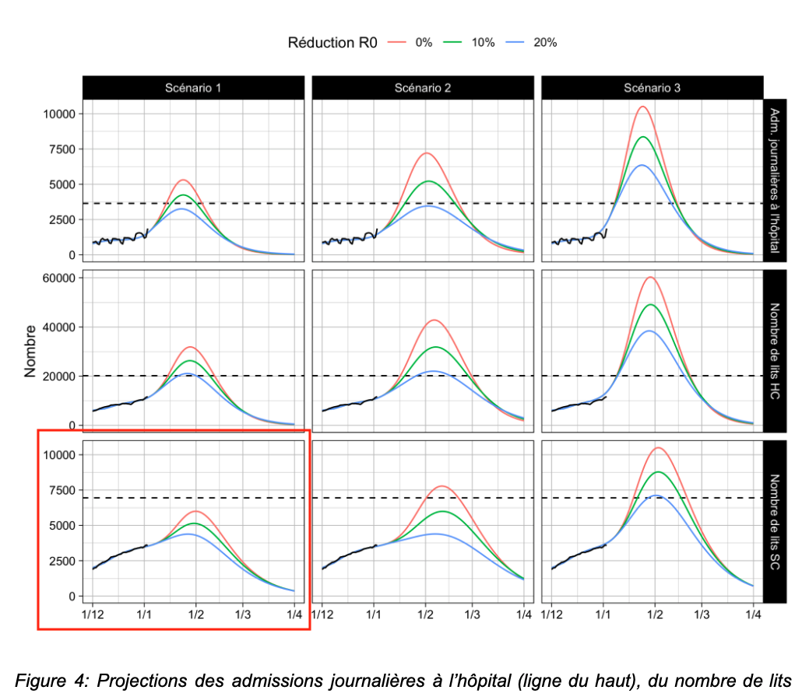
```

#### Reproduced {.tabset .tabset-fade}

We apply just a 1 day offset on the scenarios date for better alignement.

```{r}
#offset values
x_reality_offset <- 0
y_reality_offset <- 0
x_scenarios_offset <- -1
y_scenarios_offset <- 0
```


##### Before correction

```{r 2022-01-07_ICU}
scenarios <- read_csv("source_data/2022_01_07/ICU_low_VE.csv") %>%
  mutate(date = as.Date(date, format = "%Y/%m/%d", optional = T))


f_graph(
  reality_ICU_beds, scenarios, 
  "ICU_beds",
  "2022-01-07", 1000, #publication date label
  "2021-12-01", "2022-04-01", #date limits
  NA, # y limits
  "ICU beds", 
  "reality in data.gouv"
)
```

##### After correction

```{r}
temp <- f_offset(
  scenarios, 
  reality_ICU_beds, 
  "ICU_beds"
  )

f_graph_corrected(
  temp, 
  "2022-01-07", 1000, #publication date label
  "2021-12-01", "2022-04-01", #date limits
  NA, # y limits
  "ICU beds", 
  "reality in data.gouv"
) 

write_csv(temp, paste0(output_path, "2022_01_07_ICU.csv"))
```

#### Error

```{r}
error <- f_compute_error("2021-12-01", "2022-04-01", temp, max_ICU_beds)

f_graph_error(
  error,
  "2022-01-07", 50 #publication date label
  )

write_csv(error, paste0(output_path_error, "2022_01_07_ICU_error.csv"))
```


## Prepare Scenarios Hospitalizations

```{r output_path_for_corrected_hospital_scenarios}
output_path <- "output_data/extracted_data/new_hosp_scenarios/"
output_path_error <- "output_data/min_med_max_and_error/new_hosp_error/"
```

### January 16, 2021 {.tabset .tabset-fade .tabset-pills}

Source: [INSERM/Pasteur report](https://www.epicx-lab.com/uploads/9/6/9/4/9694133/inserm_covid-19-voc_dominance-20210116.pdf), January 16, 2021. Cited in the [January 29, 2021 report](https://sante.gouv.fr/IMG/pdf/note_eclairage_variants_modelisation_29_janvier_2021.pdf), which was identified on Pasteur Institute's website, on [this page](https://modelisation-covid19.pasteur.fr/realtime-analysis/impact-variant/).

#### Original {.tabset .tabset-fade}

##### Fig 1

```{r 2021_01_16_original, echo=FALSE, out.width="100%"}
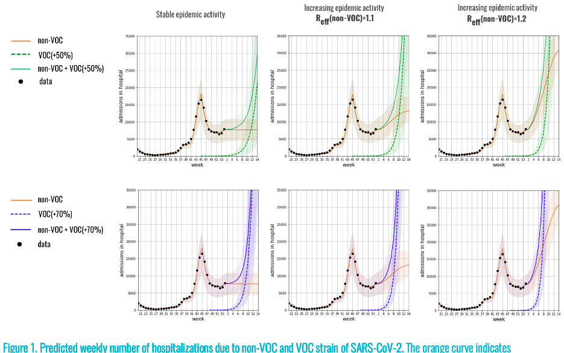
```

#### Reproduced {.tabset .tabset-fade}

We do not correct the data (no x nor y offset for better alignment).

```{r}
#offset values
x_reality_offset <- 0
y_reality_offset <- 0
x_scenarios_offset <- 0
y_scenarios_offset <- 0
```

##### Before correction

```{r 2021_01_16}
scenarios <- read_csv("source_data/2021_01_16/new_hosp_weekly.csv")
scenarios$date <- paste0(scenarios$date, "-4")
scenarios$date <- ISOweek2date(scenarios$date)

#transform daily data to weekly data
temp2 <- reality_new_hosp_adm %>%
  select(date,new_hosp) %>%
  mutate(
    date = ISOweek(date),
    date = ISOweek2date(paste0(date, "-4"))
    ) %>%
  group_by(date) %>%
  summarise(new_hosp = sum(new_hosp, na.rm=T)) 

f_graph(
  temp2, scenarios, 
  "new_hosp", 
  "2021-01-16", 1000, #publication date label
  "2020-10-01", "2021-05-01", #date limits
  NA, # y limits
  "weekly hospital admissions",
  "reality in Paireau et al."
)

  #confinement de 16 départements le 20 mars cf https://fr.wikipedia.org/wiki/Chronologie_de_la_pand%C3%A9mie_de_Covid-19_en_France
  #2 semaines pour voir les effets sur hospitalisations. correspond aussi au confinement général du 3 avril
```

##### After correction

```{r}
temp <- f_offset(
  scenarios, 
  temp2, 
  "new_hosp"
  )

f_graph_corrected(
  temp, 
  "2021-01-16", 1000, #publication date label
  "2020-10-01", "2021-05-01", #date limits
  NA, # y limits
  "weekly hospital admissions",
  "reality in Paireau et al."
)

temp <- temp %>% 
  mutate(across(-c(date), function(x) x/7)) %>% #weekly hosp transformed in daily hosp
  filter(date <= as.Date("2021-03-22")) #stop comparison before 3rd lockdown, on March 22nd

#since only 1 point per week, we linearly extrapolate missing days
temp <- left_join(
  #add missing days by join
  data_frame(date = seq(as.Date(min(temp$date)), max(temp$date), by="days")),
  temp, 
  by="date"
  ) %>%
  #linear extrapolation on missing values
  mutate(across(-date, ~na.approx(.x, na.rm=F)))

write_csv(temp, paste0(output_path, "2021_01_16_new_hosp.csv"))
```

#### Error

```{r}
error <- f_compute_error("2020-10-01", "2021-05-01", temp, max_new_hosp)

f_graph_error(
  error,
  "2021-01-16", 50 #publication date label
  )

write_csv(error, paste0(output_path_error, "2021_01_16_new_hosp_error.csv"))
```

### February 2, 2021 {.tabset .tabset-fade .tabset-pills}

Source: [INSERM/Pasteur report](https://www.epicx-lab.com/uploads/9/6/9/4/9694133/inserm-covid-19-voc-lockdown-20210202.pdf), February 2, 2021. Identified on Pasteur Institute's website, on [this page]().

#### Original {.tabset .tabset-fade}

##### Fig 2

```{r 2021_02_02_original, echo=FALSE, out.width="100%"}
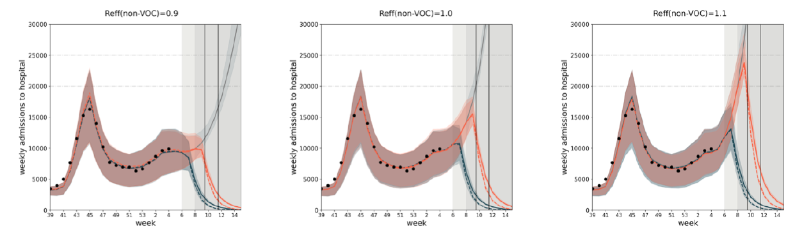
```

#### Reproduced {.tabset .tabset-fade}

We do not correct the data (no x nor y offset for better alignment).

```{r}
#offset values
x_reality_offset <- 0
y_reality_offset <- 0
x_scenarios_offset <- 0
y_scenarios_offset <- 0
```

##### Before correction

```{r 2021_02_02_Inserm}
scenarios <- read_csv("source_data/2021_02_02/new_hosp_weekly.csv")
scenarios$date <- paste0(scenarios$date, "-4")
scenarios$date <- ISOweek2date(scenarios$date)

#transform daily data to weekly data
temp2 <- reality_new_hosp_adm %>%
  select(date,new_hosp) %>%
  mutate(
    date = ISOweek(date),
    date = ISOweek2date(paste0(date, "-4"))
    ) %>%
  group_by(date) %>%
  summarise(new_hosp = sum(new_hosp, na.rm=T)) 

f_graph(
  temp2, scenarios, 
  "new_hosp", 
  "2021-02-02", 1000, #publication date label
  "2020-10-01", "2021-05-01", #date limits
  NA, # y limits
  "weekly hospital admissions",
  "reality in Paireau et al."
)
 
#confinement de 16 départements le 20 mars cf https://fr.wikipedia.org/wiki/Chronologie_de_la_pand%C3%A9mie_de_Covid-19_en_France
  #2 semaines pour voir les effets sur hospitalisations. correspond aussi au confinement général du 3 avril
```

##### After correction

```{r}
temp <- f_offset(
  scenarios, 
  temp2, 
  "new_hosp"
  )

f_graph_corrected(
  temp, 
  "2021-02-03", 1000, #publication date label
  "2020-10-01", "2021-05-01", #date limits
  NA, # y limits
  "weekly hospital admissions",
  "reality in Paireau et al."
)

temp <- temp %>% mutate(across(-c(date), function(x) x/7)) %>% #weekly hosp transformed in daily hosp
    filter(date <= as.Date("2021-03-22")) #stop comparison before 3rd lockdown, on March 22nd

#since only 1 point per week, we linearly extrapolate missing days
temp <- left_join(
  #add missing days by join
  data_frame(date = seq(as.Date(min(temp$date)), max(temp$date), by="days")),
  temp, 
  by="date"
  ) %>%
  #linear extrapolation on missing values
  mutate(across(-date, ~na.approx(.x, na.rm=F)))

write_csv(temp, paste0(output_path, "2021_02_02_new_hosp.csv"))
```


#### Error

```{r}
error <- f_compute_error("2020-10-01", "2021-05-01", temp, max_new_hosp)

f_graph_error(
  error,
  "2021-02-02", 50 #publication date label
  )

write_csv(error, paste0(output_path_error, "2021_02_02_new_hosp_error.csv"))
```


### February 8, 2021 {.tabset .tabset-fade .tabset-pills}

Source: [Pasteur report](https://modelisation-covid19.pasteur.fr/variant/RapportInstitutPasteur_variants_8fevrier2021.pdf), February 8, 2021. Identified on Pasteur Institute's website, on [this page](https://modelisation-covid19.pasteur.fr/realtime-analysis/impact-variant/).

#### Original {.tabset .tabset-fade}

##### Fig 2A

```{r 2021_02_08_fig_2_original, echo=FALSE, out.width="500px"}
knitr::include_graphics("source_data/2021_02_08/2021_02_08_fig2.png")
```

##### Fig 6A

```{r 2021_02_08_fig_6_original, echo=FALSE, out.width="500px"}
knitr::include_graphics("source_data/2021_02_08/2021_02_08_fig6.png")
```

##### Fig 7C

```{r 2021_02_08_fig_7_original, echo=FALSE, out.width="100%"}
knitr::include_graphics("source_data/2021_02_08/2021_02_08_fig7.png")
```


#### Reproduced {.tabset .tabset-fade}

We apply small -100 offset for the scenarios on the y axis for better alignment. The apparent discrepancy between the scenarios and the smoothed reality is not due to improper data extraction but is present in the modellers' report. Their scenarios matches the upper bound of the unsmoothed hospital admissions (see *Original* tab), as in our graph.

```{r}
#offset values
x_reality_offset <- 0
y_reality_offset <- 0
x_scenarios_offset <- 0
y_scenarios_offset <- -100
```


##### Before correction

```{r 2021_02_08_Pasteur}
scenarios <- read_csv("source_data/2021_02_08/new_hosp.csv") %>%
  mutate(date = as.Date(date, format = "%Y/%m/%d", optional = T))

f_graph(
  reality_new_hosp_adm, scenarios, 
  "new_hosp_smooth", 
  "2021-02-08", 5000, #publication date label
  "2021-01-01", "2021-06-01", #date limits
  NA, # y limits
  "daily hospital admissions",
  "reality in Paireau et al."
) +
  geom_line(
    data=reality_new_hosp_adm, aes(date, new_hosp), alpha=.4, color="red"
  )
```

##### After correction

```{r }
temp <- f_offset(
  scenarios, 
  reality_new_hosp_adm %>% select(date, new_hosp_smooth),
  "new_hosp_smooth"
  )

f_graph_corrected(
  temp, 
  "2021-02-08", 5000, #publication date label
  "2021-01-01", "2021-06-01", #date limits
  NA, # y limits
  "daily hospital admissions",
  "reality in Paireau et al."
)  +
  geom_line(
    data=reality_new_hosp_adm, aes(date, new_hosp+y_reality_offset), alpha=.4, color="red"
  )

#stop comparison before 3rd lockdown, on March 22nd
temp <- temp %>% filter(date <= as.Date("2021-03-22")) 

write_csv(temp, paste0(output_path, "2021_02_08_new_hosp.csv"))
```


#### Error

```{r}
error <- f_compute_error("2021-01-01", "2021-03-27", temp, max_new_hosp)

f_graph_error(
  error,
  "2021-02-08", 50 #publication date label
  )

write_csv(error, paste0(output_path_error, "2021_02_08_new_hosp_error.csv"))
```


### February 23, 2021 {.tabset .tabset-fade .tabset-pills}

Source: [Pasteur report](https://hal-pasteur.archives-ouvertes.fr/pasteur-03149525/document), February 23, 2021. Identified on Pasteur Institute's website, on [this page](https://modelisation-covid19.pasteur.fr/realtime-analysis/impact-variant/).

#### Original {.tabset .tabset-fade}

##### Fig 2C

```{r 2021_02_23__fig2_original, echo=FALSE, out.width="80%"}
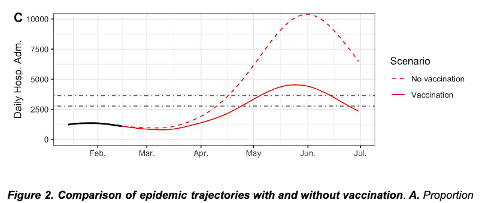
```

##### Fig 5A, 5C and 5E

```{r 2021_02_23_fig_5_original, echo=FALSE, out.width="500px"}
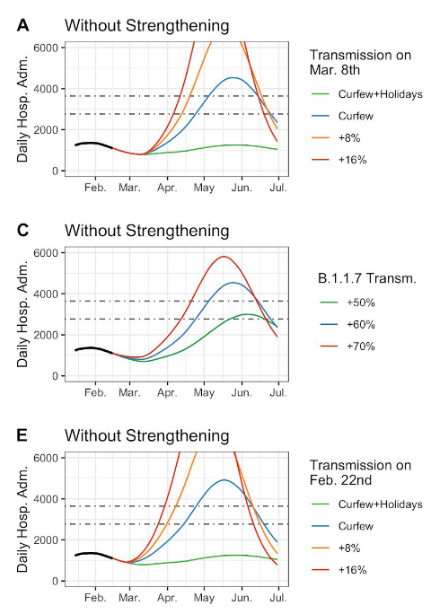
```

#### Reproduced {.tabset .tabset-fade}

We do not correct the data (no x nor y offset for better alignment). Scenarios curves diverge from reality before publication date, but this matches the modellers' original report (see *Orginal* tab). In their figure, reality data stops around mid-February, and scenarios curves keep decreasing until at least the first week of March.

```{r}
#offset values
x_reality_offset <- 0
y_reality_offset <- 0
x_scenarios_offset <- 0
y_scenarios_offset <- 0
```


##### Before correction

```{r 2021_02_23_Pasteur}
#February 23 2021
#besoin de réaligner leurs données sur la réalité (ne compte surement pas exactement la meme chose)
scenarios <- read_csv("source_data/2021_02_23/new_hosp.csv") %>%
  mutate(date = as.Date(date, format = "%Y/%m/%d", optional = T))

f_graph(
  reality_new_hosp_adm, scenarios, 
  "new_hosp_smooth", 
  "2021-02-23", 3000, #publication date label
  "2021-01-15", "2021-07-01", #date limits
  NA, # y limits
  "daily hospital admissions",
  "reality in Paireau et al."
) 

  #confinement de 16 départements le 20 mars cf https://fr.wikipedia.org/wiki/Chronologie_de_la_pand%C3%A9mie_de_Covid-19_en_France
  #2 semaines pour voir les effets sur hospitalisations. correspond aussi au confinement général du 3 avril
```

##### After correction

```{r}
temp <- f_offset(
  scenarios, 
  reality_new_hosp_adm %>% select(date, new_hosp_smooth), 
  "new_hosp_smooth"
  )

f_graph_corrected(
  temp, 
  "2021-02-23", 3000, #publication date label
  "2021-01-15", "2021-07-01", #date limits
  NA, # y limits
  "daily hospital admissions",
  "reality in Paireau et al."
)

temp <- temp %>% filter(date <= as.Date("2021-03-22")) #stop comparison before 3rd lockdown, on March 22nd

write_csv(temp, paste0(output_path, "2021_02_23_new_hosp.csv"))
```


#### Error

```{r}
error <- f_compute_error("2021-01-16", "2021-03-27", temp, max_new_hosp)

f_graph_error(
  error,
  "2021-02-23", 15 #publication date label
  )

write_csv(error, paste0(output_path_error, "2021_02_23_new_hosp_error.csv"))
```


### April 26, 2021 {.tabset .tabset-fade .tabset-pills}

Source: [Pasteur report](https://modelisation-covid19.pasteur.fr/loosening/Scenarios_de_levee_des_mesures_de_freinage_20210426.pdf), April 26, 2021. Identified on Pasteur Institute's website, on [this page](https://modelisation-covid19.pasteur.fr/realtime-analysis/delta-variant-dynamic/).

#### Original {.tabset .tabset-fade}

##### Fig 3B and 3D

```{r 2021_04_26_original, echo=FALSE, out.width="500px"}
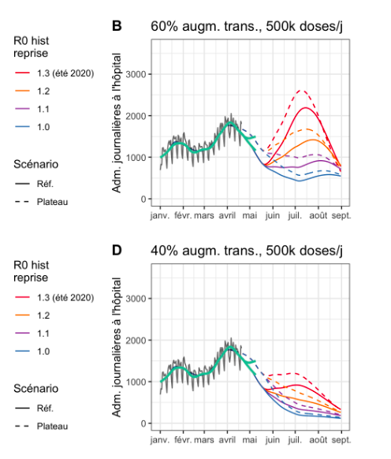
```

#### Reproduced {.tabset .tabset-fade}

We just apply a slight -39 vertical correction on scenarios curves. As in the modellers' original figure (see *Original* tab), the 2 sets of scenarios split before publication date.

```{r}
#offset values
x_reality_offset <- 0
y_reality_offset <- 0
x_scenarios_offset <- 0
y_scenarios_offset <- -30
```

##### Before correction

```{r 2021_04_26_Pasteur}
scenarios <- read_csv("source_data/2021_04_26/new_hosp.csv") %>%
  mutate(date = as.Date(date, format = "%Y/%m/%d", optional = T))

f_graph(
  reality_new_hosp_adm, scenarios, 
  "new_hosp_smooth",
  "2021-04-26", 1000, #publication date label
  "2021-01-15", "2021-07-01", #date limits
  NA, # y limits
  "daily hospital admissions", 
  "reality in Paireau et al."
) +
  geom_line(
    data=reality_new_hosp_adm, aes(date, new_hosp), alpha=.4, color="red"
  )  +
  ylim(0, 2000)
```

##### After correction

```{r}
temp <- f_offset(
  scenarios, 
  reality_new_hosp_adm %>% select(date, new_hosp_smooth), 
  "new_hosp_smooth"
  )

f_graph_corrected(
  temp, 
  "2021-04-26", 1000, #publication date label
  "2021-01-15", "2021-07-01", #date limits
  NA, # y limits
  "daily hospital admissions",
  "reality in Paireau et al."
) +
  geom_line(
    data=reality_new_hosp_adm, aes(date, new_hosp), alpha=.4, color="red"
  ) +
  ylim(0, 2000)

temp <- temp %>% filter(date<=as.Date("2021-06-15")) #stop comparison mid-June before delta variant dominant

write_csv(temp,paste0(output_path, "2021_04_26_new_hosp.csv"))
```


#### Error

```{r}
error <- f_compute_error("2021-03-15", "2021-06-15", temp, max_new_hosp)

f_graph_error(
  error,
  "2021-04-26", 30 #publication date label
  )

write_csv(error, paste0(output_path_error, "2021_04_26_new_hosp_error.csv"))
```


### May 21, 2021 {.tabset .tabset-fade .tabset-pills}

Source: [Pasteur report](https://modelisation-covid19.pasteur.fr/loosening/Mise_a_jour_scenarios_de_levee_des_mesures_de_freinage_20210521.pdf), May 21, 2021. Identified on Pasteur Institute's website, on [this page](https://modelisation-covid19.pasteur.fr/realtime-analysis/delta-variant-dynamic/).

#### Original {.tabset .tabset-fade}

##### fig 1A

```{r 2021_05_21_fig_1A_original, echo=FALSE, out.width="500px"}
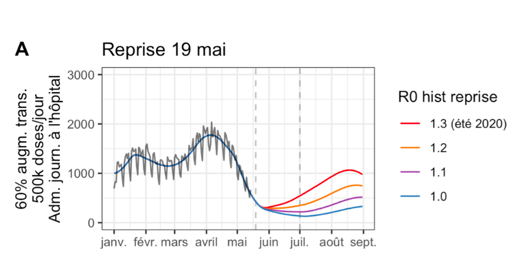
```

##### fig 1C

```{r 2021_05_21_fig_1C_original, echo=FALSE, out.width="500px"}
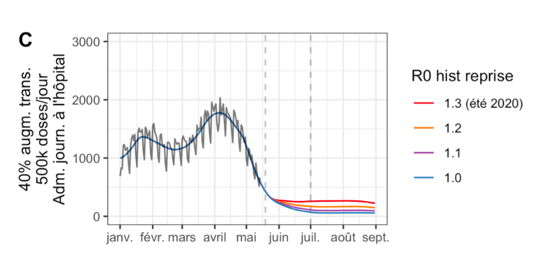
```

##### fig 1E

```{r 2021_05_21_fig_1E_original, echo=FALSE, out.width="500px"}
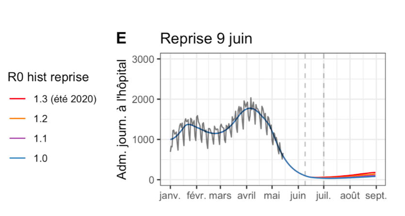
```

##### fig 1G

```{r 2021_05_21_fig_1G_original, echo=FALSE, out.width="500px"}
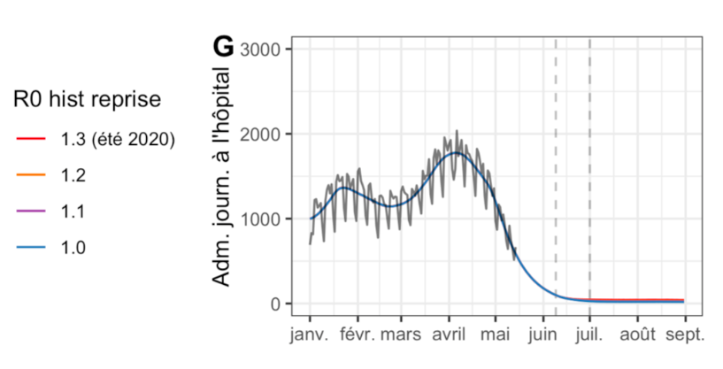
```

#### Reproduced {.tabset .tabset-fade}

We do not correct the data (no x nor y offset for better alignment).

```{r}
#offset values
x_reality_offset <- 0
y_reality_offset <- 0
x_scenarios_offset <- 0
y_scenarios_offset <- 0
```


##### Before correction

```{r 2021_05_21_Pasteur_new_hosp}
scenarios <- read_csv("source_data/2021_05_21/new_hosp.csv") %>%
  mutate(date = as.Date(date, format = "%Y/%m/%d", optional = T))

f_graph(
  reality_new_hosp_adm, scenarios, 
  "new_hosp_smooth",
  "2021-05-21", 2500, #publication date label
  "2021-01-15", "2021-06-30", #date limits
  NA, # y limits
  "daily hospital admissions", 
  "reality in Paireau et al."
) +
  geom_line(data = reality_new_hosp_adm, aes(date, new_hosp), alpha=.4, color="red")
```

##### After correction

```{r}
temp <- f_offset(
  scenarios, 
  reality_new_hosp_adm %>% select(date, new_hosp_smooth), 
  "new_hosp_smooth"
  )

f_graph_corrected(
  temp, 
  "2021-05-21", 2500, #publication date label
  "2021-01-15", "2021-06-30", #date limits
  NA, # y limits
  "daily hospital admissions", 
  "reality in Paireau et al."
) +
  geom_line(data = reality_new_hosp_adm, aes(date, new_hosp), alpha=.4, color="red")

temp <- temp %>% filter(date<=as.Date("2021-06-15")) #stop comparison mid-June before delta variant dominant 

write_csv(temp, paste0(output_path, "2021_05_21_new_hosp.csv"))
```


#### Error

```{r}
error <- f_compute_error("2021-03-15", "2021-06-15", temp, max_new_hosp)

f_graph_error(
  error,
  "2021-05-21", 10 #publication date label
  )

write_csv(error, paste0(output_path_error, "2021_05_21_new_hosp_error.csv"))
```


### July 26, 2021 {.tabset .tabset-fade .tabset-pills}

Source: [Pasteur report](https://modelisation-covid19.pasteur.fr/variant/Institut_Pasteur_Acceleration_vaccination_et_Delta_20210726.pdf), July 26, 2021. Identified on Pasteur Institute's website, on [this page](https://modelisation-covid19.pasteur.fr/realtime-analysis/delta-variant-dynamic/).

#### Original {.tabset .tabset-fade}

##### Fig 3 zoomes 

```{r}
knitr::include_graphics("source_data/2021_07_26/2021_07_26_fig3_zoom.png")
```

##### Fig 3 all

```{r}
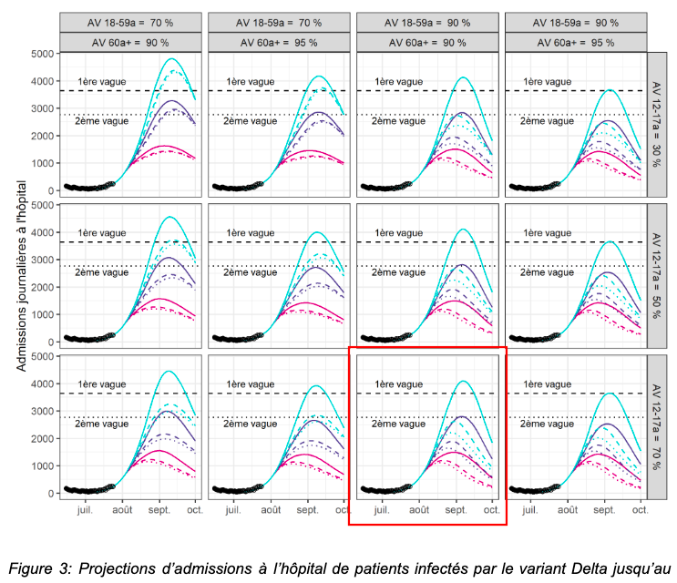
```

#### Reproduced {.tabset .tabset-fade .tabset-pills}

We do not correct the data (no x nor y offset for better alignment).

```{r}
#offset values
x_reality_offset <- 0
y_reality_offset <- 0
x_scenarios_offset <- 0
y_scenarios_offset <- 0
```

##### Before correction

```{r 2021_07_26_Pasteur_new_hosp}
scenarios <- read_csv("source_data/2021_07_26/new_hosp.csv") %>%
  mutate(date = as.Date(date, format = "%Y/%m/%d", optional = T))

f_graph(
  reality_new_hosp_adm, scenarios, 
  "new_hosp_smooth",
  "2021-07-26", 3500, #publication date label
  "2021-06-15", "2021-10-01", #date limits
  NA, # y limits
  "daily hospital admissions", 
  "reality"
)
```

##### After correction 

```{r }
temp <- f_offset(
  scenarios, 
  reality_new_hosp_adm, 
  "new_hosp_smooth"
  )

f_graph_corrected(
  temp, 
  "2021-07-26", 3500, #publication date label
  "2021-06-15", "2021-10-01", #date limits
  NA, # y limits
  "daily hospital admissions", 
  "reality"
) 

write_csv(temp, paste0(output_path, "2021_07_26_new_hosp.csv"))
```

#### Error

```{r}
error <- f_compute_error("2021-07-15", "2021-10-10", temp, max_new_hosp)

f_graph_error(
  error,
  "2021-07-26", 50 #publication date label
  )

write_csv(error, paste0(output_path_error, "2021_07_26_new_hosp_error.csv"))
```


### August 5, 2021 {.tabset .tabset-fade .tabset-pills}

Source: [Pasteur report](https://modelisation-covid19.pasteur.fr/variant/InstitutPasteur_Dynamiques_regionales_des_hospitalisations_20210805.pdf), August 5, 2021. Identified on Pasteur Institute's website, on [this page](https://modelisation-covid19.pasteur.fr/realtime-analysis/delta-variant-dynamic/).

#### Original {.tabset .tabset-fade}

##### Fig A

```{r 20201_08_05_original_A, echo=FALSE, out.width="500px"}
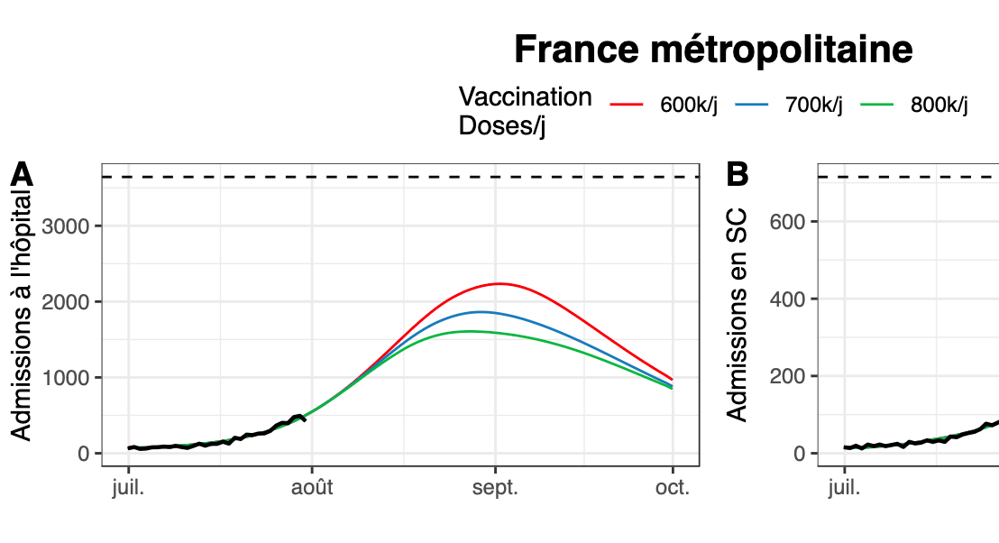
```

##### Fig C

```{r 20201_08_05_original_C, echo=FALSE, out.width="500px"}
knitr::include_graphics("source_data/2021_08_05/2021_08_05_C.png")
```

#### Reproduced {.tabset .tabset-fade}

We do not correct the data (no x nor y offset for better alignment).

```{r}
#offset values
x_reality_offset <- 0
y_reality_offset <- 0
x_scenarios_offset <- 0 
y_scenarios_offset <- 0
```


##### Before correction

```{r 2021_08_05_Pasteur_new_hosp}
scenarios <- read_csv("source_data/2021_08_05/new_hosp.csv") %>%
  mutate(date = as.Date(date, format = "%Y/%m/%d", optional = T))

f_graph(
  reality_new_hosp_adm, scenarios, 
  "new_hosp_smooth",
  "2021-08-05", 1500, #publication date label
  "2021-06-15", "2021-10-01", #date limits
  NA, # y limits
  "daily hospital admissions", 
  "reality"
) 
```

##### After correction

```{r}
temp <- f_offset(
  scenarios, 
  reality_new_hosp_adm, 
  "new_hosp_smooth"
  )

f_graph_corrected(
  temp, 
  "2021-08-05", 1500, #publication date label
  "2021-06-15", "2021-10-01", #date limits
  NA, # y limits
  "daily hospital admissions", 
  "reality"
) 

write_csv(temp, paste0(output_path, "2021_08_05_new_hosp.csv"))
```


#### Error

```{r}
error <- f_compute_error("2021-07-15", "2021-10-10", temp, max_new_hosp)

f_graph_error(
  error,
  "2021-08-05", 50 #publication date label
  )

write_csv(error, paste0(output_path_error, "2021_08_05_new_hosp_error.csv"))
```


### October 4, 2021 {.tabset .tabset-fade .tabset-pills}

Source: [Pasteur report](https://modelisation-covid19.pasteur.fr/scenarios/InstitutPasteur_scenariosCOVID19AutomneHiver_2021.pdf), October 4, 2021. Identified on Pasteur Institute's website, on [this page](https://modelisation-covid19.pasteur.fr/realtime-analysis/fall-winter-scenarios/).

#### Original {.tabset .tabset-fade}

##### Fig 9

```{r 2021_10_04_original, echo=FALSE, out.width="500px"}
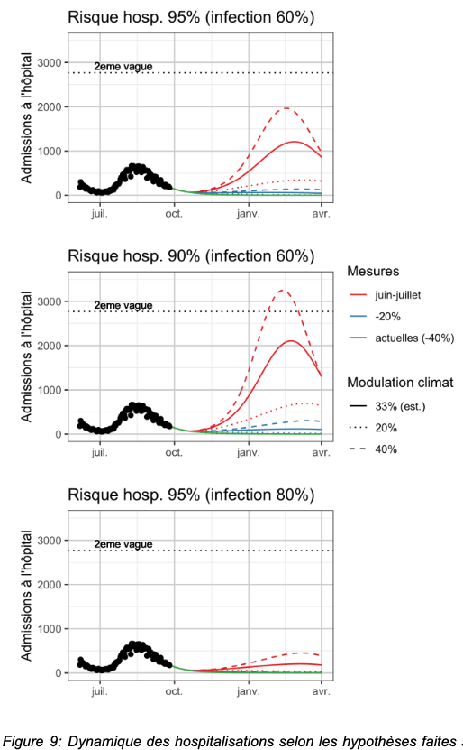
```

#### Reproduced {.tabset .tabset-fade}

We do not correct the data (no x nor y offset for better alignment).

```{r}
#offset values
x_reality_offset <- 0
y_reality_offset <- 0
x_scenarios_offset <- 0
y_scenarios_offset <- 0
```


##### Before correction

```{r 2021-10-10 Pasteur}
scenarios <- read_csv("source_data/2021_10_04/new_hosp.csv") %>%
  mutate(date = as.Date(date, format = "%Y/%m/%d", optional = T))

f_graph(
  reality_new_hosp_adm, scenarios, 
  "new_hosp_smooth",
  "2021-10-04", 1000, #publication date label
  "2021-07-01", "2022-01-01", #date limits
  NA, # y limits
  "daily hospital admissions beds", 
  "reality"
)
```

##### After correction

```{r}
temp <- f_offset(
  scenarios, 
  reality_new_hosp_adm, 
  "new_hosp_smooth"
  )

f_graph_corrected(
  temp, 
  "2021-10-04", 1000, #publication date label
  "2021-07-01", "2022-01-01", #date limits
  NA, # y limits
  "daily hospital admissions beds", 
  "reality"
) 

temp <- temp %>% filter(date <= as.Date("2021-12-15")) #stop comparison before Omicron dominance in mid-December

write_csv(temp, paste0(output_path, "2021_10_04_new_hosp.csv"))
```


#### Error

```{r}
error <- f_compute_error("2021-09-15", "2021-12-20", temp, max_new_hosp)

f_graph_error(
  error,
  "2021-10-04", -10 #publication date label
  )

write_csv(error, paste0(output_path_error, "2021_10_04_new_hosp_error.csv"))
```


### January 7, 2022 {.tabset .tabset-fade .tabset-pills}

Source: [Pasteur report](https://modelisation-covid19.pasteur.fr/variant/InstitutPasteur_Complement_Analyse_Impact_Omicron_20220107_corrige.pdf), January 7, 2022. Identified on Pasteur Institute's website, on [this page](https://modelisation-covid19.pasteur.fr/realtime-analysis/omicron-variant-epidemic/).

#### Original {.tabset .tabset-fade}

##### Figure 4 zoomed

```{r 2022_01_07_original_new_hosp_zoom, echo=FALSE, out.width="500px"}
knitr::include_graphics("source_data/2022_01_07/2022_01_07_new_hosp_zoom.png")
```

##### Figure 4 all

```{r 2022_01_07_original_new_hosp, echo=FALSE, out.width="500px"}
knitr::include_graphics("source_data/2022_01_07/2022_01_07_new_hosp.png")
```

#### Reproduced {.tabset .tabset-fade}

We do not correct the data (no x nor y offset for better alignment).

```{r}
#offset values
x_reality_offset <- 0
y_reality_offset <- 0
x_scenarios_offset <- 0
y_scenarios_offset <- 0
```


##### Before correction

```{r 2022-01-07_new_hosp}
scenarios <- read_csv("source_data/2022_01_07/new_hosp_low_VE.csv") %>%
  mutate(date = as.Date(date, format = "%Y/%m/%d", optional = T))


f_graph(
  reality_new_hosp_adm, scenarios, 
  "new_hosp_smooth",
  "2022-01-07", 3500, #publication date label
  "2021-12-01", "2022-04-01", #date limits
  NA, # y limits
  "daily new hospital admissions", 
  "reality"
)
```

##### After correction

```{r}
temp <- f_offset(
  scenarios, 
  reality_new_hosp_adm, 
  "new_hosp_smooth"
  )

f_graph_corrected(
  temp, 
  "2022-01-07", 3500, #publication date label
  "2021-12-01", "2022-04-01", #date limits
  NA, # y limits
  "daily new hospital admissions", 
  "reality"
) 

write_csv(temp, paste0(output_path, "2022_01_07_new_hosp.csv"))
```

#### Error

```{r}
error <- f_compute_error("2021-12-01", "2022-04-01", temp, max_new_hosp)

f_graph_error(
  error,
  "2022-01-07", 50 #publication date label
  ) +
  xlim(as.Date(NA), as.Date("2022-02-15")) #we do not have reality data past Feb 11

write_csv(error, paste0(output_path_error, "2022_01_07_new_hosp_error.csv"))
```

# Results

## All reports grouped {.tabset .tabset-fade .tabset-pills}

```{r combine_all_errors}
path_source <- "output_data/extracted_data/"
f_read_ICU <- function(date_scenario){
  
  #get scenario data, add report ID
  data <- read_csv(
    paste0(path_source, "ICU_scenarios/", date_scenario, "_ICU.csv")
    ) %>% 
    mutate(report = gsub("_", "-", date_scenario))
  
  #get last date of reality data in report
  temp <- data %>% select(date, reality_report) %>%
    filter(is.na(reality_report)==F)
  begin_date <- max(temp$date)
  
  #keep only data after this date
  data <- data %>%
    filter(date>=begin_date)
  
  return(data)
}

f_read_new_hosp <- function(date_scenario){
  #get scenario data, add report ID
  data <- read_csv(
    paste0(path_source, "new_hosp_scenarios/", date_scenario, "_new_hosp.csv")
    ) %>% 
    mutate(report = gsub("_", "-", date_scenario))
  
  #get last date of reality data in report
  temp <- data %>% select(date, reality_report) %>%
    filter(is.na(reality_report)==F)
  begin_date <- max(temp$date)
  
  #keep only data after this date
  data <- data %>%
    filter(date>=begin_date)
}

#ICU data
data_ICU_beds <- bind_rows(
  f_read_ICU("2020_10_30"),
  f_read_ICU("2021_05_21"),
  f_read_ICU("2021_07_26"),
  f_read_ICU("2021_08_05"),
  f_read_ICU("2022_01_07")
)
#1st scenario only Ile de France region
data_ICU_beds_IDF <- f_read_ICU("2020_04_28")


data_new_hosp <- bind_rows(
  f_read_new_hosp("2021_01_16"),
  f_read_new_hosp("2021_02_02"),
  f_read_new_hosp("2021_02_08"),
  f_read_new_hosp("2021_02_23"),
  f_read_new_hosp("2021_04_26"),
  f_read_new_hosp("2021_05_21"),
  f_read_new_hosp("2021_07_26"),
  f_read_new_hosp("2021_08_05"),
  f_read_new_hosp("2021_10_04"),
  f_read_new_hosp("2022_01_07")
)
```

### ICU

Comparison of all Pasteur Institute's scenarios on ICU beds occupancy to reality.

```{r prepare_all_ICU}
#prepare dataset

#compute error relative ICU capacity
data_ICU_beds <- data_ICU_beds %>%
  select(
    -c(reality_report)
    ) %>%
  gather(scenario_type, value, -c(date, report, reality)) %>%
  mutate(
    error = round((value-reality)/max_ICU_beds*100)
    ) 
#idem for Ile de France region with its own ICU beds capacity to compute  error
data_ICU_beds_IDF <- data_ICU_beds_IDF %>%
  select(
    -c(reality_report)
    ) %>%
  gather(scenario_type, value, -c(date, report, reality)) %>%
  mutate(
    error = round((value-reality)/max_ICU_beds_IDF*100)
    ) 
#merge the 2 files
data_ICU_beds <- bind_rows(
  data_ICU_beds, 
  data_ICU_beds_IDF
)
rm(data_ICU_beds_IDF)

#max error for colour scale
max_error <- max(data_ICU_beds$error, na.rm = T)

#date of the reports and number of reports
report_dates <- data_frame(
  report = unique(as.Date(data_ICU_beds$report)), #dates of reports
  place = report #to loaclize on x axis
)
#small offset to position summer 2021 reports
report_dates$place[report_dates$place=="2021-07-26"] <- report_dates$place[report_dates$place=="2021-07-26"]-15
report_dates$place[report_dates$place=="2021-08-05"] <- report_dates$place[report_dates$place=="2021-08-05"]+15
#number of reports
n_reports <- as.numeric(nrow(report_dates))
  


data_ICU_beds <- data_ICU_beds %>%
  mutate(
    days_since_publication = as.numeric(as.Date(date) - as.Date(report)),
    report_date = report,
    report = format(as.Date(report_date), format="%b %d, %Y")
  )
dummy <- data_ICU_beds %>% 
  #keep the reality value most close to publication date
  group_by(report) %>%
  filter(
    abs(days_since_publication) == min(abs(days_since_publication))
    ) %>%
  select(
    dummy = reality, report
    ) %>% 
  distinct()
data_ICU_beds <- left_join(data_ICU_beds, dummy, by="report") %>%
  mutate(
    error_dummy = case_when(
      # for Apr 28, 2020 scenarios, only in Ile de France (IDF)
      report_date == "2020-04-29" ~ (dummy-reality)/max_ICU_beds_IDF*100,
      T ~ (dummy-reality)/max_ICU_beds*100
    )
  )
rm(dummy)
#reorder report names
data_ICU_beds$report <- factor(
  data_ICU_beds$report,
  levels = c(
    "Apr 28, 2020",
    "Oct 30, 2020", 
    "May 21, 2021", 
    "Jul 26, 2021", 
    "Aug 05, 2021", 
    "Jan 07, 2022"
  )
)
```

```{r graph_all_ICU}
#plot
ggplot(data_ICU_beds) +
   #dates of reports on x axis
  geom_rug(data = report_dates, aes(report)) +
  #dates of reports on x axis
  scale_x_continuous(
    breaks=report_dates$place,
    labels=format(report_dates$report, format="%b %d, %Y")
    ) +
  theme(
    axis.text.x = element_text(angle = 45, hjust=1),
    axis.ticks.x=element_blank()
    ) +
  #uncomment to add green shaded area 
  # #margin of error France and Ile-de-France region
  # geom_ribbon(
  #   data=reality_ICU_beds %>% filter(date>=as.Date("2020-10-01")),
  #   aes(date, ymin=ICU_beds-max_ICU_beds*1/6 ,ymax=ICU_beds+max_ICU_beds*1/6), 
  #   fill="green", alpha=0.2
  #   ) + 
  # geom_ribbon(
  #   data=reality_ICU_beds_IDF %>% filter(date<as.Date("2020-07-01")),
  #   aes(date, ymin=ICU_beds-max_ICU_beds_IDF*1/6 ,ymax=ICU_beds+max_ICU_beds_IDF*1/6), 
  #   fill="green", alpha=0.2
  #   ) + 
  #scenarios curves and their colours
  geom_line(
    aes(date, value, group=interaction(scenario_type, report), color=abs(error)), 
    linewidth=1.5
    ) +
  scale_colour_stepsn(
    colours = c("green", "orange", "red", "purple"), 
    values = c(0, 15, 30, 100, round(max_error))/max_error,
    breaks = c(0, 15, 30, 100, round(max_error)),
    labels = c("0%", "± 15%", "± 30%", "± 100%", ""),
  ) +
  #reality national scale
  geom_line(
    data=reality_ICU_beds %>% filter(date>=as.Date("2020-10-01")), 
    aes(date, ICU_beds, linetype="reality")) +
  #reality just in Ile-de-France region
  geom_line(
    data=reality_ICU_beds_IDF %>% filter(date<as.Date("2020-07-01")), 
    aes(date, ICU_beds)) +
  #1st wave peak in France
  geom_hline(yintercept = max_ICU_beds, linetype="dashed") +
  annotate(
    'text', x = as.Date("2020-03-01"), y = max_ICU_beds, label = "1st wave peak", 
    color = "black", fontface = "italic", family = "Times New Roman", vjust=-.4, hjust=0
    ) + 
  #Ile de France region limits
  geom_rect(
    aes(xmin = as.Date("2020-03-01"), xmax = as.Date("2020-08-01"), ymin = 0, ymax = 3000),
    alpha=0, color="black", linetype="dashed", linewidth=.05
    ) +
  annotate(
    'text', x = as.Date("2020-05-15"), y = 3000, label = "Ile-de-France\nregion", 
    color = "black", fontface = "italic", family = "Times New Roman", vjust=-.2
    ) + 
  labs(
    x = paste("publication dates of the", n_reports, "reports"),
    y="ICU beds\noccupied by COVID-patients", x="",
    color="error of scenario\nas % of\n1st wave peak",
    linetype=""
  ) 

#save
ggsave(#svg
  "../graphs/all_ICU_scenarios_reality.svg",
  dpi=500, width=7, height=4, bg="white"
  )
ggsave(#png
  "../graphs/all_ICU_scenarios_reality.png",
  dpi=500, width=7, height=4, bg="white"
  )
```

### New hospitalizations

Comparison of all Pasteur Institute's scenarios on hospital admissions to reality.

```{r prepare_all_new_hosp}
#prepare data


#compute error relative to 1st wave peak
data_new_hosp <- data_new_hosp %>%
  select(
    -c(reality_report)
    ) %>%
  gather(scenario_type, value, -c(date, report, reality)) %>%
  mutate(
    error = round((value-reality)/max_new_hosp*100)
    ) 
#max error for colour scale
max_error <- max(data_new_hosp$error, na.rm = T)

#date of the reports
report_dates <- data_frame(
  report = unique(as.Date(data_new_hosp$report)),
  place = report #to loaclize on x axis
)
#small offset to position summer 2021 reports
report_dates$place[report_dates$place=="2021-07-26"] <- report_dates$place[report_dates$place=="2021-07-26"]-10
report_dates$place[report_dates$place=="2021-08-05"] <- report_dates$place[report_dates$place=="2021-08-05"]+3
#small offset to position winter 2021 reports
report_dates$place[report_dates$place=="2021-01-16"] <- report_dates$place[report_dates$place=="2021-01-16"]-10
report_dates$place[report_dates$place=="2021-02-02"] <- report_dates$place[report_dates$place=="2021-02-02"]-5
report_dates$place[report_dates$place=="2021-02-08"] <- report_dates$place[report_dates$place=="2021-02-08"]+10
report_dates$place[report_dates$place=="2021-02-23"] <- report_dates$place[report_dates$place=="2021-02-23"]+15
#number of reports
n_reports <- as.numeric(nrow(report_dates))


data_new_hosp <- data_new_hosp %>%
  mutate(
    days_since_publication = as.numeric(as.Date(date) - as.Date(report)),
    report_date = report,
    report = format(as.Date(report_date), format="%b %d, %Y")
  )
dummy <- data_new_hosp %>% 
  #keep the reality value most close to publication date
  group_by(report) %>%
  filter(
    abs(days_since_publication) == min(abs(days_since_publication))
    ) %>%
  select(
    dummy = reality, report
    ) %>% 
  distinct()
data_new_hosp <- left_join(data_new_hosp, dummy, by="report") %>%
  mutate(
    error_dummy = (dummy-reality)/max_new_hosp*100
    )
rm(dummy)
#reorder report names
data_new_hosp$report <- factor(
  data_new_hosp$report,
  levels = c(
    "Jan 16, 2021",
    "Feb 02, 2021", 
    "Feb 08, 2021", 
    "Feb 23, 2021", 
    "Apr 26, 2021", 
    "May 21, 2021",
    "Jul 26, 2021", 
    "Aug 05, 2021", 
    "Oct 04, 2021",
    "Jan 07, 2022"
  )
)
```

```{r graph_all_new_hosp}
#plot
ggplot(data_new_hosp) +
   #dates of reports on x axis
  geom_rug(data = report_dates, aes(report)) +
  #dates of reports on x axis
  scale_x_continuous(
    breaks=report_dates$place,
    labels=format(report_dates$report, format="%b %d, %Y"),
    limits = c(as.Date("2021-01-01"), as.Date("2022-02-12"))
    ) +
  theme(
    axis.text.x = element_text(angle = 45, hjust=1),
    axis.ticks.x=element_blank()
    ) +
  #unsmoothed reality
  geom_line(data=reality_new_hosp_adm, aes(date, new_hosp), alpha=.2) +
  #scenarios curves and their colours
  geom_line(
    aes(date, value, group=interaction(scenario_type, report), color=abs(error)), 
    linewidth=1
    ) +
  scale_colour_stepsn(
    colours = c("green", "orange", "red", "purple"), 
    values = c(0, 15, 30, 100, round(max_error))/max_error,
    breaks = c(0, 15, 30, 100, round(max_error)),
    labels = c("0%", "± 15%", "± 30%", "± 100%", ""),
  ) +
  #reality  
  geom_line(data=reality_new_hosp_adm, aes(date, new_hosp_smooth, linetype="reality")) +
  #peak 1st wave
  geom_hline(yintercept = max_new_hosp, linetype="dashed") +
  annotate(
    'text', x = as.Date("2021-04-15"), y = max_new_hosp, label = "1st wave peak", 
    color = "black", fontface = "italic", family = "Times New Roman", vjust=-.4, hjust=0
    ) + 
  labs(
    x = paste("publication dates of the", n_reports, "reports"),
    y="daily new hospital admissions\nrelated to COVID", x="",
    color="error of scenario\nerror as % of\n1st wave peak",
    linetype=""
  ) +
  ylim(0, 5500)

#save
ggsave(#svg
  "../graphs/all_hosp_scenarios_reality.svg",
  dpi=500, width=7, height=4, bg="white"
  )
ggsave(#png
  "../graphs/all_hosp_scenarios_reality.png",
  dpi=500, width=7, height=4, bg="white"
  )
```

## Short-term changes

In some cases the reports are published just a few weeks apart. In theses cases we compare the short-term changes in the scenarios dynamics. The 3 case studies are a) winter 2021, b) spring 2021, c) summer 2021.

```{r}
#function for short-term scenarios changes
f_graph_short_term_changes <- 
  function(
    reports, #a string vector of the reports to select
    date_min, date_max #x limits of the graph
    ){
    
    #data frame for vertical lines showing publication dates
    temp <- data_frame(
      report = reports, x = as.Date(reports, format = "%b %d, %Y")
    )

    #keep only reports of interest
    temp2 <- data_new_hosp %>% filter(report %in% reports)
    
    #chronologically order reports
    temp2$report <- factor(temp2$report, levels=reports)
    temp$report <- factor(temp$report, levels=reports)

    #graph
    g <- ggplot(temp2) +
      geom_line(
        aes(date, value, group=scenario_type, color="scenarios"), 
        linewidth=1
        ) +
      geom_line(
        data = reality_new_hosp_adm,
        aes(date, new_hosp, color="reality"), 
        alpha=.2
        ) +
      geom_line(
        data = reality_new_hosp_adm,
        aes(date, new_hosp_smooth, color="reality"), 
        linewidth=1
        ) +
      geom_vline(data = temp, aes(xintercept = x), linetype="dashed") +
      facet_wrap(vars(report), nrow=1) +
      scale_color_manual(values=c('#ff0000','#D8D8D8')) +
      labs(
        x="", y="hospital admissions", color=""
      )
    
    return(g)
  }

g1 <- 
  f_graph_short_term_changes(
    c("Jan 16, 2021", "Feb 02, 2021", "Feb 08, 2021", "Feb 23, 2021")
    ) +
  xlim(as.Date("2021-01-01"), as.Date("2021-03-25")) +
  ylim(0, 3000) +
  theme(legend.position = "none") +
  labs(
    subtitle = "vertical line: publication date"
  )

g2 <- 
  f_graph_short_term_changes(
    c("Apr 26, 2021", "May 21, 2021")
    ) +
  xlim(as.Date("2021-04-01"), as.Date("2021-06-15")) +
  ylim(0, 2100) +
  theme(legend.position = "none")

g3 <- 
  f_graph_short_term_changes(
    c("Jul 26, 2021", "Aug 05, 2021")
    ) +
  xlim(as.Date("2021-07-15"), as.Date("2021-10-01")) +
  ylim(0, NA) +
  theme(
    legend.position = c(0.9, 0.8),
    legend.background = element_rect(fill="transparent")
    ) 

plot_grid(
  g1,
  plot_grid(
    g2, g3, nrow=1, labels=(c("b", "c"))
  ), 
  nrow = 2, labels=c("a", "")
)

#save
ggsave(#svg
  "../graphs/short_term_changes.svg",
  dpi=500, width=7, height=5, bg="white"
  )
ggsave(#png
  "../graphs/short_term_changes.png",
  dpi=500, width=8, height=5, bg="white"
  )
```


## All errors grouped {.tabset .tabset-fade .tabset-pills}

```{r}
path_source <- "output_data/min_med_max_and_error/"

f_read_ICU_error <- function(date_scenario){
  
  #get scenario data, add report ID
  data <- read_csv(
    paste0(path_source, "ICU_error/", date_scenario, "_ICU_error.csv")
    ) %>% 
    mutate(report = gsub("_", "-", date_scenario))
  
  data <- data %>% select(report, date, error_min, error_med, error_max) %>%
    filter(
      is.na(error_min)==F & is.na(error_med)==F & is.na(error_max)==F
      ) %>%
    mutate(
      days_since_publication = as.Date(date)-as.Date(report)
      ) 
  
  return(data)
}

f_read_new_hosp_error <- function(date_scenario){
  #get scenario data, add report ID
  data <- read_csv(
    paste0(path_source, "new_hosp_error/", date_scenario, "_new_hosp_error.csv")
    ) %>% 
    mutate(report = gsub("_", "-", date_scenario))
  
  data <- data %>% select(report, date, error_min, error_med, error_max) %>%
    filter(
      is.na(error_min)==F & is.na(error_med)==F & is.na(error_max)==F
      ) %>%
    mutate(
      days_since_publication = as.Date(date)-as.Date(report)
      ) 
  
  return(data)
}

#ICU data
data_ICU_error <- bind_rows(
  f_read_ICU_error("2020_04_28"),
  f_read_ICU_error("2020_10_30"),
  f_read_ICU_error("2021_05_21"),
  f_read_ICU_error("2021_07_26"),
  f_read_ICU_error("2021_08_05"),
  f_read_ICU_error("2022_01_07")
)

#new hosp data
data_new_hosp_error <- bind_rows(
  f_read_new_hosp_error("2021_01_16"),
  f_read_new_hosp_error("2021_02_02"),
  f_read_new_hosp_error("2021_02_08"),
  f_read_new_hosp_error("2021_02_23"),
  f_read_new_hosp_error("2021_04_26"),
  f_read_new_hosp_error("2021_05_21"),
  f_read_new_hosp_error("2021_07_26"),
  f_read_new_hosp_error("2021_08_05"),
  f_read_new_hosp_error("2021_10_04"),
  f_read_new_hosp_error("2022_01_07")
) 
```

```{r}
temp <- bind_rows(
  data_ICU_error %>% mutate(variable = "ICU"),
  data_new_hosp_error  %>% mutate(variable = "new hosp")
) %>% 
  gather(min_med_max, error_perc, error_min, error_med, error_max)
  
max_error <- max(temp$error_perc, na.rm = T)
ggplot(temp) +
  geom_line(
    aes(days_since_publication, error_perc, color=abs(error_perc), group=report),
    linewidth=1
    ) +
  geom_vline(xintercept = 0, linetype="dashed") +
  scale_colour_stepsn(
    colours = c("green", "orange", "red", "purple"), 
    values = c(0, 15, 30, 100, max_error)/max_error,
    breaks = c(0, 15, 30, 100, max_error),
    labels = c("0%", "± 15%", "± 30%", "± 100%", ""),
  ) +
  facet_grid(variable~min_med_max) +
  ylim(NA, 100) +
  xlim(-20, NA)


ggplot(temp %>% filter(variable=="ICU")) +
  geom_line(
    aes(days_since_publication, error_perc, color=abs(error_perc), group=report),
    linewidth=1
    ) +
  scale_colour_stepsn(
    colours = c("green", "orange", "red", "purple"), 
    values = c(0, 15, 30, 100, max_error)/max_error,
    breaks = c(0, 15, 30, 100, max_error),
    labels = c("0%", "± 15%", "± 30%", "± 100%", "")
  ) +
  facet_grid(min_med_max~report) +
  ylim(-100, 150) + xlim(-20, NA)


ggplot(
  temp %>% 
    filter(variable=="new hosp")
  ) +
  geom_line(
    aes(days_since_publication, error_perc, color=abs(error_perc), group=report),
    linewidth=1
    ) +
  scale_colour_stepsn(
    colours = c("green", "orange", "red", "purple"), 
    values = c(0, 15, 30, 100, max_error)/max_error,
    breaks = c(0, 15, 30, 100, max_error)
  ) +
  facet_grid(min_med_max~report) +
  ylim(-100, 150) + xlim(-20, NA)
```


## Individual report and error {.tabset .tabset-fade .tabset-pills}

### Individual Comparison {.tabset .tabset-fade}

#### ICU beds

```{r}
ggplot(data_ICU_beds) +
  #scenarios
  geom_line(
    aes(date, value, group=interaction(scenario_type, report), color="report scenarios"), 
    linewidth=1.5
    ) +
  #reality national scale
  geom_line(
    aes(date, reality, linetype=" reality")
    ) +
  #dummy baseline
  geom_line(
    aes(date, dummy, linetype="constant dummy baseline")
    ) +
  ylim(0, NA) +
  facet_wrap(vars(report), scales="free") +
  labs(
    title = "Pasteur Institute scenarios during COVID-19\nIntensive Care Units",
    y="ICU beds\noccupied by COVID-patients", x="",
    linetype="",
    color=""
  ) 
```

#### Hospital Admissions

```{r}
ggplot(data_new_hosp) +
  #scenarios
  geom_line(
    aes(date, value, group=interaction(scenario_type, report), color="report scenarios"), 
    linewidth=1.5
    ) +
  #reality national scale
  geom_line(
    aes(date, reality, linetype=" reality")
    ) +
  #dummy baseline
  geom_line(
    aes(date, dummy, linetype="constant dummy baseline")
    ) +
  ylim(0, NA) +
  facet_wrap(vars(report), scales="free") +
  labs(
    title = "Pasteur Institute scenarios during COVID-19\nHospital Admissions",
    y="daily new hospital admissions\nrelated to COVID", x="",
    linetype="",
    color=""
  ) 
```


### Error {.tabset .tabset-fade .tabset-pills}

#### ICU

```{r}
ggplot(data_ICU_beds) +
  geom_line(aes(days_since_publication, error, color = "Pasteur's scenarios", group=scenario_type)) +
  geom_line(aes(days_since_publication, error_dummy, color="dummy variable")) +
  facet_wrap(vars(report)) +
  geom_hline(yintercept = 0, linetype="dashed") +
  ylim(-50, 150) +
  labs(
    y="error to reality as % of 1st wave peak",
    x="number of days since report publication",
    color=""
  )
```

#### Hospital Admissions

```{r}
ggplot(data_new_hosp) +
  geom_line(aes(days_since_publication, error, color = "Pasteur's scenarios", group=scenario_type)) +
  geom_line(aes(days_since_publication, error_dummy, color="dummy variable")) +
  facet_wrap(vars(report)) +
  geom_hline(yintercept = 0, linetype="dashed") +
  ylim(-50, 150) +
  labs(
    y="error to reality as % of 1st wave peak",
    x="number of days since report publication",
    color=""
  )
```


## Cumulative Error {.tabset .tabset-fade .tabset-pills}

### RMSE

```{r}
#RMSE Mean Error for each ICU report (optimist, median and pessimist scenario)
rmse_ICU <- data_ICU_error %>%
  group_by(report) %>%
  filter(date>report) %>%
  summarise(
    optimist =  round(sqrt(sum(error_min^2)/length(which(!is.na(error_min))))),
    median =  round(sqrt(sum(error_med^2)/length(which(!is.na(error_med))))),
    pessimist =  round(sqrt(sum(error_max^2)/length(which(!is.na(error_max)))))
  )
#RMSE Mean Error for each hospital admissions report (optimist, median and pessimist scenario)
rmse_hosp <- data_new_hosp_error %>%
  group_by(report) %>%
  filter(date>report) %>%
  summarise(
    optimist =  round(sqrt(sum(error_min^2)/length(which(!is.na(error_min))))),
    median =  round(sqrt(sum(error_med^2)/length(which(!is.na(error_med))))),
    pessimist =  round(sqrt(sum(error_max^2)/length(which(!is.na(error_max)))))
  )
#combine ICU and hospital admissions RMSE
rmse <- bind_rows(
  rmse_ICU %>% mutate(variable = "ICU"), 
  rmse_hosp %>% mutate(variable = "hospital admissions")
  ) %>% 
  mutate(report = as.Date(report))
rm(rmse_ICU, rmse_hosp)

#date of the reports, to position on the graph
report_dates <- data_frame(
  report = unique(as.Date(rmse$report)),
  place = report #to localize on x axis
)
#small offset to position summer 2021 reports
report_dates$place[report_dates$place=="2021-07-26"] <- report_dates$place[report_dates$place=="2021-07-26"]-10
report_dates$place[report_dates$place=="2021-08-05"] <- report_dates$place[report_dates$place=="2021-08-05"]+3
#small offset to position winter 2021 reports
report_dates$place[report_dates$place=="2021-01-16"] <- report_dates$place[report_dates$place=="2021-01-16"]-10
report_dates$place[report_dates$place=="2021-02-02"] <- report_dates$place[report_dates$place=="2021-02-02"]-5
report_dates$place[report_dates$place=="2021-02-08"] <- report_dates$place[report_dates$place=="2021-02-08"]+10
report_dates$place[report_dates$place=="2021-02-23"] <- report_dates$place[report_dates$place=="2021-02-23"]+15

#graph
ggplot(rmse) +
  geom_point(
    aes(report, median)
    ) +
  geom_errorbar(
    aes(x = report, ymin = optimist, ymax = pessimist),
    width=.2
    ) +
  facet_wrap(vars(variable), nrow = 2) +
  ylim(0, 100) +
  #dates of reports on x axis
  scale_x_continuous(
    breaks=report_dates$place,
    labels=format(report_dates$report, format="%b %d, %Y")
    ) +
  theme(
    axis.text.x = element_text(angle = 45, hjust=1),
    axis.ticks.x=element_blank()
    ) +
  labs(
    x="report date", y="RMSE, % of historical peak",
    subtitle = "point: median scenario       error bar: range of all scenarios"
  )
```

### Mean Error

```{r}
#ME Mean Error for each ICU report (optimist, median and pessimist scenario)
ME_ICU <- data_ICU_error %>%
  group_by(report) %>%
  filter(date>report) %>%
  summarise(
    optimist =  round(sum(error_min)/length(which(!is.na(error_min)))),
    median =  round(sum(error_med)/length(which(!is.na(error_med)))),
    pessimist =  round(sum(error_max)/length(which(!is.na(error_max))))
  )
#ME Mean Error for each hospital admissions report (optimist, median and pessimist scenario)
ME_hosp <- data_new_hosp_error %>%
  group_by(report) %>%
  filter(date>report) %>%
  summarise(
    optimist =  round(sum(error_min)/length(which(!is.na(error_min)))),
    median =  round(sum(error_med)/length(which(!is.na(error_med)))),
    pessimist =  round(sum(error_max)/length(which(!is.na(error_max))))
  )
#combine ICU and hospital admissions ME
ME <- bind_rows(
  ME_ICU %>% mutate(variable = "ICU"), 
  ME_hosp %>% mutate(variable = "hospital admissions")
  ) %>% 
  mutate(report = as.Date(report))
rm(ME_ICU, ME_hosp)

#date of the reports, to position on the graph
report_dates <- data_frame(
  report = unique(as.Date(ME$report)),
  place = report #to localize on x axis
)
#small offset to position summer 2021 reports
report_dates$place[report_dates$place=="2021-07-26"] <- report_dates$place[report_dates$place=="2021-07-26"]-10
report_dates$place[report_dates$place=="2021-08-05"] <- report_dates$place[report_dates$place=="2021-08-05"]+3
#small offset to position winter 2021 reports
report_dates$place[report_dates$place=="2021-01-16"] <- report_dates$place[report_dates$place=="2021-01-16"]-10
report_dates$place[report_dates$place=="2021-02-02"] <- report_dates$place[report_dates$place=="2021-02-02"]-5
report_dates$place[report_dates$place=="2021-02-08"] <- report_dates$place[report_dates$place=="2021-02-08"]+10
report_dates$place[report_dates$place=="2021-02-23"] <- report_dates$place[report_dates$place=="2021-02-23"]+15

#graph
ggplot(ME) +
  geom_point(
    aes(report, median)
    ) +
  geom_errorbar(
    aes(x = report, ymin = optimist, ymax = pessimist),
    width=.2
    ) +
  facet_wrap(vars(variable), nrow = 2) +
  ylim(-100, 100) + #dates of reports on x axis
  #dates of reports on x axis
  scale_x_continuous(
    breaks=report_dates$place,
    labels=format(report_dates$report, format="%b %d, %Y")
    ) +
  theme(
    axis.text.x = element_text(angle = 45, hjust=1),
    axis.ticks.x=element_blank()
    ) +
  geom_hline(yintercept = 0, linetype = "dashed", alpha=.5) +
  labs(
    x="report date", y="mean error, % of historical peak",
    subtitle = "point: median scenario       error bar: range of all scenarios"
  )
```


# Other figures and appendix {.tabset .tabset-fade .tabset-pills}

## Winter 2021 curfew discussion

```{r}
#load Feb 14 scenario
temp <- read_csv(
    "source_data/appendix/2021_02_14/corrected_scenarios_new_hosp.csv"
    ) %>%
  select(-reality_report) %>%
  gather(scenario_type, value, -c(date, reality)) %>%
  mutate(
    report_date = "2021-02-14",
    report = "Feb 14, 2021"
    )
#gather jan 16, Feb 2 and Feb 14 scenarios
temp <- bind_rows(
  temp,
  data_new_hosp %>%
    select(report, date, reality, scenario_type, value, report_date) %>%
    filter(report_date %in% c("2021-01-16", "2021-02-02"))
)
#order the reports for graph
temp$report <- factor(
  temp$report,
  levels = c(
    "Jan 16, 2021",
    "Feb 02, 2021", 
    "Feb 14, 2021"
  )
)

ggplot(temp) +
  geom_line(
    aes(date, value, group=scenario_type, color="scenarios"), 
    linewidth=1
    ) +
  geom_line(
    data = reality_new_hosp_adm,
    aes(date, new_hosp, color="reality"), 
    alpha=.2
    ) +
  geom_line(
    data = reality_new_hosp_adm,
    aes(date, new_hosp_smooth, color="reality"), 
    linewidth=1
    ) +
  geom_vline(data = temp, aes(xintercept = as.Date(report_date)), linetype="dashed") +
  facet_wrap(vars(report), nrow=1)  +
  scale_color_manual(values=c('#ff0000','#D8D8D8')) +
  labs(
    x="", y="hospital admissions", color="",
    subtitle = "vertical line: publication date"
  ) +
  xlim(as.Date("2021-01-01"), as.Date("2021-04-01"))

#save
ggsave(#svg
  "../graphs/curfew_discussion.svg",
  dpi=500, width=7, height=4, bg="white"
  )
ggsave(#png
  "../graphs/curfew_discussion.png",
  dpi=500, width=7, height=4, bg="white"
  )
```

## Illegitimate comparisons {.tabset .tabset-fade}

### Feb 02, 2021

```{r}
temp <- data_new_hosp %>%
  filter(report_date == "2021-02-08")

ggplot(temp) +
  geom_line(
    aes(date, value, group=scenario_type, color="scenarios"), 
    linewidth=1
    ) +
  geom_line(
    data = reality_new_hosp_adm,
    aes(date, new_hosp, color="reality"), 
    alpha=.2
    ) +
  geom_line(
    data = reality_new_hosp_adm,
    aes(date, new_hosp_smooth, color="reality"), 
    linewidth=1
    ) +
  geom_vline(data = temp, aes(xintercept = as.Date(report_date)), linetype="dashed") +
  facet_wrap(vars(report), nrow=1)  +
  scale_color_manual(values=c('#ff0000','#D8D8D8')) +
  labs(
    x="", y="hospital admissions", color="",
    subtitle = "vertical line: publication date"
  ) +
  xlim(as.Date("2021-01-01"), as.Date("2021-03-22")) +
  theme(
    legend.position = c(0.8, 0.2),
    legend.background = element_rect(fill="transparent")
    )


#save
ggsave(#svg
  "../graphs/legitimate_Feb_08_2021.svg",
  dpi=500, width=2.5, height=2.5, bg="white"
  )
ggsave(#png
  "../graphs/legitimate_Feb_08_2021.png",
  dpi=500, width=2.5, height=2.5, bg="white"
  )
```

### Jan 07, 2022

```{r}
temp <- data_ICU_beds %>%
  filter(report_date == "2022-01-07")

ggplot(temp) +
  geom_line(
    aes(date, value, group=scenario_type, color="scenarios"), 
    linewidth=1
    ) +
  geom_line(
    data = reality_ICU_beds,
    aes(date, ICU_beds, color="reality"), 
    linewidth=1
    ) +
  geom_vline(data = temp, aes(xintercept = as.Date(report_date)), linetype="dashed") +
  facet_wrap(vars(report), nrow=1)  +
  scale_color_manual(values=c('#ff0000','#D8D8D8')) +
  labs(
    x="", y="hospital admissions", color="",
    subtitle = "vertical line: publication date"
  ) +
  xlim(as.Date("2021-12-01"), as.Date("2022-04-01")) +
  theme(
    legend.position = c(0.6, 0.2),
    legend.background = element_rect(fill="transparent")
    )

#save
ggsave(#svg
  "../graphs/legitimate_Jan_07_2022.svg",
  dpi=500, width=2.5, height=2.5, bg="white"
  )
ggsave(#png
  "../graphs/legitimate_Jan_07_2022.png",
  dpi=500, width=2.5, height=2.5, bg="white"
  )
```


